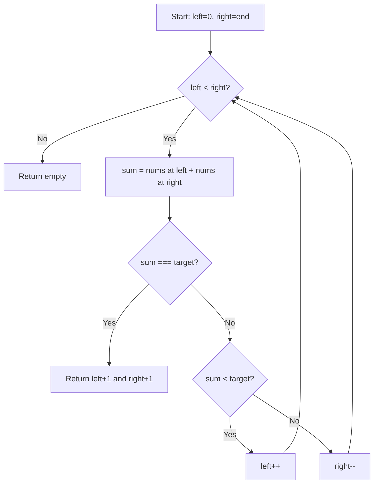

Given a **1-indexed** array of integers `numbers` that is already sorted in non-decreasing order, find two numbers such that they add up to a specific `target` number. Return the indices of the two numbers (1-indexed) as an integer array `[index1, index2]`.

You may not use the same element twice. There is exactly one solution.

## Examples

**Input:** numbers = [2,7,11,15], target = 9
**Output:** [1,2]
**Explanation:** 2 + 7 = 9. So index1 = 1, index2 = 2.

**Input:** numbers = [2,3,4], target = 6
**Output:** [1,3]
**Explanation:** 2 + 4 = 6. So index1 = 1, index2 = 3.

**Input:** numbers = [-1,0], target = -1
**Output:** [1,2]
**Explanation:** -1 + 0 = -1. So index1 = 1, index2 = 2.


## Brute Force

```js
function twoSumBrute(numbers, target) {
  for (let i = 0; i < numbers.length; i++) {
    for (let j = i + 1; j < numbers.length; j++) {
      if (numbers[i] + numbers[j] === target) return [i + 1, j + 1];
    }
  }
  return [];
}
// Time: O(n²) | Space: O(1)
```

### Brute Force Explanation

Check every pair — works but doesn't leverage the sorted property. Two pointers uses the sorting to eliminate pairs intelligently.

## Solution

```js
function twoSum(numbers, target) {
  let left = 0;
  let right = numbers.length - 1;

  while (left < right) {
    const sum = numbers[left] + numbers[right];
    if (sum === target) {
      return [left + 1, right + 1];
    } else if (sum < target) {
      left++;
    } else {
      right--;
    }
  }

  return [];
}
```

## Explanation

APPROACH: Converging Two Pointers

Place left at start, right at end. Because the array is sorted, the sum direction is predictable.

```
numbers = [2, 7, 11, 15], target = 9

  L              R
 [2,  7,  11,  15]
  sum = 2+15 = 17 > 9 → move R left

  L          R
 [2,  7,  11,  15]
  sum = 2+11 = 13 > 9 → move R left

  L      R
 [2,  7,  11,  15]
  sum = 2+7 = 9 = target → return [1, 2] ✓
```

WHY THIS WORKS:
- Sorted array means moving left pointer right increases sum, moving right pointer left decreases sum
- Each step eliminates one possibility — we never revisit
- Exactly one pass through the array → O(n)

## Diagram



## TestConfig
```json
{
  "functionName": "twoSum",
  "testCases": [
    {
      "args": [[2,7,11,15], 9],
      "expected": [1,2]
    },
    {
      "args": [[2,3,4], 6],
      "expected": [1,3]
    },
    {
      "args": [[-1,0], -1],
      "expected": [1,2]
    },
    {
      "args": [[1,2,3,4,5], 9],
      "expected": [4,5],
      "isHidden": true
    },
    {
      "args": [[1,3,5,7,9], 10],
      "expected": [2,4],
      "isHidden": true
    },
    {
      "args": [[1,2], 3],
      "expected": [1,2],
      "isHidden": true
    },
    {
      "args": [[-3,-1,0,2,4,6], 3],
      "expected": [2,6],
      "isHidden": true
    },
    {
      "args": [[5,25,75], 100],
      "expected": [2,3],
      "isHidden": true
    }
  ]
}
```
