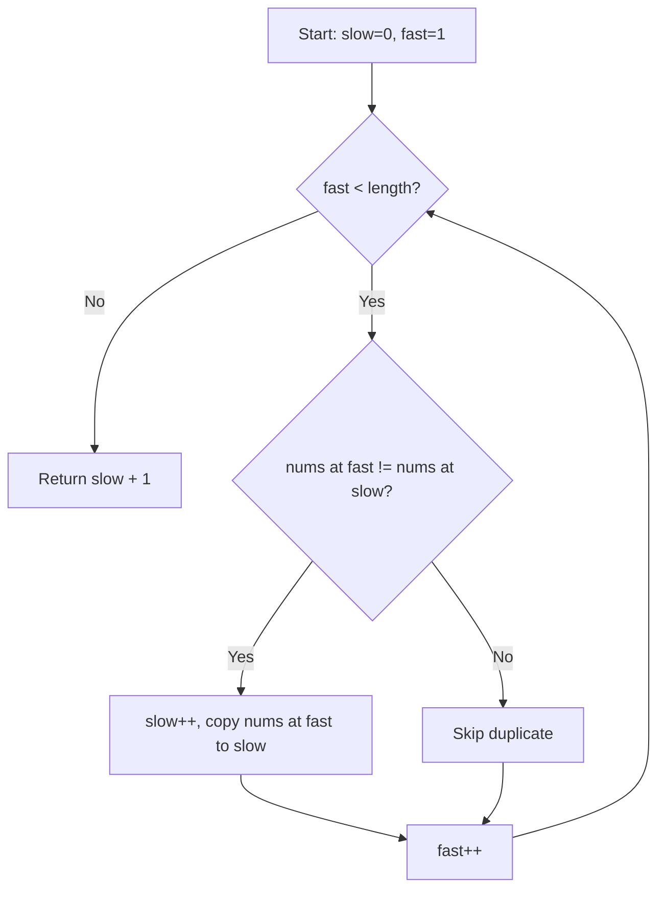

Given an integer array `nums` sorted in non-decreasing order, remove the duplicates **in-place** such that each unique element appears only once. The relative order of the elements should be kept the same. Return the number of unique elements `k`.

## Examples

**Input:** nums = [1,1,2]
**Output:** 2, nums = [1,2,_]
**Explanation:** Function returns k = 2, with the first two elements being 1 and 2.

**Input:** nums = [0,0,1,1,1,2,2,3,3,4]
**Output:** 5, nums = [0,1,2,3,4,_,_,_,_,_]
**Explanation:** Function returns k = 5, with the first five elements being 0, 1, 2, 3, and 4.


## Brute Force

```js
function removeDuplicatesBrute(nums) {
  const unique = [...new Set(nums)];
  for (let i = 0; i < unique.length; i++) {
    nums[i] = unique[i];
  }
  return unique.length;
}
// Time: O(n) | Space: O(n)
```

### Brute Force Explanation

Create a set to get unique values, copy back. Works but uses O(n) extra space. Two pointers does it in-place.

## Solution

```js
function removeDuplicates(nums) {
  if (nums.length === 0) return 0;

  let slow = 0;

  for (let fast = 1; fast < nums.length; fast++) {
    if (nums[fast] !== nums[slow]) {
      slow++;
      nums[slow] = nums[fast];
    }
  }

  return slow + 1;
}
```

## Explanation

APPROACH: Same-Direction Two Pointers

Slow pointer = write position. Fast pointer = reader scanning ahead.

```
nums = [0, 0, 1, 1, 1, 2, 2, 3, 3, 4]
        S  F

fast=1: nums[1]=0 == nums[slow]=0 → skip
fast=2: nums[2]=1 != nums[slow]=0 → slow++, write 1 → [0,1,1,1,1,2,2,3,3,4]
fast=3: nums[3]=1 == nums[slow]=1 → skip
fast=4: nums[4]=1 == nums[slow]=1 → skip
fast=5: nums[5]=2 != nums[slow]=1 → slow++, write 2 → [0,1,2,1,1,2,2,3,3,4]
fast=6: nums[6]=2 == nums[slow]=2 → skip
fast=7: nums[7]=3 != nums[slow]=2 → slow++, write 3 → [0,1,2,3,1,2,2,3,3,4]
fast=8: nums[8]=3 == nums[slow]=3 → skip
fast=9: nums[9]=4 != nums[slow]=3 → slow++, write 4 → [0,1,2,3,4,2,2,3,3,4]

Return slow+1 = 5
```

WHY THIS WORKS:
- Sorted array means duplicates are adjacent
- Slow pointer always points to the last unique element written
- Fast pointer finds the next different element
- Each element visited once → O(n), no extra space → O(1)

## Diagram



## TestConfig
```json
{
  "functionName": "removeDuplicates",
  "testCases": [
    {
      "args": [[1,1,2]],
      "expected": 2
    },
    {
      "args": [[0,0,1,1,1,2,2,3,3,4]],
      "expected": 5
    },
    {
      "args": [[1]],
      "expected": 1,
      "isHidden": true
    },
    {
      "args": [[1,2,3]],
      "expected": 3,
      "isHidden": true
    },
    {
      "args": [[1,1,1,1]],
      "expected": 1,
      "isHidden": true
    },
    {
      "args": [[-3,-1,-1,0,0,0,2,2]],
      "expected": 4,
      "isHidden": true
    },
    {
      "args": [[1,2]],
      "expected": 2,
      "isHidden": true
    }
  ]
}
```
