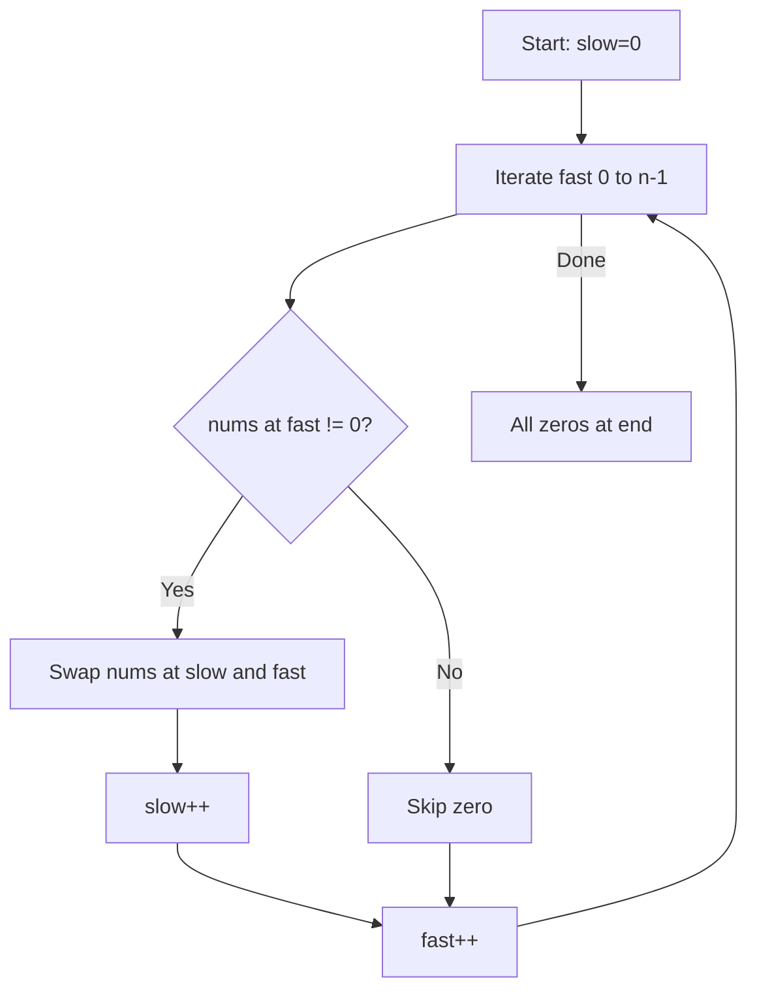

Given an integer array `nums`, move all `0`'s to the end of it while maintaining the relative order of the non-zero elements. You must do this **in-place** without making a copy of the array.

## Examples

**Input:** nums = [0,1,0,3,12]
**Output:** [1,3,12,0,0]

**Input:** nums = [0]
**Output:** [0]


## Brute Force

```js
function moveZeroesBrute(nums) {
  const nonZero = nums.filter(n => n !== 0);
  for (let i = 0; i < nums.length; i++) {
    nums[i] = i < nonZero.length ? nonZero[i] : 0;
  }
}
// Time: O(n) | Space: O(n)
```

### Brute Force Explanation

Collect non-zero elements, write them back, fill rest with zeros. Uses O(n) extra space. Two pointers avoids the extra array.

## Solution

```js
function moveZeroes(nums) {
  let slow = 0;

  for (let fast = 0; fast < nums.length; fast++) {
    if (nums[fast] !== 0) {
      [nums[slow], nums[fast]] = [nums[fast], nums[slow]];
      slow++;
    }
  }
}
```

## Explanation

APPROACH: Same-Direction Two Pointers with Swap

Slow = boundary of non-zero section. Fast scans for non-zero elements to swap in.

```
nums = [0, 1, 0, 3, 12]
        S  F

fast=0: nums[0]=0 → skip
fast=1: nums[1]=1 ≠ 0 → swap(0,1) → [1,0,0,3,12], slow=1
fast=2: nums[2]=0 → skip
fast=3: nums[3]=3 ≠ 0 → swap(1,3) → [1,3,0,0,12], slow=2
fast=4: nums[4]=12 ≠ 0 → swap(2,4) → [1,3,12,0,0], slow=3

Result: [1, 3, 12, 0, 0] ✓
```

WHY THIS WORKS:
- Slow pointer maintains the boundary: everything before slow is non-zero and in order
- Swapping preserves relative order of non-zero elements
- Zeros naturally accumulate at the end
- Single pass → O(n), in-place → O(1)

## Diagram



## TestConfig
```json
{
  "functionName": "moveZeroes",
  "testCases": [
    {
      "args": [[0,1,0,3,12]],
      "expected": undefined,
      "mutatesInput": true,
      "expectedMutation": [[1,3,12,0,0]]
    },
    {
      "args": [[0]],
      "expected": undefined,
      "mutatesInput": true,
      "expectedMutation": [[0]]
    },
    {
      "args": [[1,0,1]],
      "expected": undefined,
      "mutatesInput": true,
      "expectedMutation": [[1,1,0]],
      "isHidden": true
    },
    {
      "args": [[0,0,0,1]],
      "expected": undefined,
      "mutatesInput": true,
      "expectedMutation": [[1,0,0,0]],
      "isHidden": true
    },
    {
      "args": [[1,2,3]],
      "expected": undefined,
      "mutatesInput": true,
      "expectedMutation": [[1,2,3]],
      "isHidden": true
    },
    {
      "args": [[0,0,0]],
      "expected": undefined,
      "mutatesInput": true,
      "expectedMutation": [[0,0,0]],
      "isHidden": true
    }
  ]
}
```
