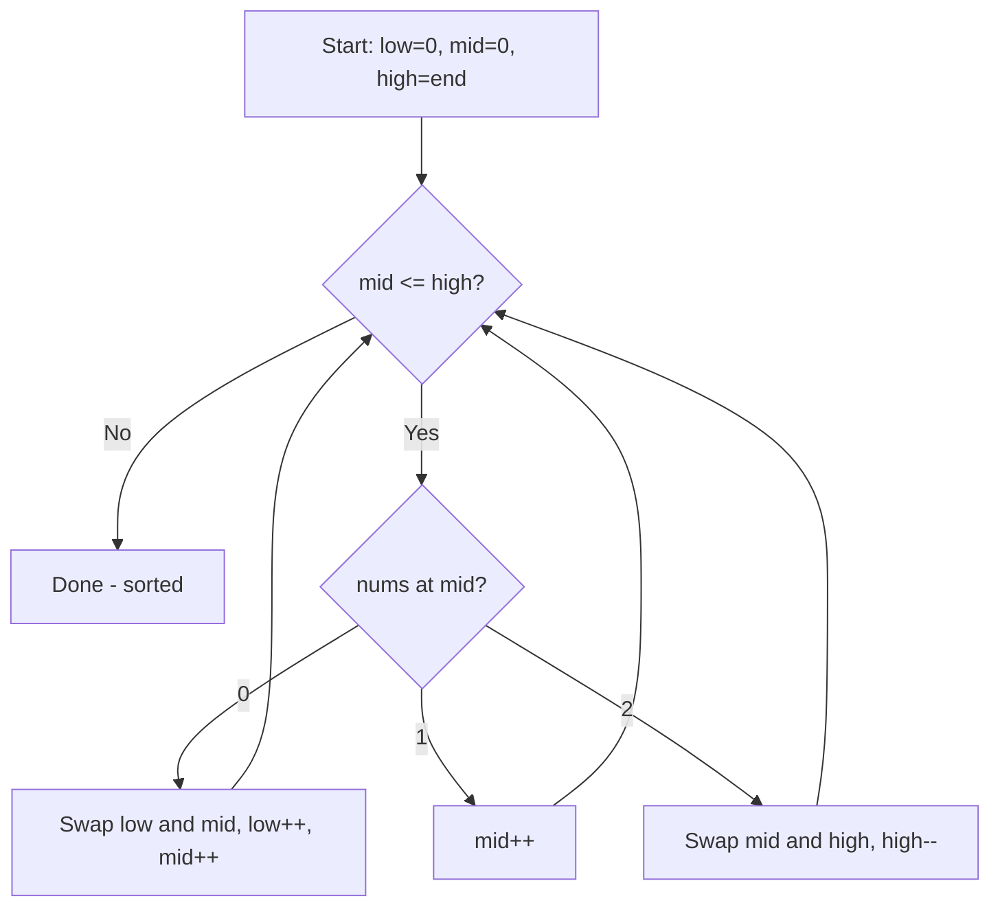

Given an array `nums` with `n` objects colored red (0), white (1), or blue (2), sort them **in-place** so that objects of the same color are adjacent, with the colors in the order red, white, and blue.

You must solve this problem without using the library's sort function. Do it in one pass.

## Examples

**Input:** nums = [2,0,2,1,1,0]
**Output:** [0,0,1,1,2,2]

**Input:** nums = [2,0,1]
**Output:** [0,1,2]


## Brute Force

```js
function sortColorsBrute(nums) {
  let count = [0, 0, 0];
  for (const n of nums) count[n]++;
  let i = 0;
  for (let c = 0; c < 3; c++) {
    while (count[c]-- > 0) nums[i++] = c;
  }
}
// Time: O(n) | Space: O(1) — but two passes
```

### Brute Force Explanation

Count occurrences then overwrite. O(n) but requires two passes. Dutch National Flag does it in one pass.

## Solution

```js
function sortColors(nums) {
  let low = 0;
  let mid = 0;
  let high = nums.length - 1;

  while (mid <= high) {
    if (nums[mid] === 0) {
      [nums[low], nums[mid]] = [nums[mid], nums[low]];
      low++;
      mid++;
    } else if (nums[mid] === 2) {
      [nums[mid], nums[high]] = [nums[high], nums[mid]];
      high--;
      // don't advance mid — need to check swapped value
    } else {
      mid++;
    }
  }
}
```

## Explanation

APPROACH: Dutch National Flag (Three Pointers)

Three regions: [0..low) = 0s, [low..mid) = 1s, (high..end] = 2s. Mid scans and places each element.

```
nums = [2, 0, 2, 1, 1, 0]
        L
        M              H

mid=0: nums[0]=2 → swap with high → [0,0,2,1,1,2] H=4
  wait: [0,0,2,1,1,2] → actually swap(mid,high): [0,0,2,1,1,2]

Let me re-trace:
[2, 0, 2, 1, 1, 0]  L=0, M=0, H=5

M=0: val=2 → swap(M,H) → [0, 0, 2, 1, 1, 2]  H=4
M=0: val=0 → swap(L,M) → [0, 0, 2, 1, 1, 2]  L=1, M=1
M=1: val=0 → swap(L,M) → [0, 0, 2, 1, 1, 2]  L=2, M=2
M=2: val=2 → swap(M,H) → [0, 0, 1, 1, 2, 2]  H=3
M=2: val=1 → mid++  M=3
M=3: val=1 → mid++  M=4
M=4 > H=3 → DONE

Result: [0, 0, 1, 1, 2, 2] ✓
```

WHY THIS WORKS:
- Low tracks where next 0 should go (left boundary of 1s)
- High tracks where next 2 should go (right boundary of 1s)
- Mid scans: 0s go left, 2s go right, 1s stay
- Don't advance mid after swapping with high (new value needs checking)
- Single pass → O(n), in-place → O(1)

## Diagram



## TestConfig
```json
{
  "functionName": "sortColors",
  "testCases": [
    {
      "args": [[2,0,2,1,1,0]],
      "expected": undefined,
      "mutatesInput": true,
      "expectedMutation": [[0,0,1,1,2,2]]
    },
    {
      "args": [[2,0,1]],
      "expected": undefined,
      "mutatesInput": true,
      "expectedMutation": [[0,1,2]]
    },
    {
      "args": [[0]],
      "expected": undefined,
      "mutatesInput": true,
      "expectedMutation": [[0]],
      "isHidden": true
    },
    {
      "args": [[1,0]],
      "expected": undefined,
      "mutatesInput": true,
      "expectedMutation": [[0,1]],
      "isHidden": true
    },
    {
      "args": [[2,2,2,0,0,0]],
      "expected": undefined,
      "mutatesInput": true,
      "expectedMutation": [[0,0,0,2,2,2]],
      "isHidden": true
    },
    {
      "args": [[0,1,2,0,1,2]],
      "expected": undefined,
      "mutatesInput": true,
      "expectedMutation": [[0,0,1,1,2,2]],
      "isHidden": true
    },
    {
      "args": [[1,1,1]],
      "expected": undefined,
      "mutatesInput": true,
      "expectedMutation": [[1,1,1]],
      "isHidden": true
    }
  ]
}
```
