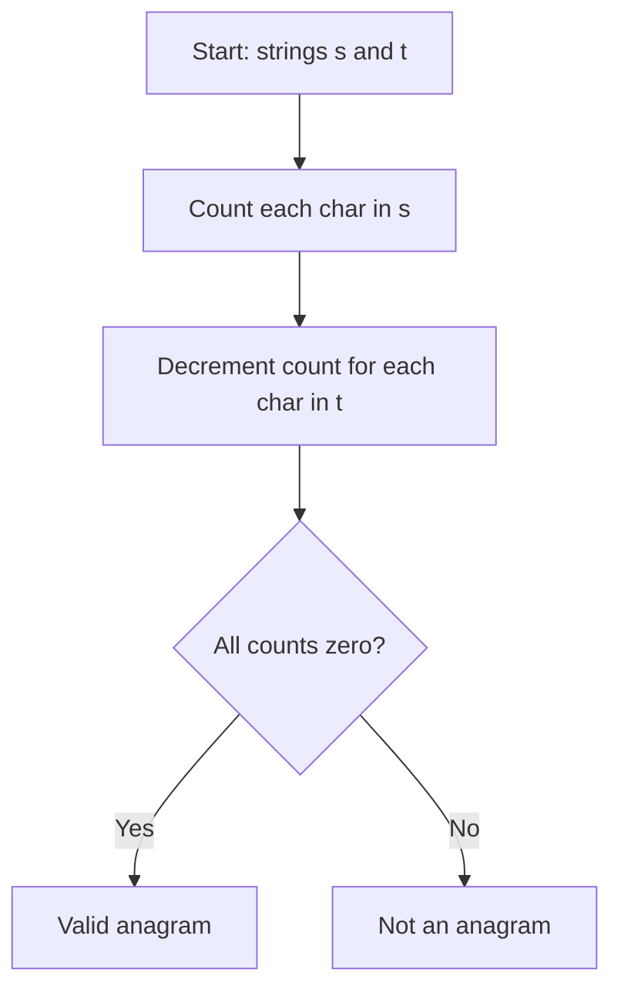

Given two strings `s` and `t`, return `true` if `t` is an anagram of `s`, and `false` otherwise. An anagram uses all the original letters exactly once.

## Examples

**Input:** s = "anagram", t = "nagaram"
**Output:** true
**Explanation:** Both strings contain the same letters (a:3, n:1, g:1, r:1, m:1), just in different order.

**Input:** s = "rat", t = "car"
**Output:** false
**Explanation:** The strings have different letters: "rat" has a 't' while "car" has a 'c'.


## Brute Force

```js
function isAnagramBrute(s, t) {
  return s.split('').sort().join('') === t.split('').sort().join('');
}
```

### Brute Force Explanation

The brute force sorts both strings and compares them, taking O(n log n) time and O(n) space for the sorted copies. The frequency counting approach runs in O(n) time with O(1) space (at most 26 character keys).

## Solution

```js
function isAnagram(s, t) {
  if (s.length !== t.length) return false;
  const count = new Map();
  for (let i = 0; i < s.length; i++) {
    count.set(s[i], (count.get(s[i]) || 0) + 1);
    count.set(t[i], (count.get(t[i]) || 0) - 1);
  }
  for (const val of count.values()) {
    if (val !== 0) return false;
  }
  return true;
}
```

## Explanation

APPROACH: Character Frequency Counting

Increment counts for characters in s, decrement for characters in t. If both strings
are anagrams, every count will be exactly zero at the end.

WALKTHROUGH with s = "anagram", t = "nagaram":

```
i   s[i]   t[i]   count after operation
─   ────   ────   ──────────────────────────────────
0   'a'    'n'    {a:+1, n:-1}
1   'n'    'a'    {a:0, n:0}
2   'a'    'g'    {a:+1, g:-1}
3   'g'    'a'    {a:0, g:0}
4   'r'    'r'    {r:0}
5   'a'    'a'    {a:0}
6   'm'    'm'    {m:0}

All values are 0 → return true
```

```
Non-anagram example: s = "rat", t = "car"
Final count: {r:0, a:0, t:+1, c:-1}
t:+1 is not 0 → return false
```

WHY THIS WORKS:
- Each character in s adds +1, each in t adds -1
- If they are anagrams, every character appears equally in both → all counts = 0
- Single pass through both strings simultaneously gives O(n) time


## Diagram



## TestConfig
```json
{
  "functionName": "isAnagram",
  "testCases": [
    {
      "args": [
        "anagram",
        "nagaram"
      ],
      "expected": true
    },
    {
      "args": [
        "rat",
        "car"
      ],
      "expected": false
    },
    {
      "args": [
        "a",
        "a"
      ],
      "expected": true
    },
    {
      "args": [
        "",
        ""
      ],
      "expected": true,
      "isHidden": true
    },
    {
      "args": [
        "ab",
        "ba"
      ],
      "expected": true,
      "isHidden": true
    },
    {
      "args": [
        "ab",
        "a"
      ],
      "expected": false,
      "isHidden": true
    },
    {
      "args": [
        "listen",
        "silent"
      ],
      "expected": true,
      "isHidden": true
    },
    {
      "args": [
        "hello",
        "world"
      ],
      "expected": false,
      "isHidden": true
    },
    {
      "args": [
        "aab",
        "aba"
      ],
      "expected": true,
      "isHidden": true
    },
    {
      "args": [
        "aacc",
        "ccac"
      ],
      "expected": false,
      "isHidden": true
    }
  ]
}
```
