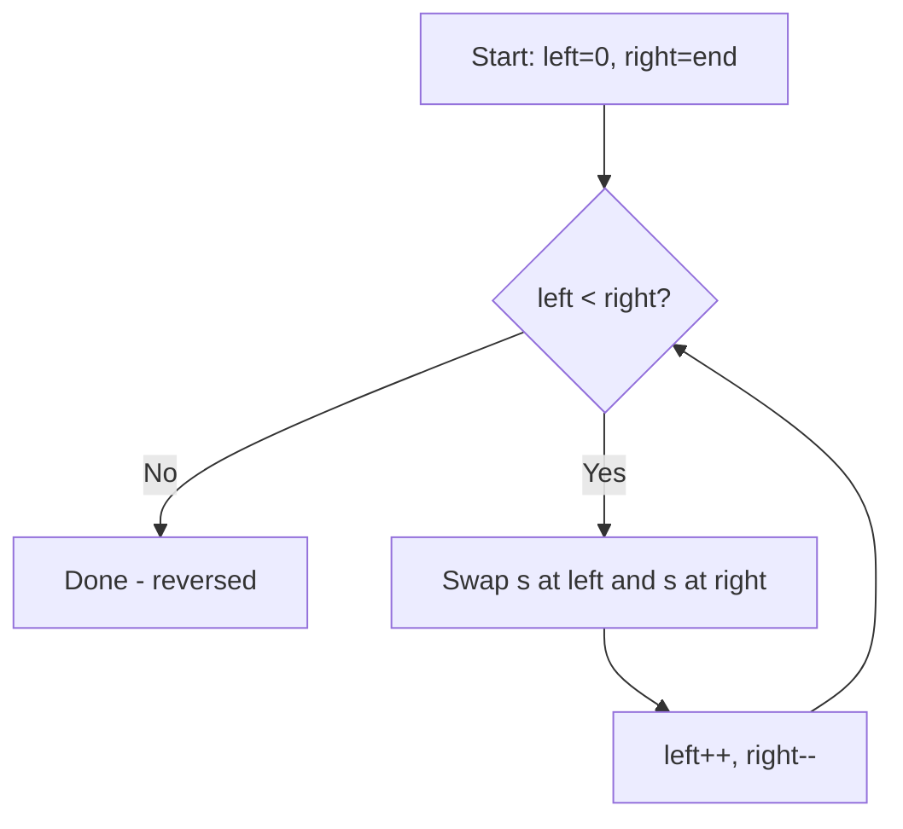

Write a function that reverses a string. The input string is given as an array of characters `s`. You must do this by modifying the input array **in-place** with O(1) extra memory.

## Examples

**Input:** s = ["h","e","l","l","o"]
**Output:** ["o","l","l","e","h"]

**Input:** s = ["H","a","n","n","a","h"]
**Output:** ["h","a","n","n","a","H"]


## Brute Force

```js
function reverseStringBrute(s) {
  const reversed = [...s].reverse();
  for (let i = 0; i < s.length; i++) {
    s[i] = reversed[i];
  }
}
// Time: O(n) | Space: O(n)
```

### Brute Force Explanation

Copy and reverse, then write back. Uses O(n) extra space. Two pointers does it in-place.

## Solution

```js
function reverseString(s) {
  let left = 0;
  let right = s.length - 1;

  while (left < right) {
    [s[left], s[right]] = [s[right], s[left]];
    left++;
    right--;
  }
}
```

## Explanation

APPROACH: Converging Two Pointers with Swap

Left and right converge to the middle, swapping at each step.

```
s = ['h', 'e', 'l', 'l', 'o']
      L                   R

Step 1: swap(L,R) → ['o', 'e', 'l', 'l', 'h']  L=1, R=3
Step 2: swap(L,R) → ['o', 'l', 'l', 'e', 'h']  L=2, R=2
Step 3: L >= R → DONE

Result: ['o', 'l', 'l', 'e', 'h'] ✓
```

WHY THIS WORKS:
- Swapping mirror positions from both ends reverses the array
- Each pair is swapped exactly once
- Pointers meet in the middle → n/2 swaps → O(n) time, O(1) space

## Diagram



## TestConfig
```json
{
  "functionName": "reverseString",
  "testCases": [
    {
      "args": [["h","e","l","l","o"]],
      "expected": undefined,
      "mutatesInput": true,
      "expectedMutation": [["o","l","l","e","h"]]
    },
    {
      "args": [["H","a","n","n","a","h"]],
      "expected": undefined,
      "mutatesInput": true,
      "expectedMutation": [["h","a","n","n","a","H"]]
    },
    {
      "args": [["a"]],
      "expected": undefined,
      "mutatesInput": true,
      "expectedMutation": [["a"]],
      "isHidden": true
    },
    {
      "args": [["a","b"]],
      "expected": undefined,
      "mutatesInput": true,
      "expectedMutation": [["b","a"]],
      "isHidden": true
    },
    {
      "args": [["A","B","C","D","E"]],
      "expected": undefined,
      "mutatesInput": true,
      "expectedMutation": [["E","D","C","B","A"]],
      "isHidden": true
    },
    {
      "args": [["a","a","a"]],
      "expected": undefined,
      "mutatesInput": true,
      "expectedMutation": [["a","a","a"]],
      "isHidden": true
    }
  ]
}
```
