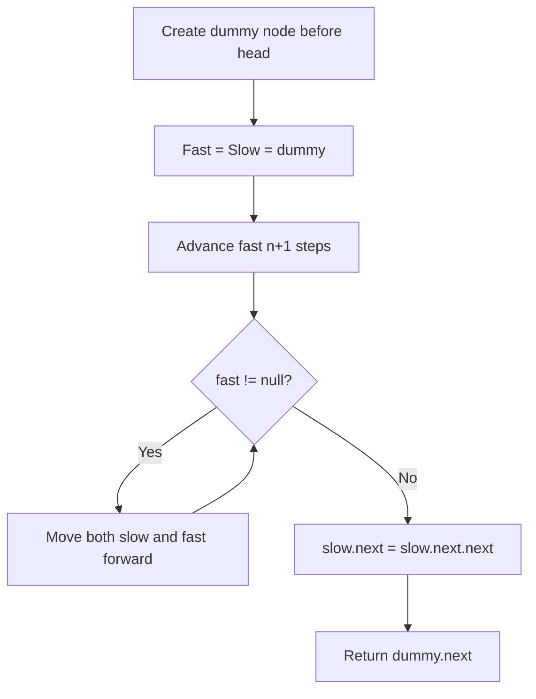

Given the `head` of a linked list, remove the `n`th node from the end of the list and return its head. Do it in one pass.

## Examples

**Input:** head = [1,2,3,4,5], n = 2
**Output:** [1,2,3,5]
**Explanation:** Remove the 2nd node from end (node 4).

**Input:** head = [1], n = 1
**Output:** []
**Explanation:** Remove the only node.

**Input:** head = [1,2], n = 1
**Output:** [1]
**Explanation:** Remove the last node.


## Brute Force

```js
function removeNthFromEndBrute(head, n) {
  // First pass: count length
  let length = 0;
  let curr = head;
  while (curr) { length++; curr = curr.next; }

  // Edge case: remove head
  if (n === length) return head.next;

  // Second pass: find (length - n - 1)th node
  curr = head;
  for (let i = 0; i < length - n - 1; i++) {
    curr = curr.next;
  }
  curr.next = curr.next.next;
  return head;
}
// Time: O(n) | Space: O(1) — but two passes
```

### Brute Force Explanation

Two passes: count length, then find the target. The two-pointer approach does it in one pass.

## Solution

```js
function removeNthFromEnd(head, n) {
  const dummy = { val: 0, next: head };
  let fast = dummy;
  let slow = dummy;

  // Advance fast n+1 steps ahead
  for (let i = 0; i <= n; i++) {
    fast = fast.next;
  }

  // Move both until fast reaches end
  while (fast !== null) {
    slow = slow.next;
    fast = fast.next;
  }

  // Skip the target node
  slow.next = slow.next.next;

  return dummy.next;
}
```

## Explanation

APPROACH: Two Pointers with N-Gap

Create n+1 gap between fast and slow. When fast reaches null, slow is right before the target.

```
head = [1,2,3,4,5], n = 2

dummy → 1 → 2 → 3 → 4 → 5 → null
  S
  F

Step 1: advance fast n+1=3 steps
dummy → 1 → 2 → 3 → 4 → 5 → null
  S              F

Step 2: move both until fast=null
dummy → 1 → 2 → 3 → 4 → 5 → null
         S              F

dummy → 1 → 2 → 3 → 4 → 5 → null
              S              F

dummy → 1 → 2 → 3 → 4 → 5 → null
                   S              F (null)

Step 3: slow.next = slow.next.next
  3.next = 3.next.next = 5
  → [1, 2, 3, 5] ✓
```

WHY THIS WORKS:
- The dummy node handles edge case of removing the head
- N+1 gap means when fast=null, slow is one before the target
- Single pass after initial setup → O(n)

## Diagram



## TestConfig
```json
{
  "functionName": "removeNthFromEnd",
  "testCases": [
    {
      "args": [[1,2,3,4,5], 2],
      "expected": [1,2,3,5],
      "inputType": "linkedList"
    },
    {
      "args": [[1], 1],
      "expected": [],
      "inputType": "linkedList"
    },
    {
      "args": [[1,2], 1],
      "expected": [1],
      "inputType": "linkedList"
    },
    {
      "args": [[1,2], 2],
      "expected": [2],
      "inputType": "linkedList",
      "isHidden": true
    },
    {
      "args": [[1,2,3], 3],
      "expected": [2,3],
      "inputType": "linkedList",
      "isHidden": true
    },
    {
      "args": [[1,2,3], 1],
      "expected": [1,2],
      "inputType": "linkedList",
      "isHidden": true
    },
    {
      "args": [[1,2,3,4,5,6,7], 4],
      "expected": [1,2,3,5,6,7],
      "inputType": "linkedList",
      "isHidden": true
    }
  ]
}
```
