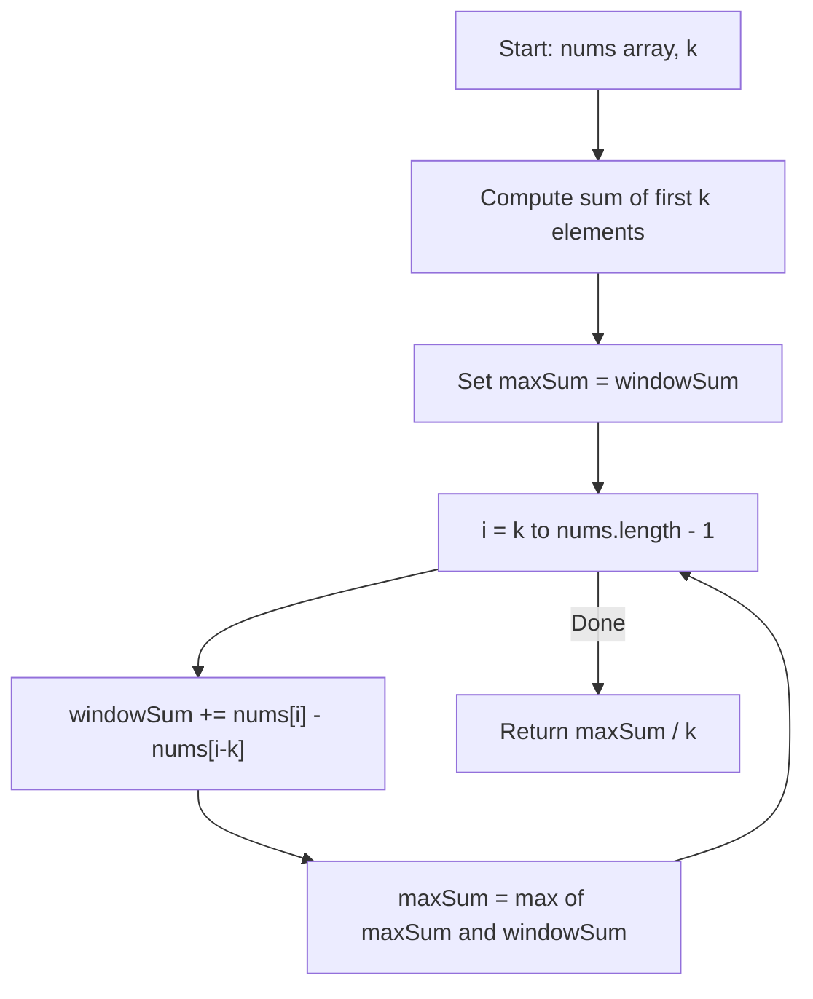

You are given an integer array `nums` consisting of `n` elements, and an integer `k`. Find a contiguous subarray whose length is equal to `k` that has the maximum average value and return this value.

## Examples

**Input:** nums = [1,12,-5,-6,50,3], k = 4
**Output:** 12.75
**Explanation:** Maximum average is (12 + (-5) + (-6) + 50) / 4 = 51 / 4 = 12.75

**Input:** nums = [5], k = 1
**Output:** 5.0
**Explanation:** Only one element, so the average is 5.0.

**Input:** nums = [0,4,0,3,2], k = 1
**Output:** 4.0
**Explanation:** With k=1, the maximum single element is 4.

## Brute Force

```js
function findMaxAverageBrute(nums, k) {
  let maxSum = -Infinity;
  for (let i = 0; i <= nums.length - k; i++) {
    let sum = 0;
    for (let j = i; j < i + k; j++) {
      sum += nums[j];
    }
    maxSum = Math.max(maxSum, sum);
  }
  return maxSum / k;
}
// Time: O(n * k) | Space: O(1)
```

### Brute Force Explanation

For every possible starting index, compute the sum of the next `k` elements. Track the maximum sum and divide by `k` at the end. This recalculates overlapping portions repeatedly.

## Solution

```js
function findMaxAverage(nums, k) {
  let windowSum = 0;

  for (let i = 0; i < k; i++) {
    windowSum += nums[i];
  }

  let maxSum = windowSum;

  for (let i = k; i < nums.length; i++) {
    windowSum += nums[i] - nums[i - k];
    maxSum = Math.max(maxSum, windowSum);
  }

  return maxSum / k;
}
```

## Explanation

APPROACH: Fixed-Size Sliding Window

Compute the sum of the first `k` elements. Then slide the window one position at a time: add the new element entering the window and subtract the element leaving it.

```
nums = [1, 12, -5, -6, 50, 3],  k = 4

Step 1: Initial window sum
  [1, 12, -5, -6] 50, 3
   sum = 1 + 12 + (-5) + (-6) = 2
   maxSum = 2

Step 2: Slide right (add 50, remove 1)
   1, [12, -5, -6, 50] 3
   sum = 2 + 50 - 1 = 51
   maxSum = 51

Step 3: Slide right (add 3, remove 12)
   1, 12, [-5, -6, 50, 3]
   sum = 51 + 3 - 12 = 42
   maxSum = 51

Answer: 51 / 4 = 12.75
```

```
Index:   0    1    2    3    4    5
Value:   1   12   -5   -6   50    3
        [─────────────────]              sum=2
             [─────────────────]         sum=51  ← max
                  [─────────────────]    sum=42
```

WHY THIS WORKS:
- The window size is fixed at `k`, so we only need to track the running sum
- Each slide operation is O(1): one addition and one subtraction
- We only need one pass through the array after the initial window

## Diagram



## TestConfig
```json
{
  "functionName": "findMaxAverage",
  "testCases": [
    {
      "args": [
        [1, 12, -5, -6, 50, 3],
        4
      ],
      "expected": 12.75
    },
    {
      "args": [
        [5],
        1
      ],
      "expected": 5.0
    },
    {
      "args": [
        [0, 4, 0, 3, 2],
        1
      ],
      "expected": 4.0
    },
    {
      "args": [
        [7, 4, 5, 8, 8, 3, 9, 8, 7, 6],
        7
      ],
      "expected": 6.571428571428571,
      "isHidden": true
    },
    {
      "args": [
        [-1],
        1
      ],
      "expected": -1.0,
      "isHidden": true
    },
    {
      "args": [
        [1, 2, 3, 4, 5],
        5
      ],
      "expected": 3.0,
      "isHidden": true
    },
    {
      "args": [
        [4, 0, 4, 3, 3],
        2
      ],
      "expected": 4.0,
      "isHidden": true
    },
    {
      "args": [
        [-6, -2, -3, -1, -4],
        3
      ],
      "expected": -2.0,
      "isHidden": true
    }
  ]
}
```
