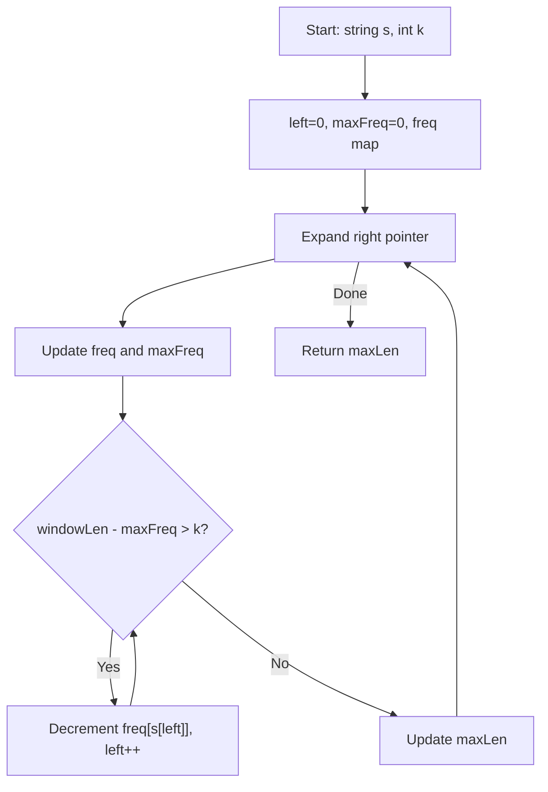

You are given a string `s` and an integer `k`. You can choose any character of the string and change it to any other uppercase English letter. You can perform this operation at most `k` times. Return the length of the longest substring containing the same letter you can get after performing the above operations.

## Examples

**Input:** s = "ABAB", k = 2
**Output:** 4
**Explanation:** Replace the two 'A's with 'B's or vice versa. The entire string becomes uniform.

**Input:** s = "AABABBA", k = 1
**Output:** 4
**Explanation:** Replace the one 'B' at index 3 to get "AABBBBA". The substring "BBBB" has length 4. Alternatively "AAAA" by replacing index 2.

**Input:** s = "ABCDE", k = 1
**Output:** 2
**Explanation:** Replace any one character to create a pair of identical adjacent characters.

## Brute Force

```js
function characterReplacementBrute(s, k) {
  let maxLen = 0;
  for (let i = 0; i < s.length; i++) {
    for (let j = i; j < s.length; j++) {
      const freq = {};
      let maxFreq = 0;
      for (let x = i; x <= j; x++) {
        freq[s[x]] = (freq[s[x]] || 0) + 1;
        maxFreq = Math.max(maxFreq, freq[s[x]]);
      }
      if ((j - i + 1) - maxFreq <= k) {
        maxLen = Math.max(maxLen, j - i + 1);
      }
    }
  }
  return maxLen;
}
// Time: O(n^3) | Space: O(26) => O(1)
```

### Brute Force Explanation

Check every substring. For each, count character frequencies and check if the number of characters that need replacing (window length minus most frequent char count) is at most `k`.

## Solution

```js
function characterReplacement(s, k) {
  const freq = {};
  let left = 0;
  let maxFreq = 0;
  let maxLen = 0;

  for (let right = 0; right < s.length; right++) {
    freq[s[right]] = (freq[s[right]] || 0) + 1;
    maxFreq = Math.max(maxFreq, freq[s[right]]);

    while ((right - left + 1) - maxFreq > k) {
      freq[s[left]]--;
      left++;
    }

    maxLen = Math.max(maxLen, right - left + 1);
  }

  return maxLen;
}
```

## Explanation

APPROACH: Variable Sliding Window with Frequency Count

Expand the window by moving `right`. Track the frequency of each character and the maximum frequency in the window. If the number of characters to replace (`windowLen - maxFreq`) exceeds `k`, shrink from the left.

```
s = "AABABBA", k = 1

Step   L   R   char   freq             maxFreq   replacements   action        len
────   ─   ─   ────   ──────────────   ───────   ────────────   ──────        ───
 1     0   0   'A'    {A:1}            1         0              valid         1
 2     0   1   'A'    {A:2}            2         0              valid         2
 3     0   2   'B'    {A:2,B:1}        2         1              valid (=k)    3
 4     0   3   'A'    {A:3,B:1}        3         1              valid (=k)    4 ← max
 5     0   4   'B'    {A:3,B:2}        3         2              shrink!       -
       1   4          {A:2,B:2}        3         2              shrink!       -
       2   4          {A:1,B:2}        3         1              valid         3
 6     2   5   'B'    {A:1,B:3}        3         1              valid (=k)    4 ← max
 7     2   6   'A'    {A:2,B:3}        3         2              shrink!       -
       3   6          {A:2,B:2}        3         1              valid         4 ← max

Answer: 4
```

```
 A  A  B  A  B  B  A
[────────────]           "AABA" len=4, replace 1 B
       [────────────]    "BABB" len=4, replace 1 A
```

WHY THIS WORKS:
- `maxFreq` tracks the count of the most frequent character in the window
- Characters to replace = `windowLen - maxFreq`
- If replacements needed exceeds `k`, the window is invalid so we shrink
- We never need to decrease `maxFreq` when shrinking because a smaller window with a smaller `maxFreq` cannot beat the current best

## Diagram



## TestConfig
```json
{
  "functionName": "characterReplacement",
  "testCases": [
    {
      "args": ["ABAB", 2],
      "expected": 4
    },
    {
      "args": ["AABABBA", 1],
      "expected": 4
    },
    {
      "args": ["ABCDE", 1],
      "expected": 2
    },
    {
      "args": ["AAAA", 0],
      "expected": 4,
      "isHidden": true
    },
    {
      "args": ["ABBB", 2],
      "expected": 4,
      "isHidden": true
    },
    {
      "args": ["A", 0],
      "expected": 1,
      "isHidden": true
    },
    {
      "args": ["ABCD", 3],
      "expected": 4,
      "isHidden": true
    },
    {
      "args": ["AABCABBB", 2],
      "expected": 6,
      "isHidden": true
    },
    {
      "args": ["BAAAB", 2],
      "expected": 5,
      "isHidden": true
    }
  ]
}
```
