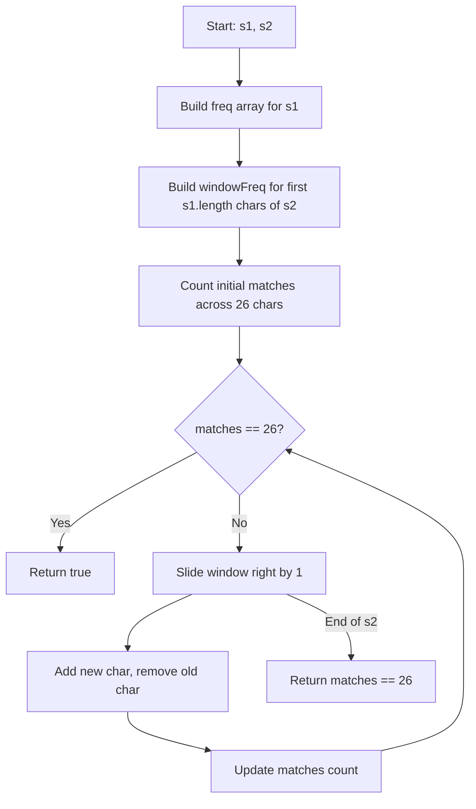

Given two strings `s1` and `s2`, return `true` if `s2` contains a permutation of `s1`, or `false` otherwise. In other words, return `true` if one of `s1`'s permutations is a substring of `s2`.

## Examples

**Input:** s1 = "ab", s2 = "eidbaooo"
**Output:** true
**Explanation:** s2 contains "ba" which is a permutation of "ab".

**Input:** s1 = "ab", s2 = "eidboaoo"
**Output:** false
**Explanation:** No substring of s2 is a permutation of s1.

**Input:** s1 = "adc", s2 = "dcda"
**Output:** true
**Explanation:** s2 contains "cda" starting at index 1 which is a permutation of "adc".

## Brute Force

```js
function checkInclusionBrute(s1, s2) {
  const sorted1 = s1.split('').sort().join('');
  for (let i = 0; i <= s2.length - s1.length; i++) {
    const sub = s2.substring(i, i + s1.length);
    if (sub.split('').sort().join('') === sorted1) {
      return true;
    }
  }
  return false;
}
// Time: O(n * m log m) where n = s2.length, m = s1.length | Space: O(m)
```

### Brute Force Explanation

For each window of length `s1.length` in `s2`, sort the characters and compare with sorted `s1`. Sorting each window is expensive.

## Solution

```js
function checkInclusion(s1, s2) {
  if (s1.length > s2.length) return false;

  const freq = new Array(26).fill(0);
  const windowFreq = new Array(26).fill(0);
  const aCode = 'a'.charCodeAt(0);

  for (let i = 0; i < s1.length; i++) {
    freq[s1.charCodeAt(i) - aCode]++;
    windowFreq[s2.charCodeAt(i) - aCode]++;
  }

  let matches = 0;
  for (let i = 0; i < 26; i++) {
    if (freq[i] === windowFreq[i]) matches++;
  }

  for (let i = s1.length; i < s2.length; i++) {
    if (matches === 26) return true;

    const addIdx = s2.charCodeAt(i) - aCode;
    windowFreq[addIdx]++;
    if (windowFreq[addIdx] === freq[addIdx]) matches++;
    else if (windowFreq[addIdx] === freq[addIdx] + 1) matches--;

    const removeIdx = s2.charCodeAt(i - s1.length) - aCode;
    windowFreq[removeIdx]--;
    if (windowFreq[removeIdx] === freq[removeIdx]) matches++;
    else if (windowFreq[removeIdx] === freq[removeIdx] - 1) matches--;
  }

  return matches === 26;
}
```

## Explanation

APPROACH: Fixed-Size Sliding Window with Frequency Matching

Use two frequency arrays of size 26 (one for `s1`, one for the current window). Track how many of the 26 character slots have matching frequencies. When all 26 match, return true.

```
s1 = "ab", s2 = "eidbaooo"

Initial freq for s1:  a:1, b:1
Window size = 2

Step   Window   windowFreq   matches(of 26)   Result
────   ──────   ──────────   ──────────────   ──────
 1     "ei"     e:1,i:1      24 (a,b miss)    no
 2     "id"     i:1,d:1      24               no
 3     "db"     d:1,b:1      25 (a misses)    no
 4     "ba"     b:1,a:1      26               YES!

Answer: true (window "ba" is permutation of "ab")
```

```
 e  i  d  b  a  o  o  o
[────]                      "ei" → no match
    [────]                  "id" → no match
       [────]               "db" → no match
          [────]            "ba" → MATCH!
```

WHY THIS WORKS:
- A permutation has identical character frequencies as the original
- Fixed window of size `s1.length` slides across `s2`
- Tracking `matches` count avoids comparing all 26 entries each step
- Each slide is O(1): update two characters and their match status

## Diagram



## TestConfig
```json
{
  "functionName": "checkInclusion",
  "testCases": [
    {
      "args": ["ab", "eidbaooo"],
      "expected": true
    },
    {
      "args": ["ab", "eidboaoo"],
      "expected": false
    },
    {
      "args": ["adc", "dcda"],
      "expected": true
    },
    {
      "args": ["a", "a"],
      "expected": true,
      "isHidden": true
    },
    {
      "args": ["abc", "ab"],
      "expected": false,
      "isHidden": true
    },
    {
      "args": ["ab", "ab"],
      "expected": true,
      "isHidden": true
    },
    {
      "args": ["hello", "ooolleoooleh"],
      "expected": false,
      "isHidden": true
    },
    {
      "args": ["aab", "cccbaab"],
      "expected": true,
      "isHidden": true
    },
    {
      "args": ["abc", "ccccbbbbaaaa"],
      "expected": false,
      "isHidden": true
    }
  ]
}
```
