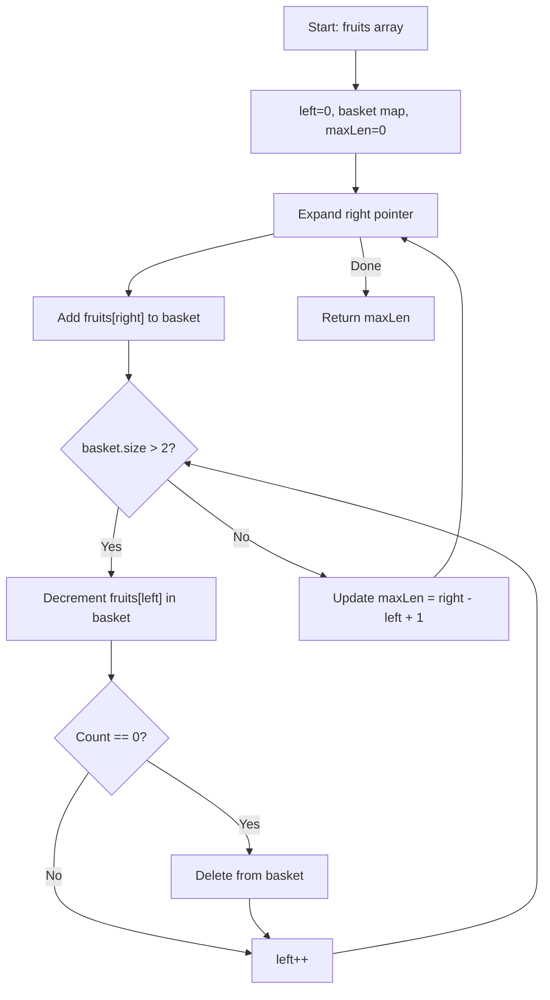

You are visiting a farm that has a single row of fruit trees. Each tree produces one type of fruit represented by an integer. You have two baskets, and each basket can only hold one type of fruit (unlimited quantity). Starting from any tree, you pick exactly one fruit from every tree moving right. You stop when you encounter a third type of fruit. Return the maximum number of fruits you can collect.

In other words, find the length of the longest subarray with at most 2 distinct values.

## Examples

**Input:** fruits = [1,2,1]
**Output:** 3
**Explanation:** We can pick from all three trees: [1,2,1].

**Input:** fruits = [0,1,2,2]
**Output:** 3
**Explanation:** We can pick from trees [1,2,2] starting at index 1.

**Input:** fruits = [1,2,3,2,2]
**Output:** 4
**Explanation:** We pick from trees [2,3,2,2] starting at index 1.

## Brute Force

```js
function totalFruitBrute(fruits) {
  let maxLen = 0;
  for (let i = 0; i < fruits.length; i++) {
    const types = new Set();
    for (let j = i; j < fruits.length; j++) {
      types.add(fruits[j]);
      if (types.size > 2) break;
      maxLen = Math.max(maxLen, j - i + 1);
    }
  }
  return maxLen;
}
// Time: O(n^2) | Space: O(1)
```

### Brute Force Explanation

For each starting index, extend the subarray until a third distinct fruit type is encountered. Track the maximum valid length.

## Solution

```js
function totalFruit(fruits) {
  const basket = new Map();
  let left = 0;
  let maxLen = 0;

  for (let right = 0; right < fruits.length; right++) {
    basket.set(fruits[right], (basket.get(fruits[right]) || 0) + 1);

    while (basket.size > 2) {
      const leftFruit = fruits[left];
      basket.set(leftFruit, basket.get(leftFruit) - 1);
      if (basket.get(leftFruit) === 0) {
        basket.delete(leftFruit);
      }
      left++;
    }

    maxLen = Math.max(maxLen, right - left + 1);
  }

  return maxLen;
}
```

## Explanation

APPROACH: Variable Sliding Window with At Most 2 Distinct

Expand the window to the right. Use a hash map to count fruit types. When the map has more than 2 keys, shrink from the left until only 2 types remain.

```
fruits = [1, 2, 3, 2, 2]

Step   L   R   fruit   basket           size   action        len
────   ─   ─   ─────   ──────────────   ────   ──────        ───
 1     0   0   1       {1:1}            1      valid         1
 2     0   1   2       {1:1, 2:1}       2      valid         2
 3     0   2   3       {1:1, 2:1, 3:1}  3      shrink!       -
       1   2           {2:1, 3:1}       2      valid         2
 4     1   3   2       {2:2, 3:1}       2      valid         3
 5     1   4   2       {2:3, 3:1}       2      valid         4 ← max

Answer: 4
```

```
 1  2  3  2  2
[────]               types: {1,2} len=2
    [────────────]   types: {2,3} len=4  ← max
```

WHY THIS WORKS:
- The map tracks counts of each fruit type in the current window
- When size exceeds 2, we remove from the left until a type is fully removed
- This guarantees the window always has at most 2 distinct types
- Each element is added and removed at most once, giving O(n) time

## Diagram



## TestConfig
```json
{
  "functionName": "totalFruit",
  "testCases": [
    {
      "args": [[1, 2, 1]],
      "expected": 3
    },
    {
      "args": [[0, 1, 2, 2]],
      "expected": 3
    },
    {
      "args": [[1, 2, 3, 2, 2]],
      "expected": 4
    },
    {
      "args": [[1]],
      "expected": 1,
      "isHidden": true
    },
    {
      "args": [[3, 3, 3, 1, 2, 1, 1, 2, 3, 3, 4]],
      "expected": 5,
      "isHidden": true
    },
    {
      "args": [[1, 1, 1, 1]],
      "expected": 4,
      "isHidden": true
    },
    {
      "args": [[1, 2, 1, 2, 1, 2]],
      "expected": 6,
      "isHidden": true
    },
    {
      "args": [[0, 1, 6, 6, 4, 4, 6]],
      "expected": 5,
      "isHidden": true
    },
    {
      "args": [[5, 4, 5, 4, 3, 2, 1]],
      "expected": 4,
      "isHidden": true
    }
  ]
}
```
