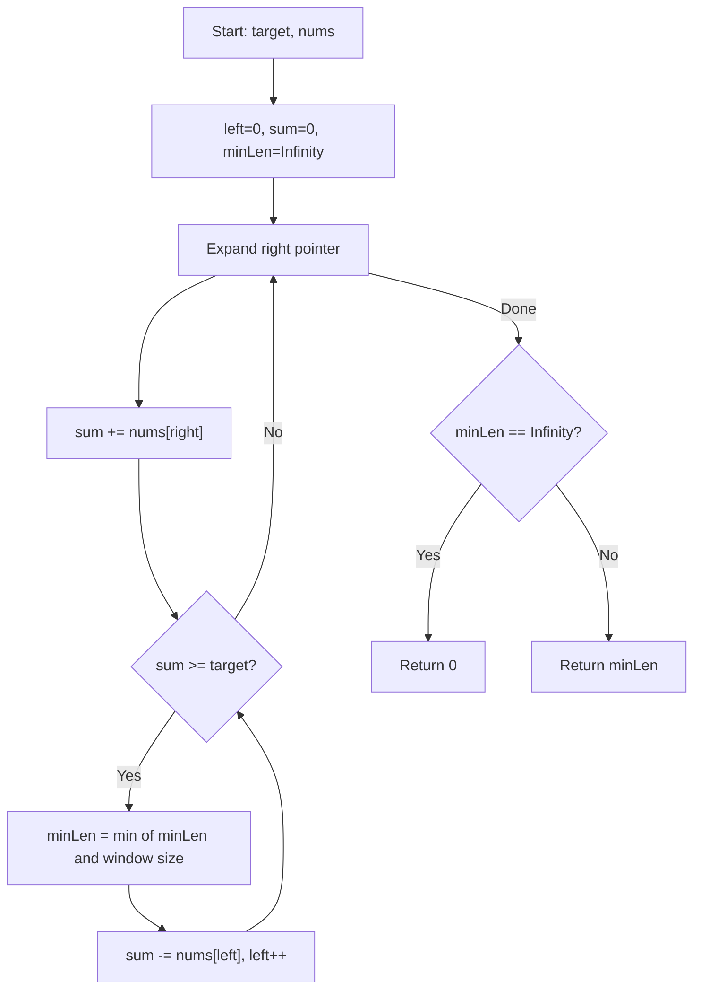

Given an array of positive integers `nums` and a positive integer `target`, return the minimal length of a subarray whose sum is greater than or equal to `target`. If there is no such subarray, return `0` instead.

## Examples

**Input:** target = 7, nums = [2,3,1,2,4,3]
**Output:** 2
**Explanation:** The subarray [4,3] has the minimal length under the problem constraint.

**Input:** target = 4, nums = [1,4,4]
**Output:** 1
**Explanation:** The element 4 alone satisfies sum >= 4.

**Input:** target = 11, nums = [1,1,1,1,1,1,1,1]
**Output:** 0
**Explanation:** No subarray sums to 11 or more.

## Brute Force

```js
function minSubArrayLenBrute(target, nums) {
  let minLen = Infinity;
  for (let i = 0; i < nums.length; i++) {
    let sum = 0;
    for (let j = i; j < nums.length; j++) {
      sum += nums[j];
      if (sum >= target) {
        minLen = Math.min(minLen, j - i + 1);
        break;
      }
    }
  }
  return minLen === Infinity ? 0 : minLen;
}
// Time: O(n^2) | Space: O(1)
```

### Brute Force Explanation

For each starting index, accumulate the sum until it meets the target. Record the length and break early since extending further only increases length.

## Solution

```js
function minSubArrayLen(target, nums) {
  let left = 0;
  let sum = 0;
  let minLen = Infinity;

  for (let right = 0; right < nums.length; right++) {
    sum += nums[right];

    while (sum >= target) {
      minLen = Math.min(minLen, right - left + 1);
      sum -= nums[left];
      left++;
    }
  }

  return minLen === Infinity ? 0 : minLen;
}
```

## Explanation

APPROACH: Variable Sliding Window (Shrinking)

Expand the window by adding elements from the right. Whenever the sum meets or exceeds the target, try shrinking from the left while the condition is still satisfied, updating the minimum length each time.

```
target = 7, nums = [2, 3, 1, 2, 4, 3]

Step   L   R   add   sum   action              minLen
────   ─   ─   ───   ───   ──────              ──────
 1     0   0   2     2     sum<7, expand       Inf
 2     0   1   3     5     sum<7, expand       Inf
 3     0   2   1     6     sum<7, expand       Inf
 4     0   3   2     8     sum>=7              4
       1   3   -2    6     sum<7, stop         4
 5     1   4   4     10    sum>=7              4
       2   4   -3    7     sum>=7              3
       3   4   -1    6     sum<7, stop         3
 6     3   5   3     9     sum>=7              3
       4   5   -2    7     sum>=7              2 ← min
       5   5   -4    3     sum<7, stop         2

Answer: 2 (subarray [4,3])
```

```
 2  3  1  2  4  3
[────────────]        sum=8  len=4
    [─────────]       sum=10 len=4
       [──────]       sum=7  len=3
          [──────]    sum=9  len=3
             [────]   sum=7  len=2  ← min
```

WHY THIS WORKS:
- All numbers are positive, so expanding always increases the sum
- Once sum >= target, we can safely shrink and still look for shorter windows
- The `while` loop shrinks as long as the condition holds, capturing all valid shorter windows
- Each element is visited at most twice (once by right, once by left), so it is O(n)

## Diagram



## TestConfig
```json
{
  "functionName": "minSubArrayLen",
  "testCases": [
    {
      "args": [7, [2, 3, 1, 2, 4, 3]],
      "expected": 2
    },
    {
      "args": [4, [1, 4, 4]],
      "expected": 1
    },
    {
      "args": [11, [1, 1, 1, 1, 1, 1, 1, 1]],
      "expected": 0
    },
    {
      "args": [15, [5, 1, 3, 5, 10, 7, 4, 9, 2, 8]],
      "expected": 2,
      "isHidden": true
    },
    {
      "args": [6, [10, 2, 3]],
      "expected": 1,
      "isHidden": true
    },
    {
      "args": [3, [1, 1]],
      "expected": 0,
      "isHidden": true
    },
    {
      "args": [5, [2, 3, 1, 1, 1, 1, 1]],
      "expected": 2,
      "isHidden": true
    },
    {
      "args": [100, [1, 2, 3, 4, 5]],
      "expected": 0,
      "isHidden": true
    },
    {
      "args": [7, [7]],
      "expected": 1,
      "isHidden": true
    }
  ]
}
```
