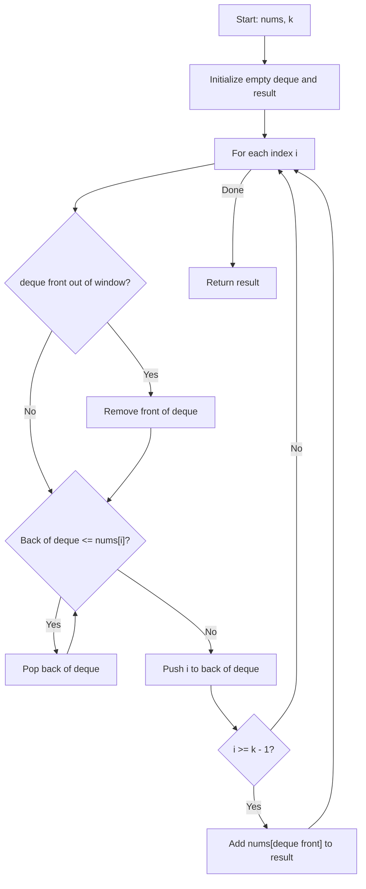

You are given an array of integers `nums` and an integer `k` representing the size of a sliding window which moves from the very left of the array to the very right. You can only see the `k` numbers in the window. Each time the sliding window moves right by one position, return the max element in each window.

## Examples

**Input:** nums = [1,3,-1,-3,5,3,6,7], k = 3
**Output:** [3,3,5,5,6,7]
**Explanation:** Window [1,3,-1] max=3, [3,-1,-3] max=3, [-1,-3,5] max=5, [-3,5,3] max=5, [5,3,6] max=6, [3,6,7] max=7.

**Input:** nums = [1], k = 1
**Output:** [1]
**Explanation:** Single element window.

**Input:** nums = [1,-1], k = 1
**Output:** [1,-1]
**Explanation:** Each element is its own window.

## Brute Force

```js
function maxSlidingWindowBrute(nums, k) {
  const result = [];
  for (let i = 0; i <= nums.length - k; i++) {
    let max = -Infinity;
    for (let j = i; j < i + k; j++) {
      max = Math.max(max, nums[j]);
    }
    result.push(max);
  }
  return result;
}
// Time: O(n * k) | Space: O(n - k + 1) for result
```

### Brute Force Explanation

For each window position, scan all `k` elements to find the maximum. This is straightforward but redundant since adjacent windows share `k-1` elements.

## Solution

```js
function maxSlidingWindow(nums, k) {
  const deque = [];
  const result = [];

  for (let i = 0; i < nums.length; i++) {
    // Remove indices outside the window
    if (deque.length > 0 && deque[0] < i - k + 1) {
      deque.shift();
    }

    // Remove smaller elements from back (they can never be max)
    while (deque.length > 0 && nums[deque[deque.length - 1]] <= nums[i]) {
      deque.pop();
    }

    deque.push(i);

    // Window is fully formed starting at index k-1
    if (i >= k - 1) {
      result.push(nums[deque[0]]);
    }
  }

  return result;
}
```

## Explanation

APPROACH: Sliding Window with Monotonic Deque

Maintain a deque (double-ended queue) of indices in decreasing order of their values. The front always holds the index of the current window's maximum. When sliding, remove out-of-window indices from the front and remove smaller elements from the back before adding the new index.

```
nums = [1, 3, -1, -3, 5, 3, 6, 7],  k = 3

Step   i   nums[i]   deque(indices)   deque(values)   window formed?   result
────   ─   ───────   ──────────────   ─────────────   ──────────────   ──────
 1     0   1         [0]              [1]              no               -
 2     1   3         [1]              [3]              no               -
           (pop 0 since 1<=3)
 3     2   -1        [1, 2]           [3, -1]          yes              [3]
 4     3   -3        [1, 2, 3]        [3, -1, -3]      yes              [3, 3]
 5     4   5         [4]              [5]              yes              [3, 3, 5]
           (pop 3,2,1 since all<=5)
 6     5   3         [4, 5]           [5, 3]           yes              [3, 3, 5, 5]
 7     6   6         [6]              [6]              yes              [3, 3, 5, 5, 6]
           (pop 5,4 since all<=6)
 8     7   7         [7]              [7]              yes              [3, 3, 5, 5, 6, 7]
           (pop 6 since 6<=7)

Answer: [3, 3, 5, 5, 6, 7]
```

```
Deque state visualization (storing indices, showing values):

i=0:  deque: [1]           front=1   (max of partial window)
i=1:  deque: [3]           front=3   (1 removed, 3 is larger)
i=2:  deque: [3, -1]       front=3   → output 3
i=3:  deque: [3, -1, -3]   front=3   → output 3
i=4:  deque: [5]           front=5   → output 5
i=5:  deque: [5, 3]        front=5   → output 5
i=6:  deque: [6]           front=6   → output 6
i=7:  deque: [7]           front=7   → output 7
```

WHY THIS WORKS:
- The deque maintains a decreasing order of values, so the front is always the max
- Elements that are smaller than a newer element can never be the max for any future window, so they are safely removed
- Each element is pushed and popped at most once, giving amortized O(n) time
- Expired indices (outside window) are removed from the front

## Diagram



## TestConfig
```json
{
  "functionName": "maxSlidingWindow",
  "testCases": [
    {
      "args": [[1, 3, -1, -3, 5, 3, 6, 7], 3],
      "expected": [3, 3, 5, 5, 6, 7]
    },
    {
      "args": [[1], 1],
      "expected": [1]
    },
    {
      "args": [[1, -1], 1],
      "expected": [1, -1]
    },
    {
      "args": [[9, 11], 2],
      "expected": [11],
      "isHidden": true
    },
    {
      "args": [[4, -2], 2],
      "expected": [4],
      "isHidden": true
    },
    {
      "args": [[7, 2, 4], 2],
      "expected": [7, 4],
      "isHidden": true
    },
    {
      "args": [[1, 3, 1, 2, 0, 5], 3],
      "expected": [3, 3, 2, 5],
      "isHidden": true
    },
    {
      "args": [[10, 9, 8, 7, 6], 3],
      "expected": [10, 9, 8],
      "isHidden": true
    },
    {
      "args": [[1, 2, 3, 4, 5], 3],
      "expected": [3, 4, 5],
      "isHidden": true
    }
  ]
}
```
