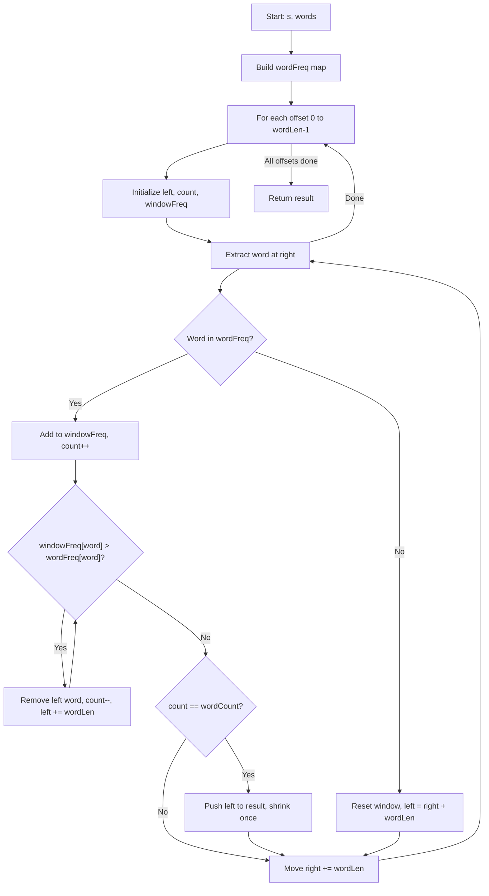

You are given a string `s` and an array of strings `words`. All the strings of `words` are of the same length. A concatenated string is a string that exactly contains all the strings of any permutation of `words` concatenated.

Return an array of the starting indices of all the concatenated substrings in `s`. You can return the answer in any order.

## Examples

**Input:** s = "barfoothefoobarman", words = ["foo","bar"]
**Output:** [0,9]
**Explanation:** "barfoo" starts at index 0. "foobar" starts at index 9.

**Input:** s = "wordgoodgoodgoodbestword", words = ["word","good","best","word"]
**Output:** [8]
**Explanation:** "goodgoodbestword" starts at index 8.

**Input:** s = "barfoofoobarthefoobarman", words = ["bar","foo","the"]
**Output:** [6,9,12]
**Explanation:** "foobarthe" at 6, "barthefoo" at 9, "thefoobar" at 12.

## Brute Force

```js
function findSubstringBrute(s, words) {
  const result = [];
  const wordLen = words[0].length;
  const totalLen = wordLen * words.length;
  const wordCount = {};
  for (const w of words) {
    wordCount[w] = (wordCount[w] || 0) + 1;
  }

  for (let i = 0; i <= s.length - totalLen; i++) {
    const seen = {};
    let j = 0;
    while (j < words.length) {
      const word = s.substring(i + j * wordLen, i + (j + 1) * wordLen);
      if (!wordCount[word]) break;
      seen[word] = (seen[word] || 0) + 1;
      if (seen[word] > wordCount[word]) break;
      j++;
    }
    if (j === words.length) result.push(i);
  }
  return result;
}
// Time: O(n * m * wordLen) | Space: O(m)
```

### Brute Force Explanation

For each starting position, extract consecutive words of the given length and check if they form a valid permutation of the words array using a frequency map. Break early if a word is not in the list or exceeds its expected count.

## Solution

```js
function findSubstring(s, words) {
  if (!s || !words.length) return [];

  const wordLen = words[0].length;
  const wordCount = words.length;
  const totalLen = wordLen * wordCount;
  const result = [];

  const wordFreq = {};
  for (const w of words) {
    wordFreq[w] = (wordFreq[w] || 0) + 1;
  }

  for (let offset = 0; offset < wordLen; offset++) {
    let left = offset;
    let count = 0;
    const windowFreq = {};

    for (let right = offset; right + wordLen <= s.length; right += wordLen) {
      const word = s.substring(right, right + wordLen);

      if (word in wordFreq) {
        windowFreq[word] = (windowFreq[word] || 0) + 1;
        count++;

        while (windowFreq[word] > wordFreq[word]) {
          const leftWord = s.substring(left, left + wordLen);
          windowFreq[leftWord]--;
          count--;
          left += wordLen;
        }

        if (count === wordCount) {
          result.push(left);
          const leftWord = s.substring(left, left + wordLen);
          windowFreq[leftWord]--;
          count--;
          left += wordLen;
        }
      } else {
        // Reset window — word not in dictionary
        Object.keys(windowFreq).forEach(key => delete windowFreq[key]);
        count = 0;
        left = right + wordLen;
      }
    }
  }

  return result;
}
```

## Explanation

APPROACH: Sliding Window with Word-Sized Steps

Since all words have equal length, we can treat the string as a sequence of word-sized chunks. We run `wordLen` separate passes, each starting at a different offset (0 to wordLen-1). In each pass, we slide a window in word-sized increments, maintaining a frequency map of words in the window.

```
s = "barfoothefoobarman", words = ["foo","bar"], wordLen = 3

wordFreq = {foo:1, bar:1}, totalLen = 6

Offset 0: chunks at positions 0,3,6,9,12,15
  right   Word     windowFreq       count   action
  ─────   ────     ──────────────   ─────   ──────
  0       "bar"    {bar:1}          1       valid word
  3       "foo"    {bar:1,foo:1}    2       count==2! → push 0
                   shrink: {foo:1}  1       left=3
  6       "the"    not in wordFreq  -       reset, left=9
  9       "foo"    {foo:1}          1       valid word
  12      "bar"    {foo:1,bar:1}    2       count==2! → push 9
                   shrink: {bar:1}  1       left=12
  15      "man"    not in wordFreq  -       reset

Result: [0, 9]
```

```
b a r f o o t h e f o o b a r m a n
[─────────────]                           "barfoo" → match at 0
                  [─────────────]         "foobar" → match at 9
```

WHY THIS WORKS:
- Using `wordLen` offsets ensures we cover all possible starting positions
- Within each offset, we slide in word-sized steps, keeping the window aligned
- The frequency map comparison ensures we find exact permutations
- Shrinking handles duplicate words correctly
- Each character is processed at most `wordLen` times across all offsets

## Diagram



## TestConfig
```json
{
  "functionName": "findSubstring",
  "testCases": [
    {
      "args": ["barfoothefoobarman", ["foo", "bar"]],
      "expected": [0, 9]
    },
    {
      "args": ["wordgoodgoodgoodbestword", ["word", "good", "best", "word"]],
      "expected": [8]
    },
    {
      "args": ["barfoofoobarthefoobarman", ["bar", "foo", "the"]],
      "expected": [6, 9, 12]
    },
    {
      "args": ["aaa", ["a", "a"]],
      "expected": [0, 1],
      "isHidden": true
    },
    {
      "args": ["abababab", ["ab", "ab"]],
      "expected": [0, 2, 4],
      "isHidden": true
    },
    {
      "args": ["a", ["a"]],
      "expected": [0],
      "isHidden": true
    },
    {
      "args": ["abcdef", ["xyz"]],
      "expected": [],
      "isHidden": true
    },
    {
      "args": ["lingmindraboofooowingdingbarrede", ["foo", "bar"]],
      "expected": [13],
      "isHidden": true
    },
    {
      "args": ["aaaaaaaaaaaaaa", ["aa", "aa"]],
      "expected": [0, 1, 2, 3, 4, 5, 6, 7, 8, 9, 10],
      "isHidden": true
    }
  ]
}
```
