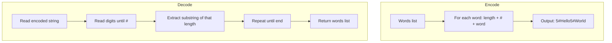

Design an algorithm to encode a list of strings to a single string and decode it back to the original list of strings. The encoded string should be transmittable over a network and decodable without ambiguity.

## Examples

**Input:** ["hello","world"]
**Output:** ["hello","world"]
**Explanation:** The encode function converts the list to a single string, and decode converts it back.


## Solution

```js
function encode(strs) {
  let encoded = '';
  for (const s of strs) {
    encoded += s.length + '#' + s;
  }
  return encoded;
}

function decode(str) {
  const result = [];
  let i = 0;
  while (i < str.length) {
    let j = i;
    while (str[j] !== '#') j++;
    const length = parseInt(str.substring(i, j));
    const s = str.substring(j + 1, j + 1 + length);
    result.push(s);
    i = j + 1 + length;
  }
  return result;
}
```

## Explanation

APPROACH: Length-Prefix Encoding

Encode each string as: [length]#[string]. The length tells us exactly how many characters to read, so even if the string contains '#', there's no ambiguity.

```
Encoding ["hello", "world"]:

  "hello" → "5#hello"
  "world" → "5#world"
  Result:    "5#hello5#world"
```

DECODING WALKTHROUGH with "5#hello5#world":

```
Step   i   find '#'   length   extract            result
────   ─   ────────   ──────   ─────────────────  ───────────
 1     0   j=1        5        str[2..7]="hello"  ["hello"]
 2     7   j=8        5        str[9..14]="world" ["hello","world"]
```

WHY THIS WORKS:
- The length prefix is unambiguous — we read digits until '#', then extract exactly that many chars
- Handles empty strings ("0#"), strings with '#' in them, any character
- O(n) time, single pass for both encode and decode

## Diagram


