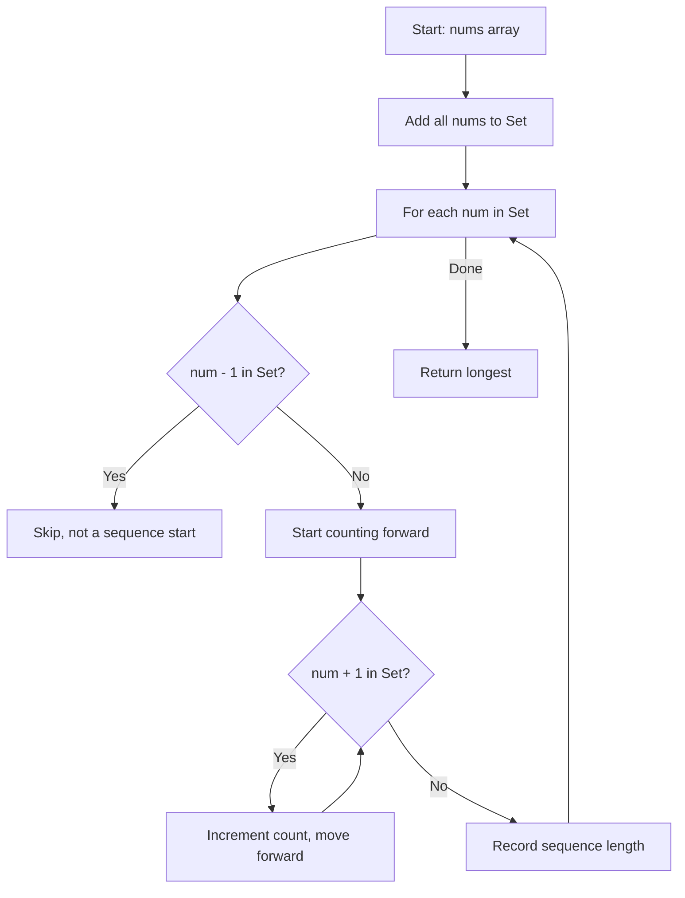

Given an unsorted array of integers `nums`, return the length of the longest consecutive elements sequence. You must write an algorithm that runs in O(n) time.

## Examples

**Input:** nums = [100,4,200,1,3,2]
**Output:** 4
**Explanation:** The longest consecutive sequence is [1, 2, 3, 4].

**Input:** nums = [0,3,7,2,5,8,4,6,0,1]
**Output:** 9
**Explanation:** The longest consecutive sequence is [0, 1, 2, 3, 4, 5, 6, 7, 8].


## Brute Force

```js
function longestConsecutiveBrute(nums) {
  if (nums.length === 0) return 0;
  nums.sort((a, b) => a - b);
  let longest = 1;
  let current = 1;
  for (let i = 1; i < nums.length; i++) {
    if (nums[i] === nums[i - 1]) continue;
    if (nums[i] === nums[i - 1] + 1) {
      current++;
      longest = Math.max(longest, current);
    } else {
      current = 1;
    }
  }
  return longest;
}
// Time: O(n log n) | Space: O(1)
```

## Solution

```js
function longestConsecutive(nums) {
  const numSet = new Set(nums);
  let longest = 0;

  for (const num of numSet) {
    // Only start counting from the beginning of a sequence
    if (!numSet.has(num - 1)) {
      let currentNum = num;
      let currentStreak = 1;
      while (numSet.has(currentNum + 1)) {
        currentNum++;
        currentStreak++;
      }
      longest = Math.max(longest, currentStreak);
    }
  }

  return longest;
}
```

## Explanation

APPROACH: Hash Set + Sequence Start Detection

Put all numbers in a Set. For each number, check if (num - 1) exists — if not, this is the START of a sequence. Then count consecutive numbers forward.

```
nums = [100, 4, 200, 1, 3, 2]
Set = {100, 4, 200, 1, 3, 2}

Only start counting from sequence STARTS (no num-1 in set):
  1 → is (0) in set? No → START! Count: 1→2→3→4 = length 4
  2 → is (1) in set? Yes → skip
  3 → is (2) in set? Yes → skip
  4 → is (3) in set? Yes → skip
  100 → is (99) in set? No → START! Count: 100 = length 1
  200 → is (199) in set? No → START! Count: 200 = length 1
```

WHY THIS WORKS:
- Each number is visited at most twice (once in outer loop, once during counting)
- Only start counting from the beginning of a sequence avoids redundant work
- Total time is O(n) despite the inner while loop

## Diagram



## TestConfig
```json
{
  "functionName": "longestConsecutive",
  "testCases": [
    {
      "args": [
        [
          100,
          4,
          200,
          1,
          3,
          2
        ]
      ],
      "expected": 4
    },
    {
      "args": [
        [
          0,
          3,
          7,
          2,
          5,
          8,
          4,
          6,
          0,
          1
        ]
      ],
      "expected": 9
    },
    {
      "args": [
        []
      ],
      "expected": 0
    },
    {
      "args": [
        [
          1
        ]
      ],
      "expected": 1,
      "isHidden": true
    },
    {
      "args": [
        [
          1,
          2,
          3,
          4,
          5
        ]
      ],
      "expected": 5,
      "isHidden": true
    },
    {
      "args": [
        [
          10,
          20,
          30
        ]
      ],
      "expected": 1,
      "isHidden": true
    },
    {
      "args": [
        [
          1,
          2,
          0,
          1
        ]
      ],
      "expected": 3,
      "isHidden": true
    },
    {
      "args": [
        [
          -1,
          0,
          1,
          2
        ]
      ],
      "expected": 4,
      "isHidden": true
    },
    {
      "args": [
        [
          9,
          1,
          4,
          7,
          3,
          -1,
          0,
          5,
          8,
          -1,
          6
        ]
      ],
      "expected": 7,
      "isHidden": true
    },
    {
      "args": [
        [
          1,
          3,
          5,
          7
        ]
      ],
      "expected": 1,
      "isHidden": true
    }
  ]
}
```
