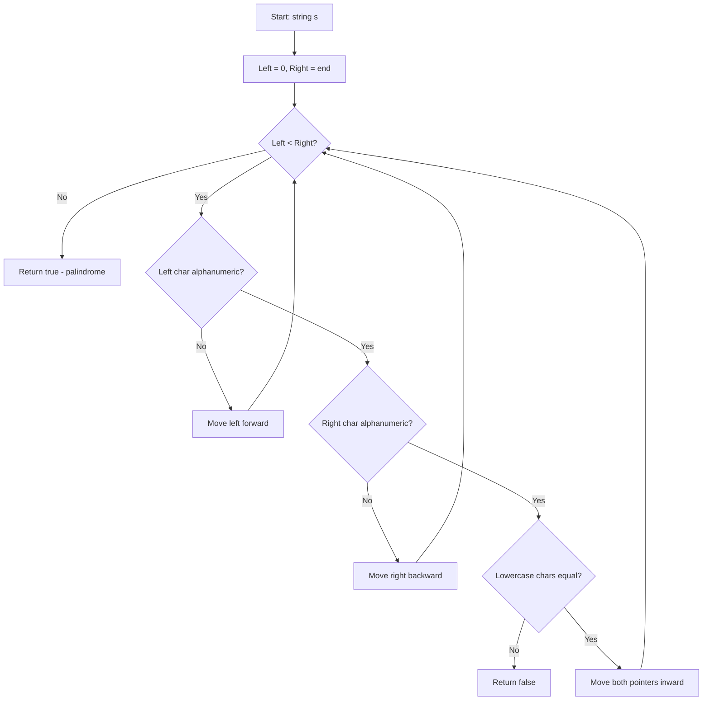

A phrase is a palindrome if, after converting all uppercase letters into lowercase letters and removing all non-alphanumeric characters, it reads the same forward and backward. Given a string `s`, return `true` if it is a palindrome, or `false` otherwise.

## Examples

**Input:** s = "A man, a plan, a canal: Panama"
**Output:** true
**Explanation:** "amanaplanacanalpanama" is a palindrome.

**Input:** s = "race a car"
**Output:** false
**Explanation:** "raceacar" is not a palindrome because it does not read the same backward.


## Brute Force

```js
function isPalindromeBrute(s) {
  const cleaned = s.replace(/[^a-zA-Z0-9]/g, '').toLowerCase();
  return cleaned === cleaned.split('').reverse().join('');
}
// Time: O(n) | Space: O(n)
```

### Brute Force Explanation

Reverse the cleaned string and compare — O(n) time but O(n) space for the reversed copy. Two pointers avoids the extra space.

## Solution

```js
function isPalindrome(s) {
  let left = 0;
  let right = s.length - 1;

  while (left < right) {
    while (left < right && !isAlphaNumeric(s[left])) left++;
    while (left < right && !isAlphaNumeric(s[right])) right--;
    if (s[left].toLowerCase() !== s[right].toLowerCase()) return false;
    left++;
    right--;
  }
  return true;
}

function isAlphaNumeric(c) {
  return /[a-zA-Z0-9]/.test(c);
}
```

## Explanation

APPROACH: Two Pointers (Converging)

Place left pointer at start, right pointer at end. Skip non-alphanumeric chars. Compare characters (case-insensitive) and move inward.

```
"A man, a plan, a canal: Panama"
 ↓ (cleaned)
"amanaplanacanalpanama"

 L                   R
 a m a n a p l a n a c a n a l p a n a m a
 ↑                                       ↑
 L='a' == R='a' ✓ → move both inward

   L                               R
 a m a n a p l a n a c a n a l p a n a m a
   ↑                                   ↑
   L='m' == R='m' ✓ → continue...

All pairs match → PALINDROME ✓
```

WHY THIS WORKS:
- A palindrome reads the same forwards and backwards
- Two pointers from edges efficiently verify this in O(n) with O(1) space
- Skip non-alphanumeric to handle spaces/punctuation

## Diagram



## TestConfig
```json
{
  "functionName": "isPalindrome",
  "testCases": [
    {
      "args": [
        "A man, a plan, a canal: Panama"
      ],
      "expected": true
    },
    {
      "args": [
        "race a car"
      ],
      "expected": false
    },
    {
      "args": [
        " "
      ],
      "expected": true
    },
    {
      "args": [
        ""
      ],
      "expected": true,
      "isHidden": true
    },
    {
      "args": [
        "a"
      ],
      "expected": true,
      "isHidden": true
    },
    {
      "args": [
        "ab"
      ],
      "expected": false,
      "isHidden": true
    },
    {
      "args": [
        "aba"
      ],
      "expected": true,
      "isHidden": true
    },
    {
      "args": [
        "0P"
      ],
      "expected": false,
      "isHidden": true
    },
    {
      "args": [
        "Was it a car or a cat I saw?"
      ],
      "expected": true,
      "isHidden": true
    },
    {
      "args": [
        "No lemon, no melon"
      ],
      "expected": true,
      "isHidden": true
    }
  ]
}
```
