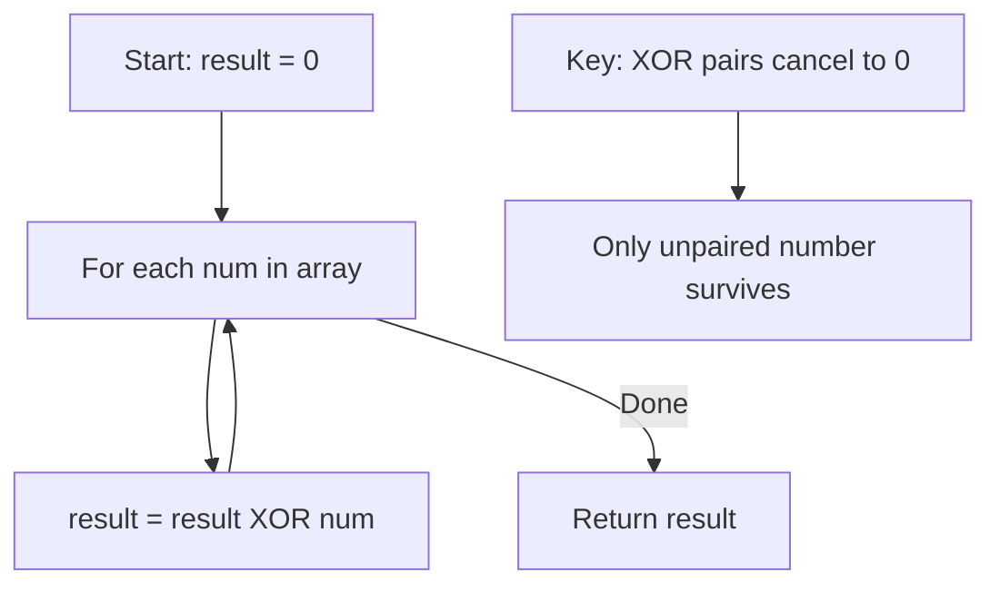

Given a non-empty array of integers `nums`, every element appears twice except for one. Find that single one. You must implement a solution with O(n) time and O(1) extra space.

## Examples

**Input:** nums = [2,2,1]
**Output:** 1

**Input:** nums = [4,1,2,1,2]
**Output:** 4

**Input:** nums = [1]
**Output:** 1


## Brute Force

```js
function singleNumberBrute(nums) {
  const count = {};
  for (const n of nums) count[n] = (count[n] || 0) + 1;
  for (const [k, v] of Object.entries(count)) {
    if (v === 1) return Number(k);
  }
}
// Time: O(n) | Space: O(n)
```

### Brute Force Explanation

Count frequencies with a hash map and find the one with count 1. Works but uses O(n) space. XOR does it in O(1) space.

## Solution

```js
function singleNumber(nums) {
  let result = 0;
  for (const num of nums) {
    result ^= num;
  }
  return result;
}
```

## Explanation

APPROACH: XOR All Elements

XOR properties: a ^ a = 0, a ^ 0 = a, XOR is commutative and associative.

```
nums = [4, 1, 2, 1, 2]

In binary:
  4 = 100
  1 = 001
  2 = 010
  1 = 001
  2 = 010

XOR step by step:
  result = 0       (000)
  result ^= 4  →   (100)     = 4
  result ^= 1  →   (101)     = 5
  result ^= 2  →   (111)     = 7
  result ^= 1  →   (110)     = 6    ← the 1s cancelled
  result ^= 2  →   (100)     = 4    ← the 2s cancelled

Only 4 remains! ✓

Think of it as: (4 ^ 1 ^ 2 ^ 1 ^ 2) = 4 ^ (1 ^ 1) ^ (2 ^ 2) = 4 ^ 0 ^ 0 = 4
```

WHY THIS WORKS:
- XOR cancels pairs: a ^ a = 0
- XOR with 0 is identity: a ^ 0 = a
- Order doesn't matter (commutative + associative)
- All pairs cancel, leaving only the unique element
- Single pass, no extra space

## Diagram



## TestConfig
```json
{
  "functionName": "singleNumber",
  "testCases": [
    {
      "args": [[2,2,1]],
      "expected": 1
    },
    {
      "args": [[4,1,2,1,2]],
      "expected": 4
    },
    {
      "args": [[1]],
      "expected": 1
    },
    {
      "args": [[0,1,0]],
      "expected": 1,
      "isHidden": true
    },
    {
      "args": [[-1,1,-1]],
      "expected": 1,
      "isHidden": true
    },
    {
      "args": [[3,3,7,7,10,11,11]],
      "expected": 10,
      "isHidden": true
    },
    {
      "args": [[100,200,300,200,100]],
      "expected": 300,
      "isHidden": true
    }
  ]
}
```
