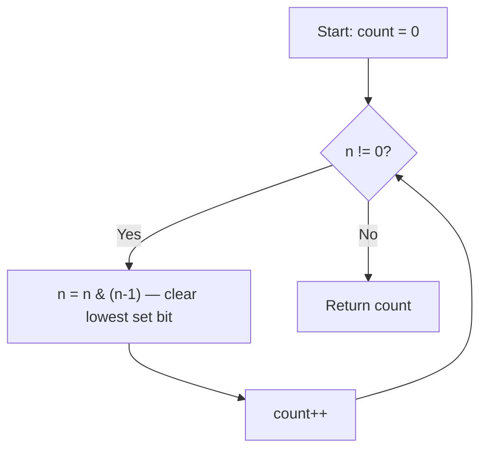

Write a function that takes the binary representation of a positive integer and returns the number of set bits (1s) it has (also known as the Hamming weight).

## Examples

**Input:** n = 11
**Output:** 3
**Explanation:** 11 in binary is `1011`, which has three set bits.

**Input:** n = 128
**Output:** 1
**Explanation:** 128 in binary is `10000000`, which has one set bit.

**Input:** n = 2147483645
**Output:** 30
**Explanation:** 2147483645 in binary has 30 set bits.


## Brute Force

```js
function hammingWeightBrute(n) {
  let count = 0;
  while (n > 0) {
    count += n & 1;
    n >>>= 1;
  }
  return count;
}
// Time: O(32) | Space: O(1)
```

### Brute Force Explanation

Check each of 32 bits by shifting right and AND-ing with 1. Always checks all 32 bits. Brian Kernighan's method only iterates for set bits.

## Solution

```js
function hammingWeight(n) {
  let count = 0;
  while (n !== 0) {
    n = n & (n - 1);
    count++;
  }
  return count;
}
```

## Explanation

APPROACH: Brian Kernighan's Algorithm

n & (n-1) clears the lowest set bit. Count how many times until n = 0.

```
n = 11 (binary: 1011)

Step 1: n = 1011 & 1010 = 1010  count=1  (cleared bit 0)
Step 2: n = 1010 & 1001 = 1000  count=2  (cleared bit 1)
Step 3: n = 1000 & 0111 = 0000  count=3  (cleared bit 3)
n = 0 → return 3 ✓

Why does n & (n-1) clear the lowest set bit?
  n   = ...1000  (lowest set bit at position k)
  n-1 = ...0111  (borrow flips all bits from position k down)
  n & (n-1) = ...0000  (bit k and below become 0)
```

WHY THIS WORKS:
- Subtracting 1 flips all bits from the lowest set bit downward
- AND-ing with n clears exactly that lowest set bit
- Number of iterations = number of set bits (optimal)

## Diagram



## TestConfig
```json
{
  "functionName": "hammingWeight",
  "testCases": [
    {
      "args": [11],
      "expected": 3
    },
    {
      "args": [128],
      "expected": 1
    },
    {
      "args": [1],
      "expected": 1,
      "isHidden": true
    },
    {
      "args": [0],
      "expected": 0,
      "isHidden": true
    },
    {
      "args": [7],
      "expected": 3,
      "isHidden": true
    },
    {
      "args": [255],
      "expected": 8,
      "isHidden": true
    },
    {
      "args": [1023],
      "expected": 10,
      "isHidden": true
    }
  ]
}
```
