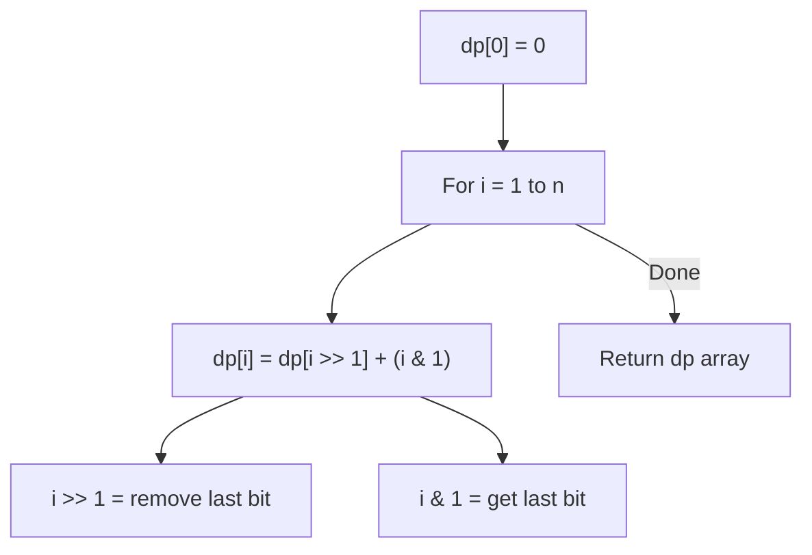

Given an integer `n`, return an array `ans` of length `n + 1` such that for each `i` (0 <= i <= n), `ans[i]` is the number of 1's in the binary representation of `i`.

## Examples

**Input:** n = 2
**Output:** [0,1,1]
**Explanation:** 0→0, 1→1, 2→10

**Input:** n = 5
**Output:** [0,1,1,2,1,2]
**Explanation:** 0→0, 1→1, 2→10, 3→11, 4→100, 5→101


## Brute Force

```js
function countBitsBrute(n) {
  const result = [];
  for (let i = 0; i <= n; i++) {
    let count = 0, num = i;
    while (num > 0) { num &= num - 1; count++; }
    result.push(count);
  }
  return result;
}
// Time: O(n log n) | Space: O(n)
```

### Brute Force Explanation

Count bits individually for each number. O(log n) per number. The DP approach reuses previous results for O(1) per number.

## Solution

```js
function countBits(n) {
  const dp = new Array(n + 1).fill(0);

  for (let i = 1; i <= n; i++) {
    dp[i] = dp[i >> 1] + (i & 1);
  }

  return dp;
}
```

## Explanation

APPROACH: DP with Right Shift

Key insight: the number of 1-bits in i equals bits in i/2 (right shift) plus the last bit.

```
i   binary   i>>1  dp[i>>1]  i&1  dp[i]
0   0000      0      0        0     0
1   0001      0      0        1     1
2   0010      1      1        0     1
3   0011      1      1        1     2
4   0100      2      1        0     1
5   0101      2      1        1     2

dp[5] = dp[5>>1] + (5&1)
      = dp[2] + 1
      = 1 + 1
      = 2 ✓ (101 has two 1-bits)

Why it works:
  5 in binary: 1 0 1
                ↑ ↑ ↑
                │ └─┘── these bits are the same as 2 (10)
                └────── this is the extra last bit (5 & 1 = 1)
```

WHY THIS WORKS:
- Right shift removes the last bit: 101 >> 1 = 10
- The remaining bits have the same count as dp[i >> 1]
- Just add back the last bit (i & 1)
- Each dp[i] computed in O(1) using a previously computed value

## Diagram



## TestConfig
```json
{
  "functionName": "countBits",
  "testCases": [
    {
      "args": [2],
      "expected": [0,1,1]
    },
    {
      "args": [5],
      "expected": [0,1,1,2,1,2]
    },
    {
      "args": [0],
      "expected": [0],
      "isHidden": true
    },
    {
      "args": [1],
      "expected": [0,1],
      "isHidden": true
    },
    {
      "args": [8],
      "expected": [0,1,1,2,1,2,2,3,1],
      "isHidden": true
    },
    {
      "args": [15],
      "expected": [0,1,1,2,1,2,2,3,1,2,2,3,2,3,3,4],
      "isHidden": true
    }
  ]
}
```
