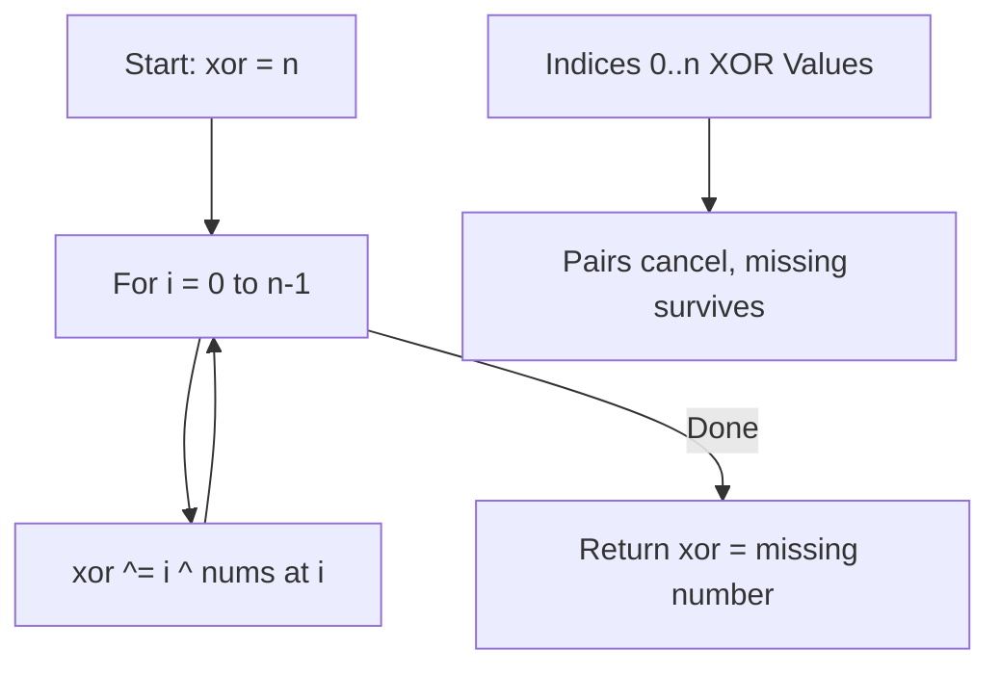

Given an array `nums` containing `n` distinct numbers in the range `[0, n]`, return the only number in the range that is missing from the array.

## Examples

**Input:** nums = [3,0,1]
**Output:** 2
**Explanation:** n = 3, range is [0,1,2,3]. 2 is missing.

**Input:** nums = [0,1]
**Output:** 2

**Input:** nums = [9,6,4,2,3,5,7,0,1]
**Output:** 8


## Brute Force

```js
function missingNumberBrute(nums) {
  const set = new Set(nums);
  for (let i = 0; i <= nums.length; i++) {
    if (!set.has(i)) return i;
  }
}
// Time: O(n) | Space: O(n)
```

### Brute Force Explanation

Put everything in a set, check which number is missing. Uses O(n) space. XOR and sum approaches use O(1) space.

## Solution

```js
function missingNumber(nums) {
  let xor = nums.length;
  for (let i = 0; i < nums.length; i++) {
    xor ^= i ^ nums[i];
  }
  return xor;
}
```

## Explanation

APPROACH: XOR Cancellation

XOR all indices (0 to n) with all values. Every number that appears in both cancels out, leaving the missing one.

```
nums = [3, 0, 1], n = 3

Indices: 0, 1, 2    (plus n=3)
Values:  3, 0, 1

XOR everything:
  start with xor = 3 (that's n)
  i=0: xor ^= 0 ^ 3 → 3 ^ 0 ^ 3 = 0
  i=1: xor ^= 1 ^ 0 → 0 ^ 1 ^ 0 = 1
  i=2: xor ^= 2 ^ 1 → 1 ^ 2 ^ 1 = 2

Result: 2 ✓

Why: (0^1^2^3) ^ (3^0^1) = 0^0 ^ 1^1 ^ 3^3 ^ 2 = 0 ^ 0 ^ 0 ^ 2 = 2
     All pairs cancel except the missing number!
```

WHY THIS WORKS:
- XOR of complete range [0..n] XOR'd with array values
- Every present number appears in both → cancels to 0
- The missing number only appears in the range → survives
- O(n) time, O(1) space, no overflow risk (unlike sum approach)

## Diagram



## TestConfig
```json
{
  "functionName": "missingNumber",
  "testCases": [
    {
      "args": [[3,0,1]],
      "expected": 2
    },
    {
      "args": [[0,1]],
      "expected": 2
    },
    {
      "args": [[9,6,4,2,3,5,7,0,1]],
      "expected": 8
    },
    {
      "args": [[0]],
      "expected": 1,
      "isHidden": true
    },
    {
      "args": [[1]],
      "expected": 0,
      "isHidden": true
    },
    {
      "args": [[0,1,2,3,4,5,6,7,9]],
      "expected": 8,
      "isHidden": true
    },
    {
      "args": [[1,2,3]],
      "expected": 0,
      "isHidden": true
    }
  ]
}
```
