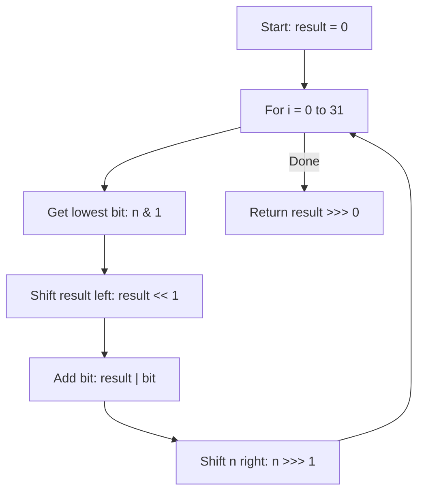

Reverse bits of a given 32-bit unsigned integer.

## Examples

**Input:** n = 43261596 (binary: 00000010100101000001111010011100)
**Output:** 964176192 (binary: 00111001011110000010100101000000)

**Input:** n = 4294967293 (binary: 11111111111111111111111111111101)
**Output:** 3221225471 (binary: 10111111111111111111111111111111)


## Brute Force

```js
function reverseBitsBrute(n) {
  const bits = n.toString(2).padStart(32, '0');
  return parseInt(bits.split('').reverse().join(''), 2) >>> 0;
}
// Time: O(1) | Space: O(32)
```

### Brute Force Explanation

Convert to binary string, reverse, parse back. Works but creates strings. Bitwise approach is cleaner and truly O(1) space.

## Solution

```js
function reverseBits(n) {
  let result = 0;
  for (let i = 0; i < 32; i++) {
    result = (result << 1) | (n & 1);
    n >>>= 1;
  }
  return result >>> 0;
}
```

## Explanation

APPROACH: Bit-by-Bit Reversal

Extract lowest bit of n, shift result left and add it, shift n right. Repeat 32 times.

```
n = 6 (binary: ...00110)  Expected: 01100...0 = 1610612736

Step by step (showing last 8 bits for clarity):
  i=0: n=00000110, result=0, bit=0 → result=00000000, n=00000011
  i=1: n=00000011, result=0, bit=1 → result=00000001, n=00000001
  i=2: n=00000001, result=1, bit=1 → result=00000011, n=00000000
  i=3: n=00000000, result=3, bit=0 → result=00000110, n=00000000
  ... (remaining 28 steps shift result left, adding 0s)

After 32 steps:
  result = 01100000...0 (32 bits) = 1610612736

The bits of n (110) become the leading bits of result (011...0)
```

WHY THIS WORKS:
- Extract from right side of n, build from right side of result
- Since result is shifted left each time, early bits end up on the left
- 32 iterations covers all bits of a 32-bit integer
- `>>> 0` ensures unsigned interpretation in JavaScript

## Diagram



## TestConfig
```json
{
  "functionName": "reverseBits",
  "testCases": [
    {
      "args": [43261596],
      "expected": 964176192
    },
    {
      "args": [4294967293],
      "expected": 3221225471
    },
    {
      "args": [0],
      "expected": 0,
      "isHidden": true
    },
    {
      "args": [1],
      "expected": 2147483648,
      "isHidden": true
    },
    {
      "args": [2147483648],
      "expected": 1,
      "isHidden": true
    },
    {
      "args": [4294967295],
      "expected": 4294967295,
      "isHidden": true
    }
  ]
}
```
