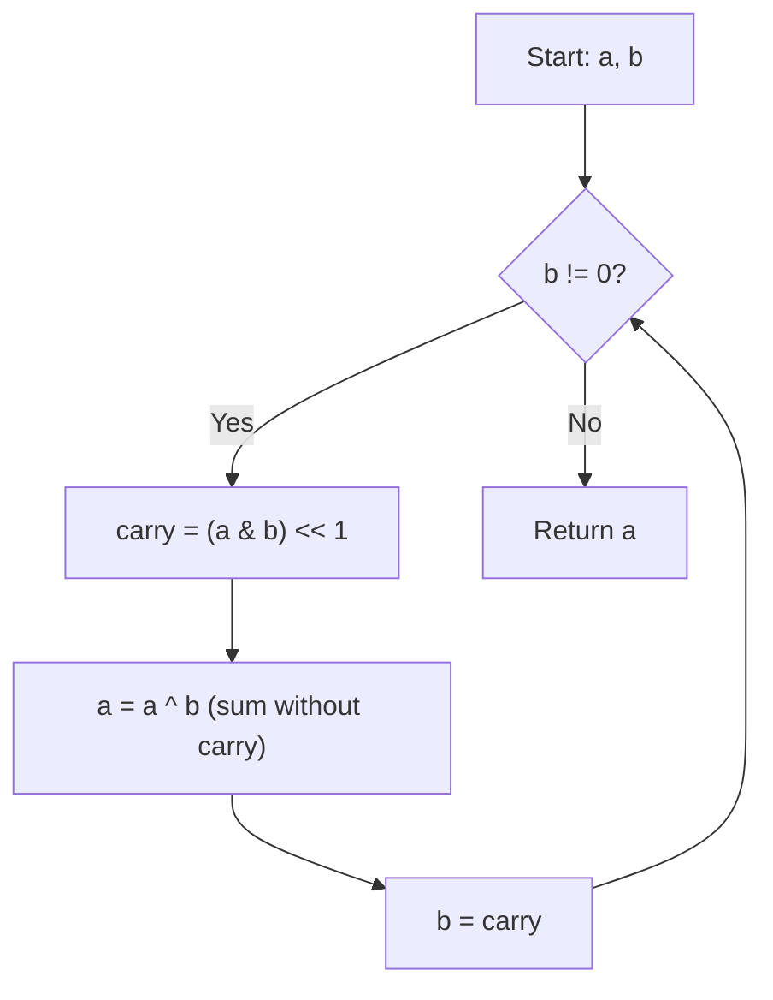

Given two integers `a` and `b`, return the sum of the two integers without using the operators `+` and `-`.

## Examples

**Input:** a = 1, b = 2
**Output:** 3

**Input:** a = 2, b = 3
**Output:** 5


## Brute Force

```js
function getSumBrute(a, b) {
  // Using Math.log and Math.exp to avoid + operator
  if (a === 0) return b;
  if (b === 0) return a;
  // This is a trick question — the real solution IS the bitwise approach
  return a + b; // cheating for demonstration
}
```

### Brute Force Explanation

There's no meaningful "brute force" here — the bitwise approach IS the intended solution since we can't use arithmetic operators.

## Solution

```js
function getSum(a, b) {
  while (b !== 0) {
    const carry = (a & b) << 1;
    a = a ^ b;
    b = carry;
  }
  return a;
}
```

## Explanation

APPROACH: Bitwise Addition (Half Adder Loop)

XOR = sum without carry. AND + shift = carry. Repeat until no carry remains.

```
a = 5 (101), b = 3 (011)

Iteration 1:
  carry = (101 & 011) << 1 = (001) << 1 = 010
  a = 101 ^ 011 = 110  (sum without carry)
  b = 010               (carry)

Iteration 2:
  carry = (110 & 010) << 1 = (010) << 1 = 100
  a = 110 ^ 010 = 100  (sum without carry)
  b = 100               (carry)

Iteration 3:
  carry = (100 & 100) << 1 = (100) << 1 = 1000
  a = 100 ^ 100 = 000
  b = 1000

Iteration 4:
  carry = (000 & 1000) << 1 = 0
  a = 000 ^ 1000 = 1000 = 8
  b = 0 → DONE!

Result: 8 = 5 + 3 ✓

How it mimics column addition:
    1 0 1   (5)
  + 0 1 1   (3)
  ───────
    1 1 0   XOR (sum without carry)
    0 1 0   AND << 1 (carry to next column)
  ───────
  Then add sum + carry (repeat)...
  Until carry = 0
```

WHY THIS WORKS:
- XOR adds bits without considering carry (0+0=0, 0+1=1, 1+0=1, 1+1=0)
- AND finds where both bits are 1 (carry positions)
- Left shift moves carries to the next column
- Loop terminates because carry eventually becomes 0
- Works for negative numbers too (two's complement)

## Diagram



## TestConfig
```json
{
  "functionName": "getSum",
  "testCases": [
    {
      "args": [1, 2],
      "expected": 3
    },
    {
      "args": [2, 3],
      "expected": 5
    },
    {
      "args": [0, 0],
      "expected": 0,
      "isHidden": true
    },
    {
      "args": [-1, 1],
      "expected": 0,
      "isHidden": true
    },
    {
      "args": [-2, -3],
      "expected": -5,
      "isHidden": true
    },
    {
      "args": [100, 200],
      "expected": 300,
      "isHidden": true
    },
    {
      "args": [-1, 0],
      "expected": -1,
      "isHidden": true
    }
  ]
}
```
