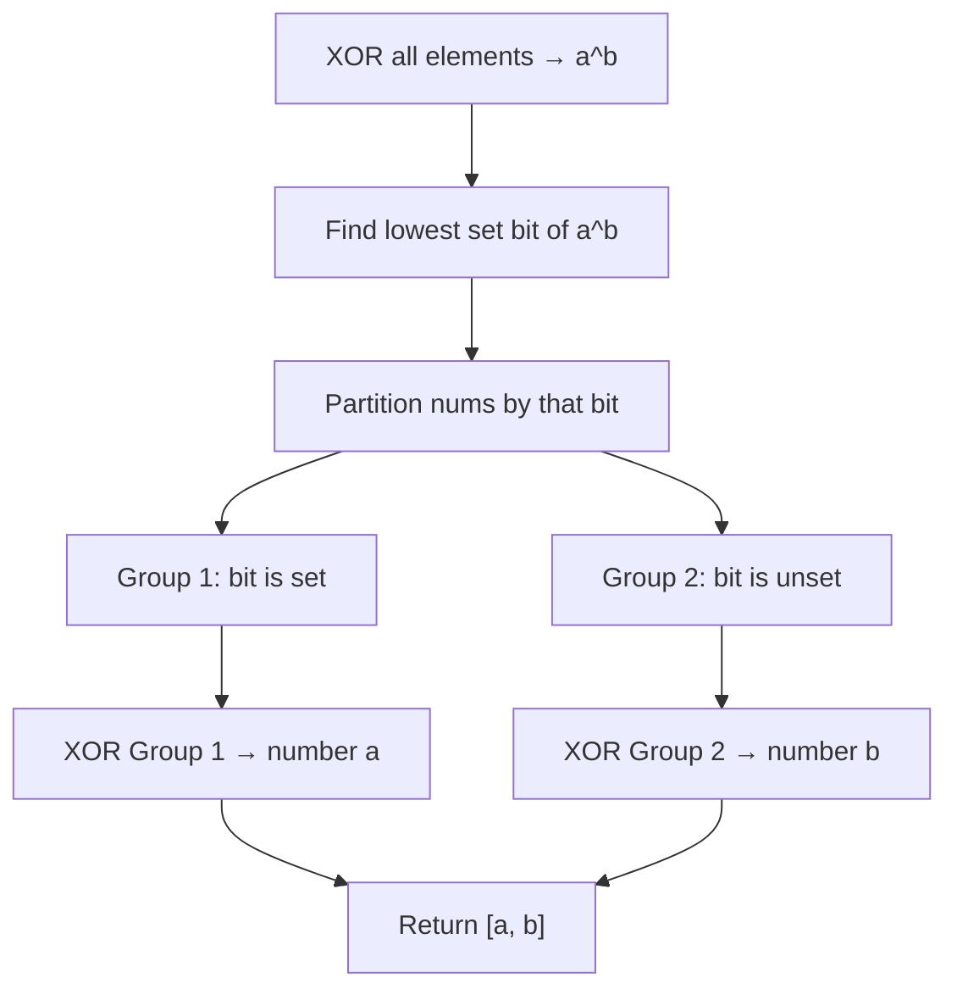

Given an integer array `nums` where exactly two elements appear only once and all the other elements appear exactly twice, find the two elements that appear only once. You can return the answer in any order. Your algorithm should run in O(n) time and O(1) extra space.

## Examples

**Input:** nums = [1,2,1,3,2,5]
**Output:** [3,5]

**Input:** nums = [-1,0]
**Output:** [-1,0]

**Input:** nums = [0,1]
**Output:** [0,1]


## Brute Force

```js
function singleNumberBrute(nums) {
  const count = {};
  for (const n of nums) count[n] = (count[n] || 0) + 1;
  return Object.entries(count)
    .filter(([_, v]) => v === 1)
    .map(([k]) => Number(k));
}
// Time: O(n) | Space: O(n)
```

### Brute Force Explanation

Count frequencies, return numbers with count 1. Uses O(n) space. The XOR + partitioning approach uses O(1) space.

## Solution

```js
function singleNumber(nums) {
  // Step 1: XOR all — gives a ^ b
  let xorAll = 0;
  for (const n of nums) xorAll ^= n;

  // Step 2: Find a bit where a and b differ
  const diffBit = xorAll & (-xorAll); // lowest set bit

  // Step 3: Partition and XOR each group
  let a = 0, b = 0;
  for (const n of nums) {
    if (n & diffBit) {
      a ^= n;
    } else {
      b ^= n;
    }
  }

  return [a, b];
}
```

## Explanation

APPROACH: XOR + Bit Partitioning

XOR all to get a^b, find a differentiating bit, split into two groups, XOR each group.

```
nums = [1, 2, 1, 3, 2, 5]

Step 1: XOR all elements
  1 ^ 2 ^ 1 ^ 3 ^ 2 ^ 5 = (1^1) ^ (2^2) ^ (3^5) = 0 ^ 0 ^ 6 = 6
  xorAll = 6 (binary: 110)
  This is 3 ^ 5 = 011 ^ 101 = 110

Step 2: Find differentiating bit
  diffBit = 6 & (-6) = 110 & 010 = 010 (bit position 1)
  This means 3 and 5 differ at bit position 1

Step 3: Partition by bit 1
  Bit 1 SET:   2(10), 2(10), 3(11)  → XOR: 2^2^3 = 3 ✓
  Bit 1 UNSET: 1(01), 1(01), 5(101) → XOR: 1^1^5 = 5 ✓

  Pairs always go to the same group (same bits), so they cancel.
  a and b go to different groups (they differ at this bit).

Result: [3, 5] ✓
```

WHY THIS WORKS:
- XOR all gives a^b, which has 1s where a and b differ
- Using any differing bit as a partition ensures a and b go to different groups
- Duplicate pairs always go to the same group (they have identical bits)
- Each group becomes a Single Number I problem → XOR isolates the unique one

## Diagram



## TestConfig
```json
{
  "functionName": "singleNumber",
  "testCases": [
    {
      "args": [[1,2,1,3,2,5]],
      "expected": [3,5],
      "unordered": true
    },
    {
      "args": [[-1,0]],
      "expected": [-1,0],
      "unordered": true
    },
    {
      "args": [[0,1]],
      "expected": [0,1],
      "unordered": true
    },
    {
      "args": [[1,1,2,3]],
      "expected": [2,3],
      "unordered": true,
      "isHidden": true
    },
    {
      "args": [[-1,-1,5,7]],
      "expected": [5,7],
      "unordered": true,
      "isHidden": true
    },
    {
      "args": [[2,1,2,3,4,1]],
      "expected": [3,4],
      "unordered": true,
      "isHidden": true
    },
    {
      "args": [[1000000,1000001]],
      "expected": [1000000,1000001],
      "unordered": true,
      "isHidden": true
    }
  ]
}
```
