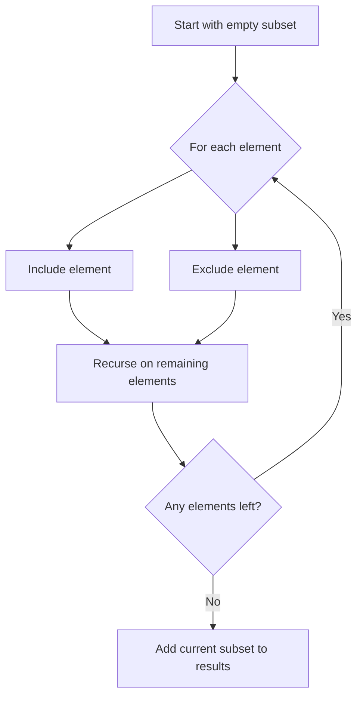

Given an integer array `nums` of unique elements, return all possible subsets (the power set). The solution set must not contain duplicate subsets. Return the solution in any order.

## Examples

**Input:** nums = [1,2,3]
**Output:** [[],[1],[2],[1,2],[3],[1,3],[2,3],[1,2,3]]
**Explanation:** Each element is either included or excluded, producing 2^3 = 8 subsets.

**Input:** nums = [0]
**Output:** [[],[0]]
**Explanation:** A single element yields two subsets: the empty set and the set containing that element.


## Brute Force

```js
function subsetsBitmask(nums) {
  const result = [];
  const n = nums.length;
  for (let mask = 0; mask < (1 << n); mask++) {
    const subset = [];
    for (let i = 0; i < n; i++) {
      if (mask & (1 << i)) subset.push(nums[i]);
    }
    result.push(subset);
  }
  return result;
}
```

### Brute Force Explanation

Bitmask approach: iterate through all 2^n numbers. Each bit represents include/exclude.

```
nums = [1, 2, 3], n=3 → 2^3 = 8 masks

mask  binary  subset
 0    000     []
 1    001     [1]
 2    010     [2]
 3    011     [1,2]
 4    100     [3]
 5    101     [1,3]
 6    110     [2,3]
 7    111     [1,2,3]
```

## Solution

```js
function subsets(nums) {
  const result = [];

  function backtrack(start, current) {
    result.push([...current]);
    for (let i = start; i < nums.length; i++) {
      current.push(nums[i]);
      backtrack(i + 1, current);
      current.pop();
    }
  }

  backtrack(0, []);
  return result;
}
```

## Explanation

APPROACH: Backtracking — Include/Exclude Decision Tree

At each element, make a binary choice: include it or skip it. This generates all 2^n subsets.

```
nums = [1, 2, 3]

Decision tree (include/skip at each level):
                    []
              /            \
          [1]               []
        /     \           /     \
     [1,2]    [1]      [2]      []
     /  \    /  \    /  \    /  \
 [1,2,3][1,2][1,3][1] [2,3][2] [3] []

Backtracking approach (for-loop style):
  start=0: pick 1 → [1]
    start=1: pick 2 → [1,2]
      start=2: pick 3 → [1,2,3]
    start=2: pick 3 → [1,3]
  start=1: pick 2 → [2]
    start=2: pick 3 → [2,3]
  start=2: pick 3 → [3]

Result collected at EVERY node: [], [1], [1,2], [1,2,3], [1,3], [2], [2,3], [3]
```

KEY INSIGHT: Unlike permutations, we collect results at every node (not just leaves). The "start" parameter ensures we only go forward, avoiding duplicates.

## Diagram



## TestConfig
```json
{
  "functionName": "subsets",
  "compareType": "setEqual",
  "testCases": [
    {
      "args": [
        [
          1,
          2,
          3
        ]
      ],
      "expected": [
        [],
        [
          1
        ],
        [
          2
        ],
        [
          3
        ],
        [
          1,
          2
        ],
        [
          1,
          3
        ],
        [
          2,
          3
        ],
        [
          1,
          2,
          3
        ]
      ]
    },
    {
      "args": [
        [
          0
        ]
      ],
      "expected": [
        [],
        [
          0
        ]
      ]
    },
    {
      "args": [
        [
          1,
          2
        ]
      ],
      "expected": [
        [],
        [
          1
        ],
        [
          2
        ],
        [
          1,
          2
        ]
      ]
    },
    {
      "args": [
        [
          1,
          2,
          3,
          4
        ]
      ],
      "expected": [
        [],
        [
          1
        ],
        [
          2
        ],
        [
          3
        ],
        [
          4
        ],
        [
          1,
          2
        ],
        [
          1,
          3
        ],
        [
          1,
          4
        ],
        [
          2,
          3
        ],
        [
          2,
          4
        ],
        [
          3,
          4
        ],
        [
          1,
          2,
          3
        ],
        [
          1,
          2,
          4
        ],
        [
          1,
          3,
          4
        ],
        [
          2,
          3,
          4
        ],
        [
          1,
          2,
          3,
          4
        ]
      ]
    },
    {
      "args": [
        [
          5
        ]
      ],
      "expected": [
        [],
        [
          5
        ]
      ]
    },
    {
      "args": [
        [
          -1,
          0
        ]
      ],
      "expected": [
        [],
        [
          -1
        ],
        [
          0
        ],
        [
          -1,
          0
        ]
      ]
    },
    {
      "args": [
        [
          1,
          5,
          3
        ]
      ],
      "expected": [
        [],
        [
          1
        ],
        [
          5
        ],
        [
          3
        ],
        [
          1,
          5
        ],
        [
          1,
          3
        ],
        [
          5,
          3
        ],
        [
          1,
          5,
          3
        ]
      ]
    },
    {
      "args": [
        [
          10,
          20,
          30
        ]
      ],
      "expected": [
        [],
        [
          10
        ],
        [
          20
        ],
        [
          30
        ],
        [
          10,
          20
        ],
        [
          10,
          30
        ],
        [
          20,
          30
        ],
        [
          10,
          20,
          30
        ]
      ]
    },
    {
      "args": [
        [
          -3,
          -2,
          -1
        ]
      ],
      "expected": [
        [],
        [
          -3
        ],
        [
          -2
        ],
        [
          -1
        ],
        [
          -3,
          -2
        ],
        [
          -3,
          -1
        ],
        [
          -2,
          -1
        ],
        [
          -3,
          -2,
          -1
        ]
      ]
    },
    {
      "args": [
        [
          7,
          8,
          9,
          10
        ]
      ],
      "expected": [
        [],
        [
          7
        ],
        [
          8
        ],
        [
          9
        ],
        [
          10
        ],
        [
          7,
          8
        ],
        [
          7,
          9
        ],
        [
          7,
          10
        ],
        [
          8,
          9
        ],
        [
          8,
          10
        ],
        [
          9,
          10
        ],
        [
          7,
          8,
          9
        ],
        [
          7,
          8,
          10
        ],
        [
          7,
          9,
          10
        ],
        [
          8,
          9,
          10
        ],
        [
          7,
          8,
          9,
          10
        ]
      ]
    }
  ]
}
```
