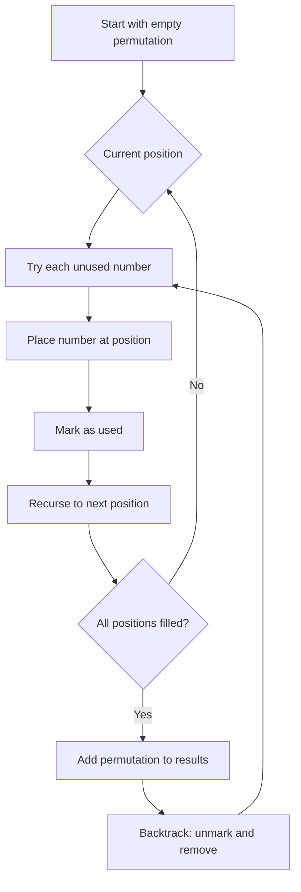

Given an array `nums` of distinct integers, return all the possible permutations. You can return the answer in any order.

## Examples

**Input:** nums = [1,2,3]
**Output:** [[1,2,3],[1,3,2],[2,1,3],[2,3,1],[3,1,2],[3,2,1]]
**Explanation:** There are 3! = 6 ways to arrange three distinct elements.

**Input:** nums = [0,1]
**Output:** [[0,1],[1,0]]
**Explanation:** Two distinct elements can be arranged in 2! = 2 ways.


## Solution

```js
function permute(nums) {
  const result = [];

  function backtrack(current, remaining) {
    if (remaining.length === 0) {
      result.push([...current]);
      return;
    }
    for (let i = 0; i < remaining.length; i++) {
      current.push(remaining[i]);
      backtrack(current, [...remaining.slice(0, i), ...remaining.slice(i + 1)]);
      current.pop();
    }
  }

  backtrack([], nums);
  return result;
}
```

## Explanation

APPROACH: Backtracking — Choose from Remaining Elements

At each position, try each remaining unused element. Recurse until no elements remain.

```
nums = [1, 2, 3]

Level 0: choose from [1,2,3]
├── pick 1, remaining [2,3]
│   ├── pick 2, remaining [3]
│   │   └── pick 3 → [1,2,3] ✓
│   └── pick 3, remaining [2]
│       └── pick 2 → [1,3,2] ✓
├── pick 2, remaining [1,3]
│   ├── pick 1 → [2,1,3] ✓
│   └── pick 3 → [2,3,1] ✓
└── pick 3, remaining [1,2]
    ├── pick 1 → [3,1,2] ✓
    └── pick 2 → [3,2,1] ✓

n=3 → 3! = 6 permutations
```

KEY: At level k, there are (n-k) choices. Total leaves = n × (n-1) × ... × 1 = n!

## Diagram



## TestConfig
```json
{
  "functionName": "permute",
  "compareType": "setEqual",
  "testCases": [
    {
      "args": [
        [
          1,
          2,
          3
        ]
      ],
      "expected": [
        [
          1,
          2,
          3
        ],
        [
          1,
          3,
          2
        ],
        [
          2,
          1,
          3
        ],
        [
          2,
          3,
          1
        ],
        [
          3,
          1,
          2
        ],
        [
          3,
          2,
          1
        ]
      ]
    },
    {
      "args": [
        [
          0,
          1
        ]
      ],
      "expected": [
        [
          0,
          1
        ],
        [
          1,
          0
        ]
      ]
    },
    {
      "args": [
        [
          1
        ]
      ],
      "expected": [
        [
          1
        ]
      ]
    },
    {
      "args": [
        [
          1,
          2
        ]
      ],
      "expected": [
        [
          1,
          2
        ],
        [
          2,
          1
        ]
      ]
    },
    {
      "args": [
        [
          -1,
          0,
          1
        ]
      ],
      "expected": [
        [
          -1,
          0,
          1
        ],
        [
          -1,
          1,
          0
        ],
        [
          0,
          -1,
          1
        ],
        [
          0,
          1,
          -1
        ],
        [
          1,
          -1,
          0
        ],
        [
          1,
          0,
          -1
        ]
      ]
    },
    {
      "args": [
        [
          5,
          6,
          7
        ]
      ],
      "expected": [
        [
          5,
          6,
          7
        ],
        [
          5,
          7,
          6
        ],
        [
          6,
          5,
          7
        ],
        [
          6,
          7,
          5
        ],
        [
          7,
          5,
          6
        ],
        [
          7,
          6,
          5
        ]
      ]
    },
    {
      "args": [
        [
          10
        ]
      ],
      "expected": [
        [
          10
        ]
      ]
    },
    {
      "args": [
        [
          3,
          4
        ]
      ],
      "expected": [
        [
          3,
          4
        ],
        [
          4,
          3
        ]
      ]
    },
    {
      "args": [
        [
          2,
          3,
          4
        ]
      ],
      "expected": [
        [
          2,
          3,
          4
        ],
        [
          2,
          4,
          3
        ],
        [
          3,
          2,
          4
        ],
        [
          3,
          4,
          2
        ],
        [
          4,
          2,
          3
        ],
        [
          4,
          3,
          2
        ]
      ]
    },
    {
      "args": [
        [
          0,
          -1
        ]
      ],
      "expected": [
        [
          0,
          -1
        ],
        [
          -1,
          0
        ]
      ]
    }
  ]
}
```
