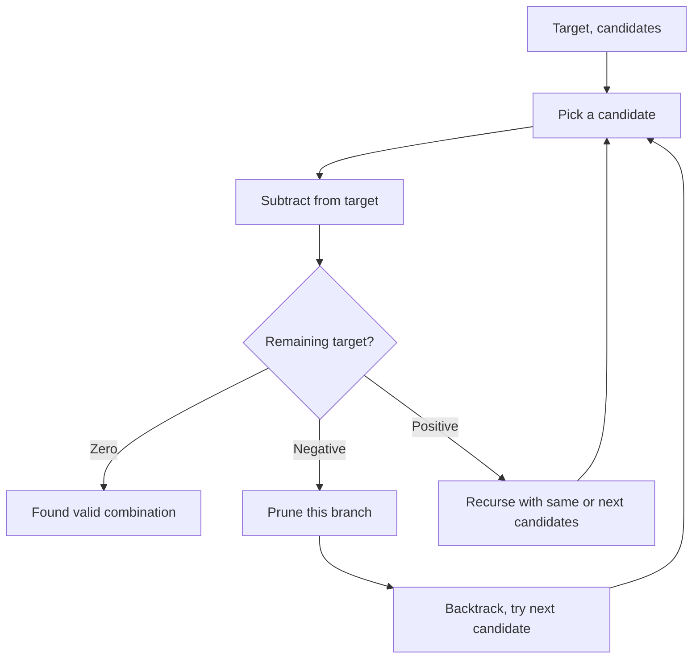

Given an array of distinct integers `candidates` and a target integer `target`, return a list of all unique combinations of candidates where the chosen numbers sum to target. The same number may be chosen from candidates an unlimited number of times. Return combinations in any order.

## Examples

**Input:** candidates = [2,3,6,7], target = 7
**Output:** [[2,2,3],[7]]
**Explanation:** 2+2+3 = 7 and 7 = 7 are the only combinations from [2,3,6,7] that sum to 7.

**Input:** candidates = [2,3,5], target = 8
**Output:** [[2,2,2,2],[2,3,3],[3,5]]
**Explanation:** These are the three unique ways to combine elements from [2,3,5] (with reuse) to reach a sum of 8.


## Solution

```js
function combinationSum(candidates, target) {
  const result = [];
  candidates.sort((a, b) => a - b);

  function backtrack(start, remaining, current) {
    if (remaining === 0) {
      result.push([...current]);
      return;
    }
    for (let i = start; i < candidates.length; i++) {
      if (candidates[i] > remaining) break;
      current.push(candidates[i]);
      backtrack(i, remaining - candidates[i], current);
      current.pop();
    }
  }

  backtrack(0, target, []);
  return result;
}
```

## Explanation

APPROACH: Backtracking with Reuse (same index allowed)

Unlike combinations, the same candidate can be reused. Key: pass `i` (not `i+1`) to allow reuse, and sort + break for pruning.

```
candidates = [2, 3, 6, 7], target = 7

                    (rem=7)
              /     |      \       \
          +2(5)  +3(4)  +6(1)  +7(0)✓
         / | \    / \     |
      +2(3)+3(2)+3(1)+3(1) +6(-) ✗
      / \   |     ✗    ✗
   +2(1)+3(0)✓
    ✗

Results: [2,2,3] and [7]

Pruning: sort candidates, break when candidate > remaining.
If candidates[i] > remaining → all candidates[i..n] are too large → break.
```

## Diagram



## TestConfig
```json
{
  "functionName": "combinationSum",
  "compareType": "setEqual",
  "testCases": [
    {
      "args": [
        [
          2,
          3,
          6,
          7
        ],
        7
      ],
      "expected": [
        [
          2,
          2,
          3
        ],
        [
          7
        ]
      ]
    },
    {
      "args": [
        [
          2,
          3,
          5
        ],
        8
      ],
      "expected": [
        [
          2,
          2,
          2,
          2
        ],
        [
          2,
          3,
          3
        ],
        [
          3,
          5
        ]
      ]
    },
    {
      "args": [
        [
          2
        ],
        1
      ],
      "expected": []
    },
    {
      "args": [
        [
          1
        ],
        1
      ],
      "expected": [
        [
          1
        ]
      ]
    },
    {
      "args": [
        [
          1
        ],
        2
      ],
      "expected": [
        [
          1,
          1
        ]
      ]
    },
    {
      "args": [
        [
          1,
          2
        ],
        3
      ],
      "expected": [
        [
          1,
          1,
          1
        ],
        [
          1,
          2
        ]
      ]
    },
    {
      "args": [
        [
          2,
          3
        ],
        6
      ],
      "expected": [
        [
          2,
          2,
          2
        ],
        [
          3,
          3
        ]
      ]
    },
    {
      "args": [
        [
          2,
          7,
          6,
          3,
          5,
          1
        ],
        9
      ],
      "expected": [
        [
          1,
          1,
          1,
          1,
          1,
          1,
          1,
          1,
          1
        ],
        [
          1,
          1,
          1,
          1,
          1,
          1,
          1,
          2
        ],
        [
          1,
          1,
          1,
          1,
          1,
          1,
          3
        ],
        [
          1,
          1,
          1,
          1,
          1,
          2,
          2
        ],
        [
          1,
          1,
          1,
          1,
          2,
          3
        ],
        [
          1,
          1,
          1,
          1,
          5
        ],
        [
          1,
          1,
          1,
          2,
          2,
          2
        ],
        [
          1,
          1,
          1,
          3,
          3
        ],
        [
          1,
          1,
          1,
          6
        ],
        [
          1,
          1,
          2,
          2,
          3
        ],
        [
          1,
          1,
          2,
          5
        ],
        [
          1,
          1,
          7
        ],
        [
          1,
          2,
          2,
          2,
          2
        ],
        [
          1,
          2,
          3,
          3
        ],
        [
          1,
          2,
          6
        ],
        [
          1,
          3,
          5
        ],
        [
          2,
          2,
          2,
          3
        ],
        [
          2,
          2,
          5
        ],
        [
          2,
          7
        ],
        [
          3,
          3,
          3
        ],
        [
          3,
          6
        ]
      ]
    },
    {
      "args": [
        [
          5,
          10
        ],
        15
      ],
      "expected": [
        [
          5,
          5,
          5
        ],
        [
          5,
          10
        ]
      ]
    },
    {
      "args": [
        [
          3
        ],
        9
      ],
      "expected": [
        [
          3,
          3,
          3
        ]
      ]
    }
  ]
}
```
