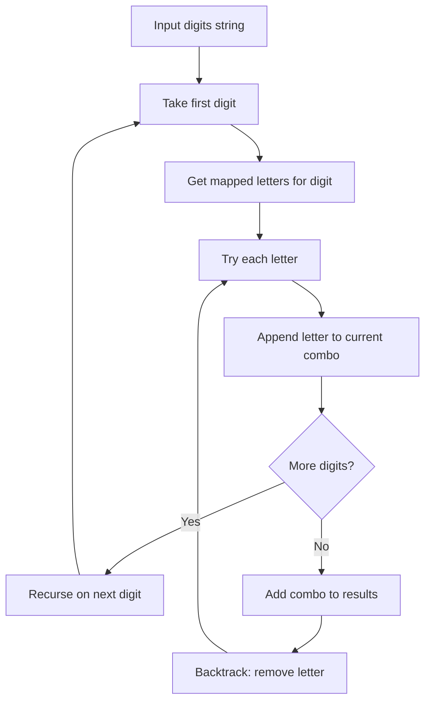

Given a string containing digits from 2-9 inclusive, return all possible letter combinations that the number could represent. A mapping of digits to letters (like on a telephone) is given. Return the answer in any order.

## Examples

**Input:** digits = "23"
**Output:** ["ad","ae","af","bd","be","bf","cd","ce","cf"]
**Explanation:** Digit 2 maps to "abc" and digit 3 maps to "def", giving 3 x 3 = 9 combinations.

**Input:** digits = ""
**Output:** []
**Explanation:** An empty input has no digits to map, so no combinations exist.

**Input:** digits = "2"
**Output:** ["a","b","c"]
**Explanation:** Digit 2 maps to the letters "abc", yielding three single-character combinations.


## Solution

```js
function letterCombinations(digits) {
  if (digits.length === 0) return [];
  const map = { '2': 'abc', '3': 'def', '4': 'ghi', '5': 'jkl', '6': 'mno', '7': 'pqrs', '8': 'tuv', '9': 'wxyz' };
  const result = [];

  function backtrack(index, current) {
    if (index === digits.length) {
      result.push(current);
      return;
    }
    for (const char of map[digits[index]]) {
      backtrack(index + 1, current + char);
    }
  }

  backtrack(0, '');
  return result;
}
```

## Explanation

APPROACH: Backtracking over digit-to-letter mapping

Each digit maps to 3-4 letters. Build combinations by picking one letter per digit.

```
digits = "23"
Map: 2→"abc", 3→"def"

        ""
      / | \
     a   b   c        (digit '2')
    /|\  /|\  /|\
   ad ae af bd be bf cd ce cf   (digit '3')

Recursion:
  index=0 ('2'): for char in "abc"
    index=1 ('3'): for char in "def"
      index=2: length == digits.length → push result

Total combinations: 3 × 3 = 9
For "234": 3 × 3 × 3 = 27
For "79":  4 × 4 = 16  (7→pqrs, 9→wxyz)
```

## Diagram



## TestConfig
```json
{
  "functionName": "letterCombinations",
  "compareType": "setEqual",
  "testCases": [
    {
      "args": [
        "23"
      ],
      "expected": [
        "ad",
        "ae",
        "af",
        "bd",
        "be",
        "bf",
        "cd",
        "ce",
        "cf"
      ]
    },
    {
      "args": [
        ""
      ],
      "expected": []
    },
    {
      "args": [
        "2"
      ],
      "expected": [
        "a",
        "b",
        "c"
      ]
    },
    {
      "args": [
        "7"
      ],
      "expected": [
        "p",
        "q",
        "r",
        "s"
      ]
    },
    {
      "args": [
        "9"
      ],
      "expected": [
        "w",
        "x",
        "y",
        "z"
      ]
    },
    {
      "args": [
        "34"
      ],
      "expected": [
        "dg",
        "dh",
        "di",
        "eg",
        "eh",
        "ei",
        "fg",
        "fh",
        "fi"
      ]
    },
    {
      "args": [
        "56"
      ],
      "expected": [
        "jm",
        "jn",
        "jo",
        "km",
        "kn",
        "ko",
        "lm",
        "ln",
        "lo"
      ]
    },
    {
      "args": [
        "79"
      ],
      "expected": [
        "pw",
        "px",
        "py",
        "pz",
        "qw",
        "qx",
        "qy",
        "qz",
        "rw",
        "rx",
        "ry",
        "rz",
        "sw",
        "sx",
        "sy",
        "sz"
      ]
    },
    {
      "args": [
        "22"
      ],
      "expected": [
        "aa",
        "ab",
        "ac",
        "ba",
        "bb",
        "bc",
        "ca",
        "cb",
        "cc"
      ]
    },
    {
      "args": [
        "234"
      ],
      "expected": [
        "adg",
        "adh",
        "adi",
        "aeg",
        "aeh",
        "aei",
        "afg",
        "afh",
        "afi",
        "bdg",
        "bdh",
        "bdi",
        "beg",
        "beh",
        "bei",
        "bfg",
        "bfh",
        "bfi",
        "cdg",
        "cdh",
        "cdi",
        "ceg",
        "ceh",
        "cei",
        "cfg",
        "cfh",
        "cfi"
      ]
    }
  ]
}
```
