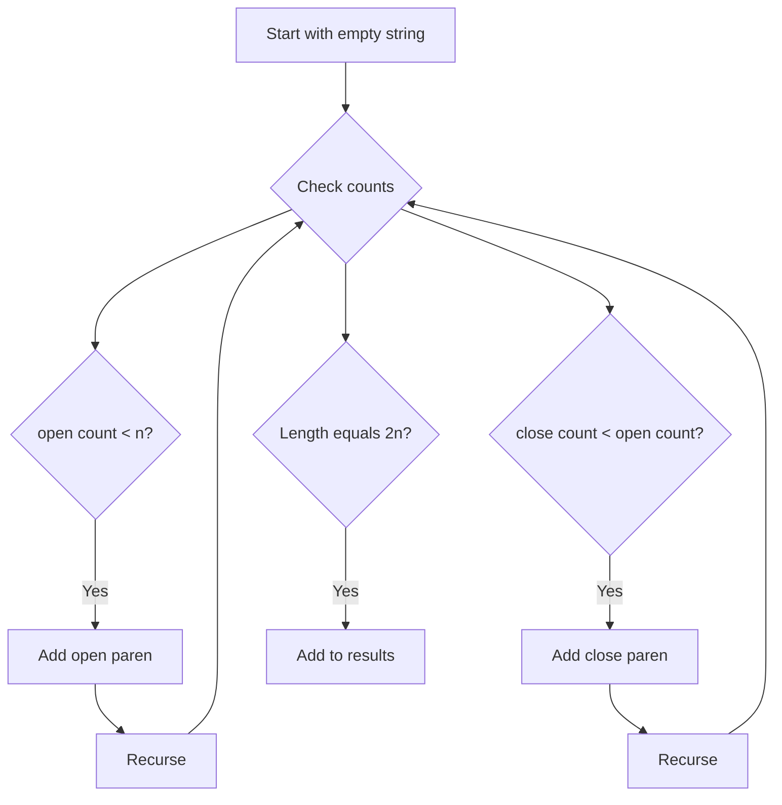

Given `n` pairs of parentheses, write a function to generate all combinations of well-formed parentheses.

## Examples

**Input:** n = 3
**Output:** ["((()))","(()())","(())()","()(())","()()()"]
**Explanation:** There are exactly 5 (the 3rd Catalan number) ways to arrange 3 pairs of valid parentheses.

**Input:** n = 1
**Output:** ["()"]
**Explanation:** With only one pair, the sole valid arrangement is "()".


## Solution

```js
function generateParenthesis(n) {
  const result = [];

  function backtrack(current, open, close) {
    if (current.length === 2 * n) {
      result.push(current);
      return;
    }
    if (open < n) {
      backtrack(current + '(', open + 1, close);
    }
    if (close < open) {
      backtrack(current + ')', open, close + 1);
    }
  }

  backtrack('', 0, 0);
  return result;
}
```

## Explanation

APPROACH: Constrained Backtracking — Only Valid Parentheses

Two rules prune the tree: (1) add "(" if open < n, (2) add ")" only if close < open.

```
n = 3

                    ""
             /              \
          "("               (close < open? No → prune)
        /       \
     "(("       "()"
    /    \      /    \
  "((("  "(()" "()(""  "()()"?
   |      / \    |      close<open? No
"((()" "(()(" "(())"
   |     |      |
"((())" "(()(" "(())(""
   |     |      |
"((()))" "(()())" "(())()"
                    ...→ "()(())" "()()()"

All valid results for n=3:
  ((()))  (()())  (())()  ()(())  ()()()

Total: C(n) = Catalan number = (2n)! / ((n+1)! × n!)
  C(3) = 5, C(4) = 14
```

KEY: The constraint "close < open" ensures we never have more closing than opening parens at any point, guaranteeing validity without post-filtering.

## Diagram



## TestConfig
```json
{
  "functionName": "generateParenthesis",
  "compareType": "setEqual",
  "testCases": [
    {
      "args": [
        3
      ],
      "expected": [
        "((()))",
        "(()())",
        "(())()",
        "()(())",
        "()()()"
      ]
    },
    {
      "args": [
        1
      ],
      "expected": [
        "()"
      ]
    },
    {
      "args": [
        2
      ],
      "expected": [
        "(())",
        "()()"
      ]
    },
    {
      "args": [
        4
      ],
      "expected": [
        "(((())))",
        "((()()))",
        "((())())",
        "((()))()",
        "(()(()))",
        "(()()())",
        "(()())()",
        "(())(())",
        "(())()()",
        "()((()))",
        "()(()())",
        "()(())()",
        "()()(())",
        "()()()()"
      ]
    },
    {
      "args": [
        0
      ],
      "expected": [
        ""
      ]
    },
    {
      "args": [
        1
      ],
      "expected": [
        "()"
      ]
    },
    {
      "args": [
        2
      ],
      "expected": [
        "(())",
        "()()"
      ]
    },
    {
      "args": [
        3
      ],
      "expected": [
        "((()))",
        "(()())",
        "(())()",
        "()(())",
        "()()()"
      ]
    },
    {
      "args": [
        1
      ],
      "expected": [
        "()"
      ]
    },
    {
      "args": [
        2
      ],
      "expected": [
        "(())",
        "()()"
      ]
    }
  ]
}
```
