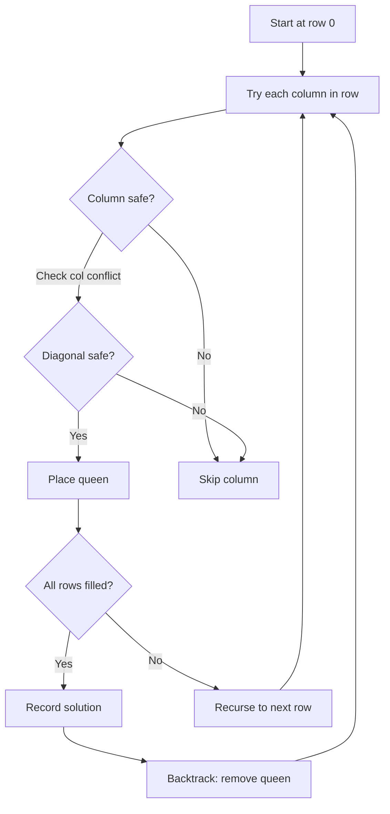

The n-queens puzzle is the problem of placing `n` queens on an `n x n` chessboard such that no two queens attack each other. Given an integer `n`, return all distinct solutions to the n-queens puzzle. Each solution contains a distinct board configuration of queen placements.

## Examples

**Input:** n = 4
**Output:** [[".Q..","...Q","Q...","..Q."],["..Q.","Q...","...Q",".Q.."]]
**Explanation:** There are only two ways to place 4 non-attacking queens on a 4x4 board.


## Solution

```js
function solveNQueens(n) {
  const result = [];
  const board = Array.from({ length: n }, () => '.'.repeat(n));
  const cols = new Set();
  const diag1 = new Set();
  const diag2 = new Set();

  function backtrack(row) {
    if (row === n) {
      result.push([...board]);
      return;
    }
    for (let col = 0; col < n; col++) {
      if (cols.has(col) || diag1.has(row - col) || diag2.has(row + col)) continue;
      cols.add(col);
      diag1.add(row - col);
      diag2.add(row + col);
      board[row] = board[row].substring(0, col) + 'Q' + board[row].substring(col + 1);
      backtrack(row + 1);
      board[row] = board[row].substring(0, col) + '.' + board[row].substring(col + 1);
      cols.delete(col);
      diag1.delete(row - col);
      diag2.delete(row + col);
    }
  }

  backtrack(0);
  return result;
}
```

## Explanation

APPROACH: Backtracking with Column & Diagonal Tracking

Place queens row by row. Track attacked columns and diagonals using sets.

```
n = 4

Row 0: try col 0 → Q at (0,0)
  Row 1: col 0 (same col) ✗, col 1 (diagonal) ✗, col 2 → Q at (1,2)
    Row 2: all blocked ✗ → BACKTRACK
  Row 1: col 3 → Q at (1,3)
    Row 2: col 1 → Q at (2,1)
      Row 3: all blocked ✗ → BACKTRACK
    Row 2: col 0 blocked, col 1 tried...→ BACKTRACK

Row 0: try col 1 → Q at (0,1)
  Row 1: col 3 → Q at (1,3)
    Row 2: col 0 → Q at (2,0)
      Row 3: col 2 → Q at (3,2) ✓ SOLUTION 1!

. Q . .       . . Q .
. . . Q       Q . . .
Q . . .       . . . Q
. . Q .       . Q . .

Diagonal tracking:
  row - col = constant on \ diagonals
  row + col = constant on / diagonals

cols = {}, diag1 = {row-col}, diag2 = {row+col}
Check: !cols.has(col) && !diag1.has(r-c) && !diag2.has(r+c)
```

## Diagram



## TestConfig
```json
{
  "functionName": "solveNQueens",
  "compareType": "setEqual",
  "testCases": [
    {
      "args": [
        4
      ],
      "expected": [
        [
          ".Q..",
          "...Q",
          "Q...",
          "..Q."
        ],
        [
          "..Q.",
          "Q...",
          "...Q",
          ".Q.."
        ]
      ]
    },
    {
      "args": [
        1
      ],
      "expected": [
        [
          "Q"
        ]
      ]
    },
    {
      "args": [
        2
      ],
      "expected": []
    },
    {
      "args": [
        3
      ],
      "expected": []
    },
    {
      "args": [
        5
      ],
      "expected": [
        [
          "Q....",
          "..Q..",
          "....Q",
          ".Q...",
          "...Q."
        ],
        [
          "Q....",
          "...Q.",
          ".Q...",
          "....Q",
          "..Q.."
        ],
        [
          "..Q..",
          "Q....",
          "...Q.",
          ".Q...",
          "....Q"
        ],
        [
          "..Q..",
          "....Q",
          ".Q...",
          "...Q.",
          "Q...."
        ],
        [
          "....Q",
          "..Q..",
          "Q....",
          "...Q.",
          ".Q..."
        ],
        [
          "....Q",
          ".Q...",
          "...Q.",
          "Q....",
          "..Q.."
        ],
        [
          "...Q.",
          "Q....",
          "..Q..",
          "....Q",
          ".Q..."
        ],
        [
          "...Q.",
          ".Q...",
          "....Q",
          "..Q..",
          "Q...."
        ],
        [
          "Q....",
          "..Q..",
          "....Q",
          ".Q...",
          "...Q."
        ],
        [
          ".Q...",
          "...Q.",
          "Q....",
          "..Q..",
          "....Q"
        ]
      ]
    },
    {
      "args": [
        1
      ],
      "expected": [
        [
          "Q"
        ]
      ]
    },
    {
      "args": [
        4
      ],
      "expected": [
        [
          ".Q..",
          "...Q",
          "Q...",
          "..Q."
        ],
        [
          "..Q.",
          "Q...",
          "...Q",
          ".Q.."
        ]
      ]
    },
    {
      "args": [
        2
      ],
      "expected": []
    },
    {
      "args": [
        3
      ],
      "expected": []
    },
    {
      "args": [
        1
      ],
      "expected": [
        [
          "Q"
        ]
      ]
    }
  ]
}
```
