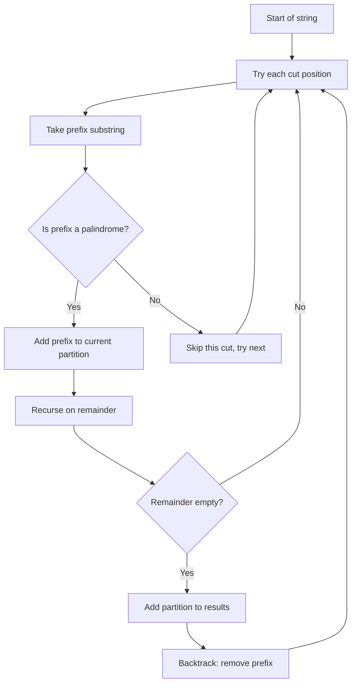

Given a string `s`, partition `s` such that every substring of the partition is a palindrome. Return all possible palindrome partitionings of `s`.

## Examples

**Input:** s = "aab"
**Output:** [["a","a","b"],["aa","b"]]
**Explanation:** "a","a","b" are all palindromes individually, and "aa" is also a palindrome, giving two valid partitions.

**Input:** s = "a"
**Output:** [["a"]]
**Explanation:** A single character is always a palindrome, so there is only one partition.


## Solution

```js
function partition(s) {
  const result = [];

  function isPalindrome(str, l, r) {
    while (l < r) {
      if (str[l] !== str[r]) return false;
      l++;
      r--;
    }
    return true;
  }

  function backtrack(start, current) {
    if (start === s.length) {
      result.push([...current]);
      return;
    }
    for (let end = start; end < s.length; end++) {
      if (isPalindrome(s, start, end)) {
        current.push(s.substring(start, end + 1));
        backtrack(end + 1, current);
        current.pop();
      }
    }
  }

  backtrack(0, []);
  return result;
}
```

## Explanation

APPROACH: Backtracking — Try All Cut Points, Prune Non-Palindromes

At each position, try every possible prefix. Only recurse if the prefix is a palindrome.

```
s = "aab"

start=0:
  try "a" (palindrome ✓) → recurse at start=1
    try "a" (palindrome ✓) → recurse at start=2
      try "b" (palindrome ✓) → start=3=len → ["a","a","b"] ✓
    try "ab" (not palindrome ✗) → skip
  try "aa" (palindrome ✓) → recurse at start=2
    try "b" (palindrome ✓) → start=3=len → ["aa","b"] ✓
  try "aab" (not palindrome ✗) → skip

Result: [["a","a","b"], ["aa","b"]]

s = "racecar":
  "r" → "a" → "c" → "e" → "c" → "a" → "r"  ✓
  "r" → "a" → "cec" → "a" → "r"               ✓
  "r" → "aceca" → "r"                           ✓
  "racecar"                                      ✓
```

KEY: The palindrome check prunes many branches early. Only valid palindrome prefixes lead to recursion, significantly reducing the search space from 2^(n-1) to much fewer.

## Diagram



## TestConfig
```json
{
  "functionName": "partition",
  "compareType": "setEqual",
  "testCases": [
    {
      "args": [
        "aab"
      ],
      "expected": [
        [
          "a",
          "a",
          "b"
        ],
        [
          "aa",
          "b"
        ]
      ]
    },
    {
      "args": [
        "a"
      ],
      "expected": [
        [
          "a"
        ]
      ]
    },
    {
      "args": [
        "ab"
      ],
      "expected": [
        [
          "a",
          "b"
        ]
      ]
    },
    {
      "args": [
        "aa"
      ],
      "expected": [
        [
          "a",
          "a"
        ],
        [
          "aa"
        ]
      ]
    },
    {
      "args": [
        "aba"
      ],
      "expected": [
        [
          "a",
          "b",
          "a"
        ],
        [
          "aba"
        ]
      ]
    },
    {
      "args": [
        "aaa"
      ],
      "expected": [
        [
          "a",
          "a",
          "a"
        ],
        [
          "a",
          "aa"
        ],
        [
          "aa",
          "a"
        ],
        [
          "aaa"
        ]
      ]
    },
    {
      "args": [
        "abba"
      ],
      "expected": [
        [
          "a",
          "b",
          "b",
          "a"
        ],
        [
          "a",
          "bb",
          "a"
        ],
        [
          "abba"
        ]
      ]
    },
    {
      "args": [
        "abc"
      ],
      "expected": [
        [
          "a",
          "b",
          "c"
        ]
      ]
    },
    {
      "args": [
        "aba"
      ],
      "expected": [
        [
          "a",
          "b",
          "a"
        ],
        [
          "aba"
        ]
      ]
    },
    {
      "args": [
        "racecar"
      ],
      "expected": [
        [
          "r",
          "a",
          "c",
          "e",
          "c",
          "a",
          "r"
        ],
        [
          "r",
          "a",
          "cec",
          "a",
          "r"
        ],
        [
          "r",
          "aceca",
          "r"
        ],
        [
          "racecar"
        ]
      ]
    }
  ]
}
```
