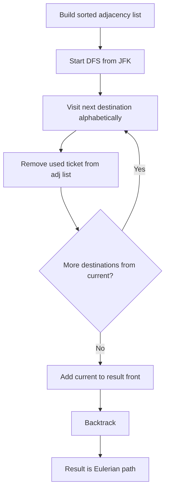

There are a total of `numCourses` courses you have to take, labeled from `0` to `numCourses - 1`. You are given an array `prerequisites` where `prerequisites[i] = [a, b]` indicates that you must take course `b` first if you want to take course `a`. Return the ordering of courses you should take to finish all courses. If it is impossible, return an empty array.

## Examples

**Input:** numCourses = 4, prerequisites = [[1,0],[2,0],[3,1],[3,2]]
**Output:** [0,1,2,3] or [0,2,1,3]
**Explanation:** There are two valid topological orderings.

**Input:** numCourses = 2, prerequisites = [[1,0],[0,1]]
**Output:** []
**Explanation:** Cycle exists, impossible to finish all courses.


## Brute Force

```js
function findOrderDFS(numCourses, prerequisites) {
  const graph = Array.from({ length: numCourses }, () => []);
  for (const [course, prereq] of prerequisites) {
    graph[prereq].push(course);
  }

  const state = new Array(numCourses).fill(0);
  const result = [];

  function dfs(node) {
    if (state[node] === 1) return false;
    if (state[node] === 2) return true;
    state[node] = 1;
    for (const neighbor of graph[node]) {
      if (!dfs(neighbor)) return false;
    }
    state[node] = 2;
    result.push(node);
    return true;
  }

  for (let i = 0; i < numCourses; i++) {
    if (!dfs(i)) return [];
  }
  return result.reverse();
}
```

### Brute Force Explanation

DFS Post-Order approach:

Visit nodes via DFS. After fully exploring all neighbors, push the node to result. Reverse at the end gives topological order.

```
State tracking: 0=unvisited, 1=in-path, 2=done

DFS(0): state[0]=1
  DFS(1): state[1]=1
    DFS(3): state[3]=1, no unvisited neighbors
            state[3]=2, push 3
  state[1]=2, push 1
  DFS(2): state[2]=1
    DFS(3): state[3]=2 → skip
  state[2]=2, push 2
state[0]=2, push 0

result = [3,1,2,0] → reverse → [0,2,1,3] ✓
```

## Solution

```js
function findOrder(numCourses, prerequisites) {
  const graph = Array.from({ length: numCourses }, () => []);
  const inDegree = new Array(numCourses).fill(0);

  for (const [course, prereq] of prerequisites) {
    graph[prereq].push(course);
    inDegree[course]++;
  }

  const queue = [];
  for (let i = 0; i < numCourses; i++) {
    if (inDegree[i] === 0) queue.push(i);
  }

  const order = [];
  while (queue.length > 0) {
    const course = queue.shift();
    order.push(course);
    for (const next of graph[course]) {
      inDegree[next]--;
      if (inDegree[next] === 0) queue.push(next);
    }
  }

  return order.length === numCourses ? order : [];
}
```

## Explanation

APPROACH: Topological Sort (Kahn's BFS)

Build a directed graph from prerequisites. Use BFS starting from nodes with in-degree 0 (no prerequisites). Record the order as nodes are dequeued.

```
prerequisites = [[1,0],[2,0],[3,1],[3,2]]

Graph:           In-degree:
0 → [1, 2]      0: 0  ← start here
1 → [3]         1: 1
2 → [3]         2: 1
                 3: 2

BFS: queue=[0]
  Pop 0 → order=[0], decrement 1→0, 2→0 → queue=[1,2]
  Pop 1 → order=[0,1], decrement 3→1 → queue=[2]
  Pop 2 → order=[0,1,2], decrement 3→0 → queue=[3]
  Pop 3 → order=[0,1,2,3]

All 4 courses completed → return [0,1,2,3] ✓
```

If a cycle exists, some nodes never reach in-degree 0, so order.length < numCourses → return [].

## Diagram


