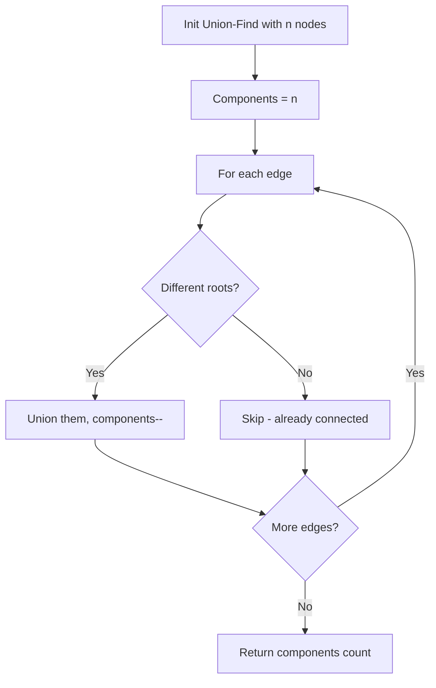

There is a new alien language that uses the English alphabet. The order among the letters is unknown. You are given a list of strings `words` from the alien language dictionary, where the strings are sorted lexicographically by the rules of this new language. Derive the order of letters in this language. If the order is invalid, return `""`.

## Examples

**Input:** words = ["wrt","wrf","er","ett","rftt"]
**Output:** "wertf"
**Explanation:** Comparing adjacent words reveals the ordering: w < e < r < t < f.

**Input:** words = ["z","x","z"]
**Output:** ""
**Explanation:** The order is invalid (cycle: z before x, x before z).


## Solution

```js
function alienOrder(words) {
  const graph = new Map();
  const inDegree = new Map();

  for (const word of words) {
    for (const ch of word) {
      if (!graph.has(ch)) graph.set(ch, new Set());
      if (!inDegree.has(ch)) inDegree.set(ch, 0);
    }
  }

  for (let i = 0; i < words.length - 1; i++) {
    const w1 = words[i];
    const w2 = words[i + 1];
    if (w1.length > w2.length && w1.startsWith(w2)) return "";

    for (let j = 0; j < Math.min(w1.length, w2.length); j++) {
      if (w1[j] !== w2[j]) {
        if (!graph.get(w1[j]).has(w2[j])) {
          graph.get(w1[j]).add(w2[j]);
          inDegree.set(w2[j], inDegree.get(w2[j]) + 1);
        }
        break;
      }
    }
  }

  const queue = [];
  for (const [ch, deg] of inDegree) {
    if (deg === 0) queue.push(ch);
  }

  const result = [];
  while (queue.length > 0) {
    const ch = queue.shift();
    result.push(ch);
    for (const next of graph.get(ch)) {
      inDegree.set(next, inDegree.get(next) - 1);
      if (inDegree.get(next) === 0) queue.push(next);
    }
  }

  return result.length === inDegree.size ? result.join('') : "";
}
```

## Explanation

APPROACH: Compare Adjacent Words → Build Graph → Topological Sort

Step 1: Compare adjacent words pairwise to extract letter ordering rules.
Step 2: Build directed graph from those rules.
Step 3: Topological sort gives the alien alphabet order.

```
words = ["wrt","wrf","er","ett","rftt"]

Compare adjacent pairs:
  "wrt" vs "wrf": t < f     (first diff at index 2)
  "wrf" vs "er":  w < e     (first diff at index 0)
  "er"  vs "ett": r < t     (first diff at index 1)
  "ett" vs "rftt": e < r    (first diff at index 0)

Graph edges: t→f, w→e, r→t, e→r
In-degree:   w:0  e:1  r:1  t:1  f:1

Topological sort:
  queue=[w] → pop w, decrement e→0 → queue=[e]
  queue=[e] → pop e, decrement r→0 → queue=[r]
  queue=[r] → pop r, decrement t→0 → queue=[t]
  queue=[t] → pop t, decrement f→0 → queue=[f]

Result: "wertf" ✓

Edge case: "abc" before "ab" → INVALID (longer prefix first)
```

## Diagram


