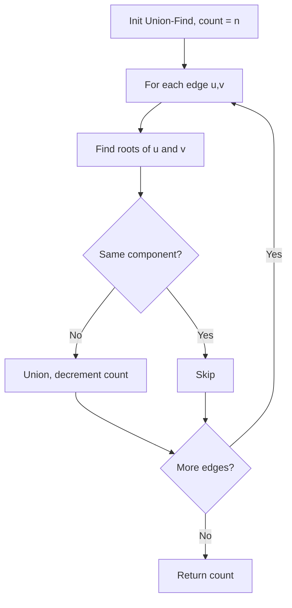

You are given an `m x n` binary matrix `grid`. An island is a group of `1`s (representing land) connected 4-directionally. Return the maximum area of an island in `grid`. If there is no island, return `0`.

## Examples

**Input:** grid = [[0,0,1,0,0],[0,0,0,0,0],[0,1,1,0,0],[0,1,0,0,0]]
**Output:** 3
**Explanation:** The largest island is the connected group of three 1s at positions (1,1), (2,1), and (2,2).


## Solution

```js
function maxAreaOfIsland(grid) {
  const rows = grid.length;
  const cols = grid[0].length;
  let maxArea = 0;

  function dfs(r, c) {
    if (r < 0 || r >= rows || c < 0 || c >= cols || grid[r][c] === 0) return 0;
    grid[r][c] = 0;
    return 1 + dfs(r + 1, c) + dfs(r - 1, c) + dfs(r, c + 1) + dfs(r, c - 1);
  }

  for (let r = 0; r < rows; r++) {
    for (let c = 0; c < cols; c++) {
      if (grid[r][c] === 1) {
        maxArea = Math.max(maxArea, dfs(r, c));
      }
    }
  }

  return maxArea;
}
```

## Diagram



## TestConfig
```json
{
  "functionName": "maxAreaOfIsland",
  "testCases": [
    {
      "args": [
        [
          [
            0,
            0,
            1,
            0,
            0,
            0,
            0,
            1,
            0,
            0,
            0,
            0,
            0
          ],
          [
            0,
            0,
            0,
            0,
            0,
            0,
            0,
            1,
            1,
            1,
            0,
            0,
            0
          ],
          [
            0,
            1,
            1,
            0,
            1,
            0,
            0,
            0,
            0,
            0,
            0,
            0,
            0
          ],
          [
            0,
            1,
            0,
            0,
            1,
            1,
            0,
            0,
            1,
            0,
            1,
            0,
            0
          ],
          [
            0,
            1,
            0,
            0,
            1,
            1,
            0,
            0,
            1,
            1,
            1,
            0,
            0
          ],
          [
            0,
            0,
            0,
            0,
            0,
            0,
            0,
            0,
            0,
            0,
            1,
            0,
            0
          ],
          [
            0,
            0,
            0,
            0,
            0,
            0,
            0,
            1,
            1,
            1,
            0,
            0,
            0
          ],
          [
            0,
            0,
            0,
            0,
            0,
            0,
            0,
            1,
            1,
            0,
            0,
            0,
            0
          ]
        ]
      ],
      "expected": 6
    },
    {
      "args": [
        [
          [
            0,
            0,
            0,
            0,
            0,
            0,
            0,
            0
          ]
        ]
      ],
      "expected": 0
    },
    {
      "args": [
        [
          [
            1,
            1,
            0,
            0,
            0
          ],
          [
            1,
            1,
            0,
            0,
            0
          ],
          [
            0,
            0,
            0,
            1,
            1
          ],
          [
            0,
            0,
            0,
            1,
            1
          ]
        ]
      ],
      "expected": 4
    },
    {
      "args": [
        [
          [
            1
          ]
        ]
      ],
      "expected": 1,
      "isHidden": true
    },
    {
      "args": [
        [
          [
            0
          ]
        ]
      ],
      "expected": 0,
      "isHidden": true
    },
    {
      "args": [
        [
          [
            1,
            1,
            1
          ],
          [
            1,
            1,
            1
          ],
          [
            1,
            1,
            1
          ]
        ]
      ],
      "expected": 9,
      "isHidden": true
    },
    {
      "args": [
        [
          [
            1,
            0,
            1
          ],
          [
            0,
            0,
            0
          ],
          [
            1,
            0,
            1
          ]
        ]
      ],
      "expected": 1,
      "isHidden": true
    },
    {
      "args": [
        [
          [
            1,
            1,
            0
          ],
          [
            0,
            1,
            0
          ],
          [
            0,
            1,
            1
          ]
        ]
      ],
      "expected": 5,
      "isHidden": true
    },
    {
      "args": [
        [
          [
            0,
            0,
            0
          ],
          [
            0,
            0,
            0
          ]
        ]
      ],
      "expected": 0,
      "isHidden": true
    },
    {
      "args": [
        [
          [
            1,
            0
          ],
          [
            0,
            1
          ]
        ]
      ],
      "expected": 1,
      "isHidden": true
    }
  ]
}
```
