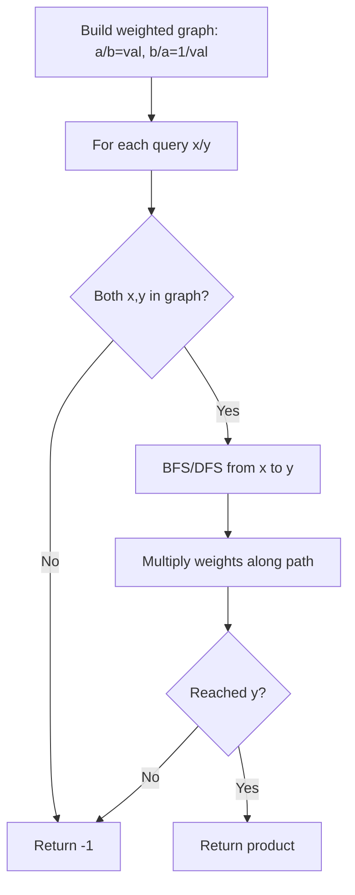

There are `n` cities connected by some number of flights. You are given an array `flights` where `flights[i] = [from, to, price]`. You are also given `src`, `dst`, and `k`, return the cheapest price from `src` to `dst` with at most `k` stops. If there is no such route, return `-1`.

## Examples

**Input:** n = 4, flights = [[0,1,100],[1,2,100],[2,0,100],[1,3,600],[2,3,200]], src = 0, dst = 3, k = 1
**Output:** 700
**Explanation:** The optimal path is 0 → 1 → 3 with cost 100 + 600 = 700.


## Brute Force

```js
function findCheapestPriceBFS(n, flights, src, dst, k) {
  const graph = Array.from({ length: n }, () => []);
  for (const [from, to, price] of flights) {
    graph[from].push([to, price]);
  }

  const queue = [[src, 0]];
  const dist = new Array(n).fill(Infinity);
  dist[src] = 0;
  let stops = 0;

  while (queue.length > 0 && stops <= k) {
    const size = queue.length;
    for (let i = 0; i < size; i++) {
      const [node, cost] = queue.shift();
      for (const [next, price] of graph[node]) {
        const newCost = cost + price;
        if (newCost < dist[next]) {
          dist[next] = newCost;
          queue.push([next, newCost]);
        }
      }
    }
    stops++;
  }

  return dist[dst] === Infinity ? -1 : dist[dst];
}
```

### Brute Force Explanation

BFS level-by-level:

Each BFS level = one flight. Process at most k+1 levels.

```
Level 0: (node=0, cost=0)
Level 1: (node=1, cost=100)
Level 2: (node=2, cost=200), (node=3, cost=700)
         ↑ stop here (k=1, so max 2 levels)

dist[3] = 700 ✓
```

## Solution

```js
function findCheapestPrice(n, flights, src, dst, k) {
  let prices = new Array(n).fill(Infinity);
  prices[src] = 0;

  for (let i = 0; i <= k; i++) {
    const temp = [...prices];
    for (const [from, to, price] of flights) {
      if (prices[from] === Infinity) continue;
      if (prices[from] + price < temp[to]) {
        temp[to] = prices[from] + price;
      }
    }
    prices = temp;
  }

  return prices[dst] === Infinity ? -1 : prices[dst];
}
```

## Explanation

APPROACH: Bellman-Ford with K+1 iterations

Relax all edges k+1 times. Use a COPY of prices each round to prevent cascading updates that use more stops than allowed.

```
flights: 0→1:100, 1→2:100, 2→0:100, 1→3:600, 2→3:200
src=0, dst=3, k=1 (at most 1 stop)

Initial: prices = [0, ∞, ∞, ∞]

Round 0 (direct flights from src):
  0→1: 0+100=100 < ∞  → temp[1]=100
  1→3: ∞ (skip, prices[1]=∞)
  prices = [0, 100, ∞, ∞]

Round 1 (1 stop allowed):
  0→1: already 100
  1→2: 100+100=200 < ∞ → temp[2]=200
  1→3: 100+600=700 < ∞ → temp[3]=700
  2→3: ∞ (prices[2]=∞, NOT temp[2])
  prices = [0, 100, 200, 700]

Answer: prices[3] = 700 ✓
(Path: 0→1→3, cost 100+600=700)

Key: using prices (not temp) for source prevents
using edges from the current round.
```

## Diagram



## TestConfig
```json
{
  "functionName": "findCheapestPrice",
  "testCases": [
    {
      "args": [
        4,
        [
          [
            0,
            1,
            100
          ],
          [
            1,
            2,
            100
          ],
          [
            2,
            0,
            100
          ],
          [
            1,
            3,
            600
          ],
          [
            2,
            3,
            200
          ]
        ],
        0,
        3,
        1
      ],
      "expected": 700
    },
    {
      "args": [
        3,
        [
          [
            0,
            1,
            100
          ],
          [
            1,
            2,
            100
          ],
          [
            0,
            2,
            500
          ]
        ],
        0,
        2,
        1
      ],
      "expected": 200
    },
    {
      "args": [
        3,
        [
          [
            0,
            1,
            100
          ],
          [
            1,
            2,
            100
          ],
          [
            0,
            2,
            500
          ]
        ],
        0,
        2,
        0
      ],
      "expected": 500
    },
    {
      "args": [
        2,
        [
          [
            0,
            1,
            100
          ]
        ],
        0,
        1,
        0
      ],
      "expected": 100,
      "isHidden": true
    },
    {
      "args": [
        2,
        [
          [
            0,
            1,
            100
          ]
        ],
        1,
        0,
        0
      ],
      "expected": -1,
      "isHidden": true
    },
    {
      "args": [
        3,
        [
          [
            0,
            1,
            1
          ],
          [
            1,
            2,
            1
          ]
        ],
        0,
        2,
        1
      ],
      "expected": 2,
      "isHidden": true
    },
    {
      "args": [
        3,
        [
          [
            0,
            1,
            1
          ],
          [
            1,
            2,
            1
          ]
        ],
        0,
        2,
        0
      ],
      "expected": -1,
      "isHidden": true
    },
    {
      "args": [
        4,
        [
          [
            0,
            1,
            1
          ],
          [
            0,
            2,
            5
          ],
          [
            1,
            2,
            1
          ],
          [
            2,
            3,
            1
          ]
        ],
        0,
        3,
        2
      ],
      "expected": 3,
      "isHidden": true
    },
    {
      "args": [
        5,
        [
          [
            0,
            1,
            5
          ],
          [
            1,
            2,
            5
          ],
          [
            0,
            3,
            2
          ],
          [
            3,
            1,
            2
          ],
          [
            1,
            4,
            1
          ],
          [
            4,
            2,
            1
          ]
        ],
        0,
        2,
        2
      ],
      "expected": 7,
      "isHidden": true
    },
    {
      "args": [
        1,
        [],
        0,
        0,
        0
      ],
      "expected": 0,
      "isHidden": true
    }
  ]
}
```
