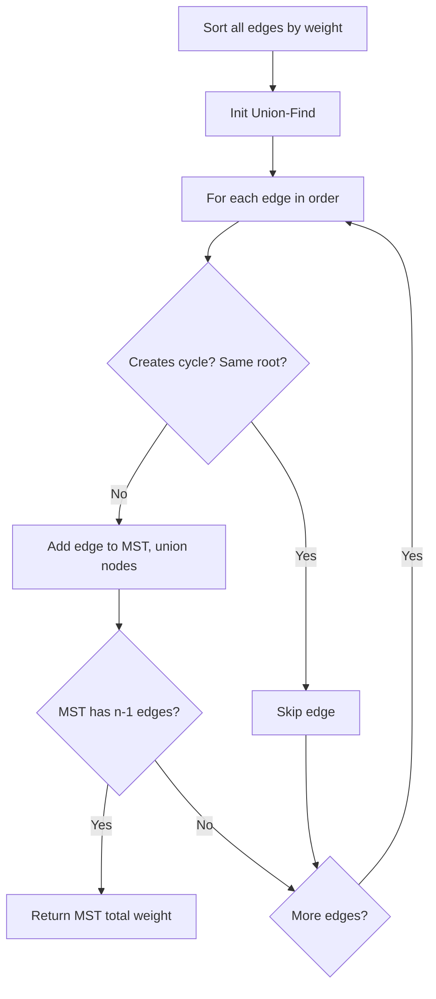

You are given a network of `n` nodes, labeled from `1` to `n`. You are given `times`, a list of travel times as directed edges `times[i] = (u, v, w)`, where `u` is the source, `v` is the target, and `w` is the travel time. Send a signal from node `k`. Return the minimum time for all `n` nodes to receive the signal. If impossible, return `-1`.

## Examples

**Input:** times = [[2,1,1],[2,3,1],[3,4,1]], n = 4, k = 2
**Output:** 2
**Explanation:** The signal from node 2 reaches nodes 1 and 3 at time 1, then node 4 at time 2.


## Solution

```js
function networkDelayTime(times, n, k) {
  const graph = Array.from({ length: n + 1 }, () => []);
  for (const [u, v, w] of times) {
    graph[u].push([v, w]);
  }

  const dist = new Array(n + 1).fill(Infinity);
  dist[k] = 0;

  const minHeap = [[0, k]];

  while (minHeap.length > 0) {
    minHeap.sort((a, b) => a[0] - b[0]);
    const [d, node] = minHeap.shift();

    if (d > dist[node]) continue;

    for (const [next, weight] of graph[node]) {
      const newDist = d + weight;
      if (newDist < dist[next]) {
        dist[next] = newDist;
        minHeap.push([newDist, next]);
      }
    }
  }

  const maxDist = Math.max(...dist.slice(1));
  return maxDist === Infinity ? -1 : maxDist;
}
```

## Explanation

APPROACH: Dijkstra's Algorithm

Greedily process the closest unvisited node. The signal reaches all nodes; the answer is the maximum distance.

```
times = [[2,1,1],[2,3,1],[3,4,1]], n=4, k=2

Graph: 2→[(1,1),(3,1)], 3→[(4,1)]

dist = [∞, ∞, 0, ∞, ∞]  (0-indexed offset, node 2 = source)
heap = [(0, 2)]

Pop (0,2): process neighbors
  → node 1: 0+1=1 < ∞ → dist[1]=1, push (1,1)
  → node 3: 0+1=1 < ∞ → dist[3]=1, push (1,3)

Pop (1,1): no outgoing edges

Pop (1,3): process neighbors
  → node 4: 1+1=2 < ∞ → dist[4]=2, push (2,4)

Pop (2,4): no outgoing edges

dist = [∞, 1, 0, 1, 2]
max(dist[1..4]) = 2 → answer: 2 ✓

Signal timeline: node2(t=0) → node1,node3(t=1) → node4(t=2)
```

## Diagram



## TestConfig
```json
{
  "functionName": "networkDelayTime",
  "testCases": [
    {
      "args": [
        [
          [
            2,
            1,
            1
          ],
          [
            2,
            3,
            1
          ],
          [
            3,
            4,
            1
          ]
        ],
        4,
        2
      ],
      "expected": 2
    },
    {
      "args": [
        [
          [
            1,
            2,
            1
          ]
        ],
        2,
        1
      ],
      "expected": 1
    },
    {
      "args": [
        [
          [
            1,
            2,
            1
          ]
        ],
        2,
        2
      ],
      "expected": -1
    },
    {
      "args": [
        [
          [
            1,
            2,
            1
          ],
          [
            2,
            3,
            2
          ],
          [
            1,
            3,
            4
          ]
        ],
        3,
        1
      ],
      "expected": 3,
      "isHidden": true
    },
    {
      "args": [
        [
          [
            1,
            2,
            1
          ],
          [
            2,
            1,
            3
          ]
        ],
        2,
        2
      ],
      "expected": 3,
      "isHidden": true
    },
    {
      "args": [
        [
          [
            1,
            2,
            1
          ],
          [
            2,
            3,
            2
          ],
          [
            3,
            4,
            3
          ]
        ],
        4,
        1
      ],
      "expected": 6,
      "isHidden": true
    },
    {
      "args": [
        [
          [
            1,
            2,
            1
          ]
        ],
        1,
        1
      ],
      "expected": 0,
      "isHidden": true
    },
    {
      "args": [
        [
          [
            1,
            2,
            10
          ],
          [
            1,
            3,
            5
          ],
          [
            3,
            2,
            1
          ]
        ],
        3,
        1
      ],
      "expected": 6,
      "isHidden": true
    },
    {
      "args": [
        [
          [
            1,
            2,
            1
          ],
          [
            1,
            3,
            1
          ],
          [
            2,
            3,
            1
          ]
        ],
        3,
        1
      ],
      "expected": 1,
      "isHidden": true
    },
    {
      "args": [
        [
          [
            1,
            2,
            100
          ]
        ],
        3,
        1
      ],
      "expected": -1,
      "isHidden": true
    }
  ]
}
```
