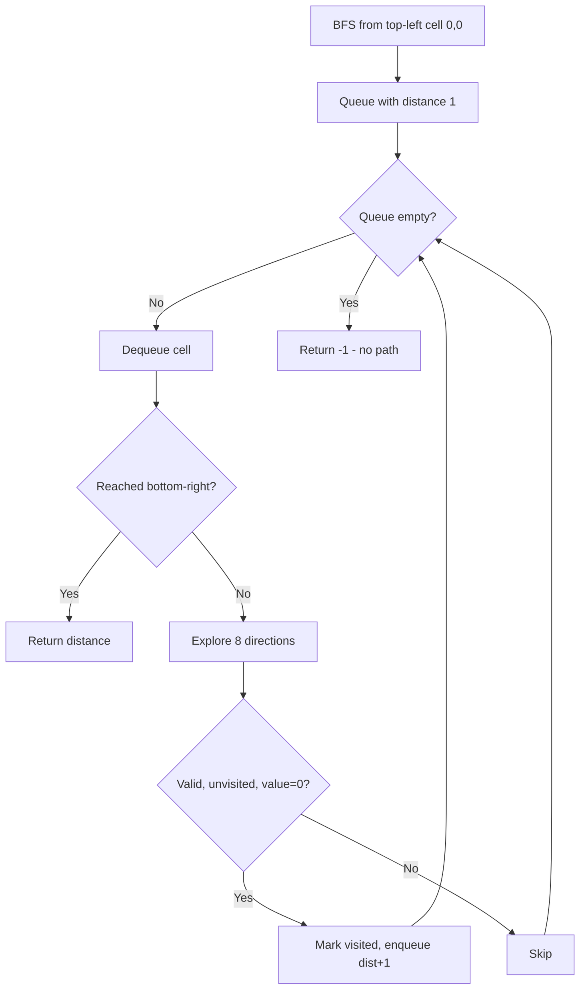

Given a list of `accounts` where each element `accounts[i]` is a list of strings, where the first element `accounts[i][0]` is a name, and the rest are emails belonging to that account. Merge accounts that share a common email. Return the merged accounts in the format [name, ...sorted_emails].

## Examples

**Input:** accounts = [["John","j1@mail.com","j2@mail.com"],["John","j1@mail.com","j3@mail.com"],["Mary","m1@mail.com"]]
**Output:** [["John","j1@mail.com","j2@mail.com","j3@mail.com"],["Mary","m1@mail.com"]]
**Explanation:** Accounts 1 and 2 share "j1@mail.com", so they are merged into one account with all three emails.


## Solution

```js
function accountsMerge(accounts) {
  const parent = {};
  const rank = {};
  const emailToName = {};

  function find(x) {
    if (parent[x] !== x) parent[x] = find(parent[x]);
    return parent[x];
  }

  function union(a, b) {
    const rootA = find(a);
    const rootB = find(b);
    if (rootA === rootB) return;
    if ((rank[rootA] || 0) < (rank[rootB] || 0)) parent[rootA] = rootB;
    else if ((rank[rootA] || 0) > (rank[rootB] || 0)) parent[rootB] = rootA;
    else { parent[rootB] = rootA; rank[rootA] = (rank[rootA] || 0) + 1; }
  }

  for (const account of accounts) {
    const name = account[0];
    for (let i = 1; i < account.length; i++) {
      const email = account[i];
      if (!parent[email]) { parent[email] = email; rank[email] = 0; }
      emailToName[email] = name;
      if (i > 1) union(account[1], email);
    }
  }

  const groups = {};
  for (const email of Object.keys(parent)) {
    const root = find(email);
    if (!groups[root]) groups[root] = [];
    groups[root].push(email);
  }

  const result = [];
  for (const [root, emails] of Object.entries(groups)) {
    result.push([emailToName[root], ...emails.sort()]);
  }
  return result;
}
```

## Explanation

APPROACH: Union-Find on Emails

Union all emails within the same account. Then group by root and sort.

```
accounts = [
  ["John", "j1@mail", "j2@mail"],
  ["John", "j1@mail", "j3@mail"],
  ["Mary", "m1@mail"]
]

Process account 0: union(j1, j2)
  parent: j1→j1, j2→j1

Process account 1: union(j1, j3)
  parent: j1→j1, j2→j1, j3→j1

Process account 2: m1 stands alone
  parent: ..., m1→m1

Group by root:
  j1: [j1, j2, j3]  → name: "John"
  m1: [m1]           → name: "Mary"

Result: [["John","j1@mail","j2@mail","j3@mail"], ["Mary","m1@mail"]]

Key: same name doesn't mean same person.
Only SHARED EMAILS prove same person.
```

## Diagram


