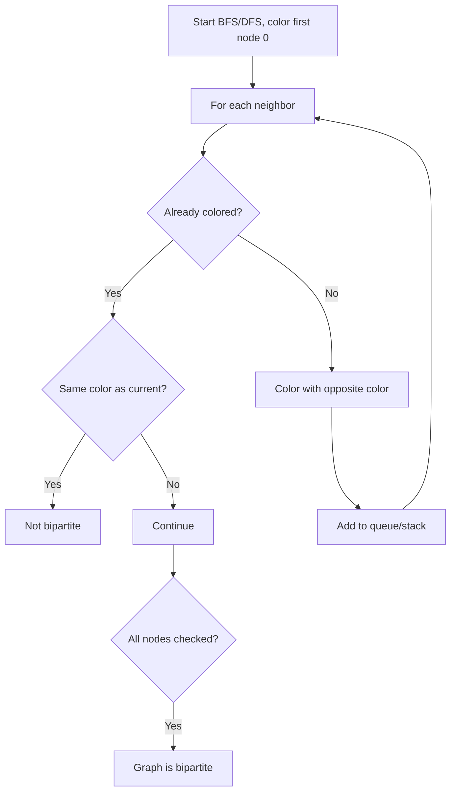

Given an `n x n` binary matrix `grid`, return the length of the shortest clear path from top-left to bottom-right. A clear path moves only through cells with `0` and can move in 8 directions. If no clear path exists, return `-1`.

## Examples

**Input:** grid = [[0,0,0],[1,1,0],[1,1,0]]
**Output:** 4
**Explanation:** The path goes (0,0) -> (0,1) -> (0,2) -> (1,2) -> (2,2), traversing 4 cells.

**Input:** grid = [[1,0,0],[1,1,0],[1,1,0]]
**Output:** -1
**Explanation:** The starting cell is blocked.


## Solution

```js
function shortestPathBinaryMatrix(grid) {
  const n = grid.length;
  if (grid[0][0] !== 0 || grid[n - 1][n - 1] !== 0) return -1;
  if (n === 1) return 1;

  const dirs = [[-1,-1],[-1,0],[-1,1],[0,-1],[0,1],[1,-1],[1,0],[1,1]];
  const queue = [[0, 0, 1]];
  grid[0][0] = 1;

  while (queue.length > 0) {
    const [r, c, dist] = queue.shift();
    for (const [dr, dc] of dirs) {
      const nr = r + dr;
      const nc = c + dc;
      if (nr < 0 || nr >= n || nc < 0 || nc >= n || grid[nr][nc] !== 0) continue;
      if (nr === n - 1 && nc === n - 1) return dist + 1;
      grid[nr][nc] = 1;
      queue.push([nr, nc, dist + 1]);
    }
  }

  return -1;
}
```

## Diagram



## TestConfig
```json
{
  "functionName": "shortestPathBinaryMatrix",
  "testCases": [
    {
      "args": [
        [
          [
            0,
            1
          ],
          [
            1,
            0
          ]
        ]
      ],
      "expected": 2
    },
    {
      "args": [
        [
          [
            0,
            0,
            0
          ],
          [
            1,
            1,
            0
          ],
          [
            1,
            1,
            0
          ]
        ]
      ],
      "expected": 4
    },
    {
      "args": [
        [
          [
            1,
            0,
            0
          ],
          [
            1,
            1,
            0
          ],
          [
            1,
            1,
            0
          ]
        ]
      ],
      "expected": -1
    },
    {
      "args": [
        [
          [
            0
          ]
        ]
      ],
      "expected": 1,
      "isHidden": true
    },
    {
      "args": [
        [
          [
            1
          ]
        ]
      ],
      "expected": -1,
      "isHidden": true
    },
    {
      "args": [
        [
          [
            0,
            0
          ],
          [
            0,
            0
          ]
        ]
      ],
      "expected": 2,
      "isHidden": true
    },
    {
      "args": [
        [
          [
            0,
            0,
            0
          ],
          [
            0,
            0,
            0
          ],
          [
            0,
            0,
            0
          ]
        ]
      ],
      "expected": 3,
      "isHidden": true
    },
    {
      "args": [
        [
          [
            0,
            1,
            0
          ],
          [
            1,
            0,
            1
          ],
          [
            0,
            1,
            0
          ]
        ]
      ],
      "expected": 3,
      "isHidden": true
    },
    {
      "args": [
        [
          [
            0,
            0,
            1
          ],
          [
            1,
            0,
            1
          ],
          [
            1,
            1,
            0
          ]
        ]
      ],
      "expected": 3,
      "isHidden": true
    },
    {
      "args": [
        [
          [
            0,
            1,
            1,
            0
          ],
          [
            0,
            0,
            1,
            0
          ],
          [
            1,
            0,
            0,
            0
          ],
          [
            0,
            1,
            0,
            0
          ]
        ]
      ],
      "expected": 4,
      "isHidden": true
    }
  ]
}
```
