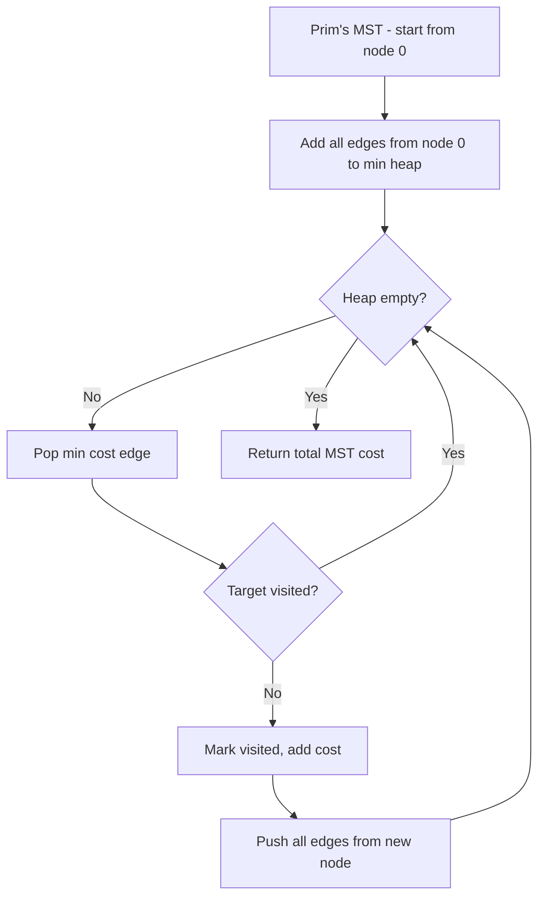

There is an `m x n` rectangular island. The Pacific ocean touches the island's left and top edges, and the Atlantic ocean touches the island's right and bottom edges. Rain water can flow to neighboring cells (up, down, left, right) if the neighboring cell's height is less than or equal to the current cell's height. Return a list of cells where water can flow to both oceans.

## Examples

**Input:** heights = [[1,2,2,3,5],[3,2,3,4,4],[2,4,5,3,1],[6,7,1,4,5],[5,1,1,2,4]]
**Output:** [[0,4],[1,3],[1,4],[2,2],[3,0],[3,1],[4,0]]
**Explanation:** These cells can flow water to both the Pacific (top/left) and Atlantic (bottom/right) oceans.


## Solution

```js
function pacificAtlantic(heights) {
  const rows = heights.length;
  const cols = heights[0].length;
  const pacific = Array.from({ length: rows }, () => new Array(cols).fill(false));
  const atlantic = Array.from({ length: rows }, () => new Array(cols).fill(false));
  const dirs = [[1,0],[-1,0],[0,1],[0,-1]];

  function dfs(r, c, reachable, prevHeight) {
    if (r < 0 || r >= rows || c < 0 || c >= cols) return;
    if (reachable[r][c] || heights[r][c] < prevHeight) return;
    reachable[r][c] = true;
    for (const [dr, dc] of dirs) {
      dfs(r + dr, c + dc, reachable, heights[r][c]);
    }
  }

  for (let r = 0; r < rows; r++) {
    dfs(r, 0, pacific, heights[r][0]);
    dfs(r, cols - 1, atlantic, heights[r][cols - 1]);
  }
  for (let c = 0; c < cols; c++) {
    dfs(0, c, pacific, heights[0][c]);
    dfs(rows - 1, c, atlantic, heights[rows - 1][c]);
  }

  const result = [];
  for (let r = 0; r < rows; r++) {
    for (let c = 0; c < cols; c++) {
      if (pacific[r][c] && atlantic[r][c]) result.push([r, c]);
    }
  }
  return result;
}
```

## Explanation

APPROACH: Reverse DFS from Ocean Borders

Instead of checking each cell → can it reach both oceans?, start from each ocean and DFS inward (uphill). Cells reachable from both sets are the answer.

```
Pacific touches:     Atlantic touches:
  top row + left col   bottom row + right col

heights:
  1  2  2  3 [5]    ← 5 touches both (top-right corner)
  3  2  3 [4][4]
  2  4 [5] 3  1
 [6][7] 1  4  5
 [5] 1  1  2 [4]

Pacific DFS (uphill from borders):    Atlantic DFS (uphill from borders):
  P  P  P  P  P                         .  .  .  .  A
  P  .  .  P  P                         .  .  .  A  A
  P  .  P  .  .                         .  .  A  .  A
  P  P  .  .  .                         A  A  .  A  A
  P  .  .  .  .                         A  .  .  .  A

Intersection (both P and A):
  [0,4], [1,3], [1,4], [2,2], [3,0], [3,1], [4,0]
```

## Diagram



## TestConfig
```json
{
  "functionName": "pacificAtlantic",
  "compareType": "setEqual",
  "testCases": [
    {
      "args": [
        [
          [
            1,
            2,
            2,
            3,
            5
          ],
          [
            3,
            2,
            3,
            4,
            4
          ],
          [
            2,
            4,
            5,
            3,
            1
          ],
          [
            6,
            7,
            1,
            4,
            5
          ],
          [
            5,
            1,
            1,
            2,
            4
          ]
        ]
      ],
      "expected": [
        [
          0,
          4
        ],
        [
          1,
          3
        ],
        [
          1,
          4
        ],
        [
          2,
          2
        ],
        [
          3,
          0
        ],
        [
          3,
          1
        ],
        [
          4,
          0
        ]
      ]
    },
    {
      "args": [
        [
          [
            1
          ]
        ]
      ],
      "expected": [
        [
          0,
          0
        ]
      ]
    },
    {
      "args": [
        [
          [
            1,
            1
          ],
          [
            1,
            1
          ]
        ]
      ],
      "expected": [
        [
          0,
          0
        ],
        [
          0,
          1
        ],
        [
          1,
          0
        ],
        [
          1,
          1
        ]
      ]
    },
    {
      "args": [
        [
          [
            1,
            2
          ],
          [
            2,
            1
          ]
        ]
      ],
      "expected": [
        [
          0,
          0
        ],
        [
          0,
          1
        ],
        [
          1,
          0
        ],
        [
          1,
          1
        ]
      ],
      "isHidden": true
    },
    {
      "args": [
        [
          [
            10,
            10,
            10
          ],
          [
            10,
            1,
            10
          ],
          [
            10,
            10,
            10
          ]
        ]
      ],
      "expected": [
        [
          0,
          0
        ],
        [
          0,
          1
        ],
        [
          0,
          2
        ],
        [
          1,
          0
        ],
        [
          1,
          2
        ],
        [
          2,
          0
        ],
        [
          2,
          1
        ],
        [
          2,
          2
        ]
      ],
      "isHidden": true
    },
    {
      "args": [
        [
          [
            1,
            2,
            3
          ],
          [
            8,
            9,
            4
          ],
          [
            7,
            6,
            5
          ]
        ]
      ],
      "expected": [
        [
          0,
          2
        ],
        [
          1,
          0
        ],
        [
          1,
          1
        ],
        [
          1,
          2
        ],
        [
          2,
          0
        ],
        [
          2,
          1
        ],
        [
          2,
          2
        ]
      ],
      "isHidden": true
    },
    {
      "args": [
        [
          [
            3,
            3,
            3,
            3,
            3
          ]
        ]
      ],
      "expected": [
        [
          0,
          0
        ],
        [
          0,
          1
        ],
        [
          0,
          2
        ],
        [
          0,
          3
        ],
        [
          0,
          4
        ]
      ],
      "isHidden": true
    },
    {
      "args": [
        [
          [
            3
          ],
          [
            3
          ],
          [
            3
          ]
        ]
      ],
      "expected": [
        [
          0,
          0
        ],
        [
          1,
          0
        ],
        [
          2,
          0
        ]
      ],
      "isHidden": true
    },
    {
      "args": [
        [
          [
            3,
            3
          ],
          [
            3,
            3
          ]
        ]
      ],
      "expected": [
        [
          0,
          0
        ],
        [
          0,
          1
        ],
        [
          1,
          0
        ],
        [
          1,
          1
        ]
      ],
      "isHidden": true
    },
    {
      "args": [
        [
          [
            2,
            1
          ],
          [
            1,
            2
          ]
        ]
      ],
      "expected": [
        [
          0,
          0
        ],
        [
          0,
          1
        ],
        [
          1,
          0
        ],
        [
          1,
          1
        ]
      ],
      "isHidden": true
    }
  ]
}
```
