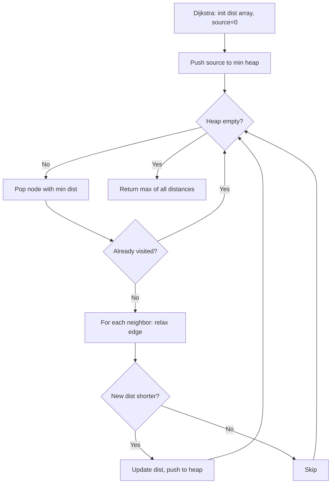

Given an `m x n` matrix `board` containing `'X'` and `'O'`, capture all regions that are 4-directionally surrounded by `'X'`. A region is captured by flipping all `'O'`s into `'X'`s in that surrounded region.

## Examples

**Input:** board = [["X","X","X","X"],["X","O","O","X"],["X","X","O","X"],["X","O","X","X"]]
**Output:** [["X","X","X","X"],["X","X","X","X"],["X","X","X","X"],["X","O","X","X"]]
**Explanation:** The bottom 'O' is on the border, so it's not surrounded. The rest are flipped.


## Solution

```js
function solve(board) {
  const rows = board.length;
  const cols = board[0].length;

  function dfs(r, c) {
    if (r < 0 || r >= rows || c < 0 || c >= cols || board[r][c] !== 'O') return;
    board[r][c] = 'T';
    dfs(r + 1, c);
    dfs(r - 1, c);
    dfs(r, c + 1);
    dfs(r, c - 1);
  }

  for (let r = 0; r < rows; r++) {
    dfs(r, 0);
    dfs(r, cols - 1);
  }
  for (let c = 0; c < cols; c++) {
    dfs(0, c);
    dfs(rows - 1, c);
  }

  for (let r = 0; r < rows; r++) {
    for (let c = 0; c < cols; c++) {
      if (board[r][c] === 'O') board[r][c] = 'X';
      if (board[r][c] === 'T') board[r][c] = 'O';
    }
  }
}
```

## Explanation

APPROACH: Border DFS + Flip

Step 1: DFS from all border 'O' cells, mark them as 'T' (temporary safe).
Step 2: Flip remaining 'O' → 'X' (surrounded). Flip 'T' → 'O' (restore safe).

```
Original:          After border DFS:     Final:
X  X  X  X         X  X  X  X           X  X  X  X
X  O  O  X    →    X  O  O  X     →     X  X  X  X
X  X  O  X         X  X  O  X           X  X  X  X
X  O  X  X         X  T  X  X           X  O  X  X
                   ↑ border O→T

The border 'O' at [3,1] is marked 'T' (safe).
Interior 'O's at [1,1],[1,2],[2,2] have no border connection → flipped to 'X'.
```

## Diagram


