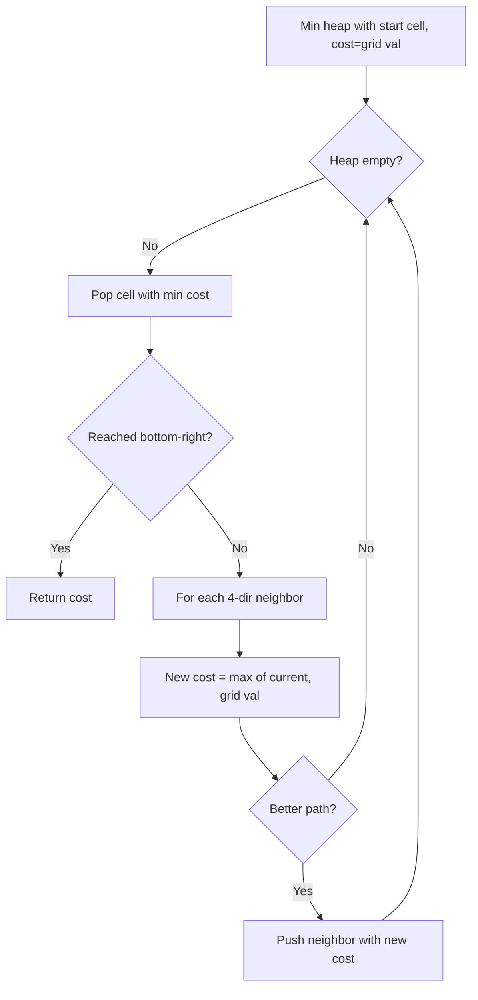

You are given an `m x n` grid where each cell can have one of three values: `0` (empty), `1` (fresh orange), or `2` (rotten orange). Every minute, any fresh orange that is 4-directionally adjacent to a rotten orange becomes rotten. Return the minimum number of minutes until no cell has a fresh orange. If this is impossible, return `-1`.

## Examples

**Input:** grid = [[2,1,1],[1,1,0],[0,1,1]]
**Output:** 4
**Explanation:** It takes 4 minutes for the rot to spread from (0,0) to all fresh oranges, reaching (2,2) last.

**Input:** grid = [[2,1,1],[0,1,1],[1,0,1]]
**Output:** -1
**Explanation:** The orange in the bottom left corner is never reached.


## Solution

```js
function orangesRotting(grid) {
  const rows = grid.length;
  const cols = grid[0].length;
  const queue = [];
  let fresh = 0;

  for (let r = 0; r < rows; r++) {
    for (let c = 0; c < cols; c++) {
      if (grid[r][c] === 2) queue.push([r, c]);
      if (grid[r][c] === 1) fresh++;
    }
  }

  if (fresh === 0) return 0;

  const dirs = [[1,0],[-1,0],[0,1],[0,-1]];
  let minutes = 0;

  while (queue.length > 0 && fresh > 0) {
    const size = queue.length;
    for (let i = 0; i < size; i++) {
      const [r, c] = queue.shift();
      for (const [dr, dc] of dirs) {
        const nr = r + dr;
        const nc = c + dc;
        if (nr >= 0 && nr < rows && nc >= 0 && nc < cols && grid[nr][nc] === 1) {
          grid[nr][nc] = 2;
          fresh--;
          queue.push([nr, nc]);
        }
      }
    }
    minutes++;
  }

  return fresh === 0 ? minutes : -1;
}
```

## Explanation

APPROACH: Multi-source BFS

Start BFS from ALL rotten oranges simultaneously. Each BFS level = 1 minute.

```
Time 0:     Time 1:     Time 2:     Time 3:     Time 4:
2  1  1     2  2  1     2  2  2     2  2  2     2  2  2
1  1  0     2  1  0     2  2  0     2  2  0     2  2  0
0  1  1     0  1  1     0  2  1     0  2  2     0  2  2
                                                ↑ done!

Queue starts with: [(0,0)]
Min 1: rot (0,1), (1,0)           fresh: 6→4
Min 2: rot (0,2), (1,1)           fresh: 4→2
Min 3: rot (2,1), (1,2) blocked   fresh: 2→1
Min 4: rot (2,2)                  fresh: 1→0 ✓

Answer: 4 minutes
```

## Diagram



## TestConfig
```json
{
  "functionName": "orangesRotting",
  "testCases": [
    {
      "args": [
        [
          [
            2,
            1,
            1
          ],
          [
            1,
            1,
            0
          ],
          [
            0,
            1,
            1
          ]
        ]
      ],
      "expected": 4
    },
    {
      "args": [
        [
          [
            2,
            1,
            1
          ],
          [
            0,
            1,
            1
          ],
          [
            1,
            0,
            1
          ]
        ]
      ],
      "expected": -1
    },
    {
      "args": [
        [
          [
            0,
            2
          ]
        ]
      ],
      "expected": 0
    },
    {
      "args": [
        [
          [
            0
          ]
        ]
      ],
      "expected": 0,
      "isHidden": true
    },
    {
      "args": [
        [
          [
            1
          ]
        ]
      ],
      "expected": -1,
      "isHidden": true
    },
    {
      "args": [
        [
          [
            2
          ]
        ]
      ],
      "expected": 0,
      "isHidden": true
    },
    {
      "args": [
        [
          [
            2,
            1,
            1
          ],
          [
            1,
            1,
            1
          ],
          [
            1,
            1,
            2
          ]
        ]
      ],
      "expected": 2,
      "isHidden": true
    },
    {
      "args": [
        [
          [
            2,
            0,
            1,
            1
          ],
          [
            0,
            0,
            0,
            1
          ],
          [
            1,
            1,
            0,
            2
          ]
        ]
      ],
      "expected": -1,
      "isHidden": true
    },
    {
      "args": [
        [
          [
            2,
            2,
            2
          ],
          [
            2,
            2,
            2
          ]
        ]
      ],
      "expected": 0,
      "isHidden": true
    },
    {
      "args": [
        [
          [
            0,
            0,
            0
          ],
          [
            0,
            0,
            0
          ]
        ]
      ],
      "expected": 0,
      "isHidden": true
    }
  ]
}
```
