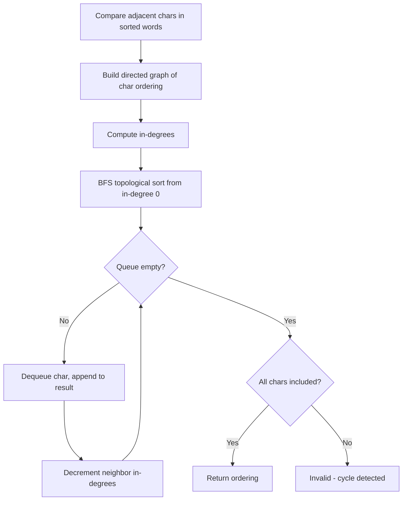

Given `n` nodes labeled from `0` to `n - 1` and a list of undirected edges, determine if these edges make up a valid tree. A valid tree has exactly `n - 1` edges, is connected, and has no cycles.

## Examples

**Input:** n = 5, edges = [[0,1],[0,2],[0,3],[1,4]]
**Output:** true
**Explanation:** The graph has exactly n-1=4 edges, is connected, and has no cycles.

**Input:** n = 5, edges = [[0,1],[1,2],[2,3],[1,3],[1,4]]
**Output:** false
**Explanation:** There is a cycle: 1 → 2 → 3 → 1.


## Brute Force

```js
function validTreeDFS(n, edges) {
  if (edges.length !== n - 1) return false;

  const graph = Array.from({ length: n }, () => []);
  for (const [u, v] of edges) {
    graph[u].push(v);
    graph[v].push(u);
  }

  const visited = new Set();

  function dfs(node, parent) {
    visited.add(node);
    for (const neighbor of graph[node]) {
      if (neighbor === parent) continue;
      if (visited.has(neighbor)) return false;
      if (!dfs(neighbor, node)) return false;
    }
    return true;
  }

  return dfs(0, -1) && visited.size === n;
}
```

### Brute Force Explanation

DFS cycle detection:

Build adjacency list, DFS from node 0. If we visit an already-visited node (that isn't the parent), there's a cycle. Also check all nodes were visited (connected).

```
n=5, edges=[[0,1],[0,2],[0,3],[1,4]]

Graph: 0→[1,2,3], 1→[0,4], 2→[0], 3→[0], 4→[1]

DFS(0, parent=-1):
  visit 1 (parent=0):
    visit 4 (parent=1): no unvisited → ok
  visit 2 (parent=0): no unvisited → ok
  visit 3 (parent=0): no unvisited → ok

visited.size = 5 = n ✓, no cycle ✓ → true
```

## Solution

```js
function validTree(n, edges) {
  if (edges.length !== n - 1) return false;

  const parent = Array.from({ length: n }, (_, i) => i);
  const rank = new Array(n).fill(0);

  function find(x) {
    if (parent[x] !== x) parent[x] = find(parent[x]);
    return parent[x];
  }

  function union(a, b) {
    const rootA = find(a);
    const rootB = find(b);
    if (rootA === rootB) return false;
    if (rank[rootA] < rank[rootB]) parent[rootA] = rootB;
    else if (rank[rootA] > rank[rootB]) parent[rootB] = rootA;
    else { parent[rootB] = rootA; rank[rootA]++; }
    return true;
  }

  for (const [u, v] of edges) {
    if (!union(u, v)) return false;
  }

  return true;
}
```

## Explanation

APPROACH: Union-Find (quick check: edges = n-1, then no cycle)

A valid tree must have exactly n-1 edges and no cycles. Union-Find detects cycles: if two nodes share a root before union, a cycle exists.

```
n=5, edges=[[0,1],[0,2],[0,3],[1,4]]

Initial: parent = [0,1,2,3,4]  (each node is its own root)

Union(0,1): roots 0≠1 → merge → parent = [0,0,2,3,4]
Union(0,2): roots 0≠2 → merge → parent = [0,0,0,3,4]
Union(0,3): roots 0≠3 → merge → parent = [0,0,0,0,4]
Union(1,4): find(1)=0, find(4)=4, 0≠4 → merge → parent = [0,0,0,0,0]

4 edges, 5 nodes → n-1 = 4 ✓
No cycle detected → return true ✓

With cycle: edges=[[0,1],[1,2],[2,3],[1,3],[1,4]]
Union(1,3): find(1)=0, find(3)=0, SAME ROOT → cycle! return false
```

## Diagram



## TestConfig
```json
{
  "functionName": "validTree",
  "testCases": [
    {
      "args": [
        5,
        [
          [
            0,
            1
          ],
          [
            0,
            2
          ],
          [
            0,
            3
          ],
          [
            1,
            4
          ]
        ]
      ],
      "expected": true
    },
    {
      "args": [
        5,
        [
          [
            0,
            1
          ],
          [
            1,
            2
          ],
          [
            2,
            3
          ],
          [
            1,
            3
          ],
          [
            1,
            4
          ]
        ]
      ],
      "expected": false
    },
    {
      "args": [
        1,
        []
      ],
      "expected": true
    },
    {
      "args": [
        2,
        [
          [
            0,
            1
          ]
        ]
      ],
      "expected": true,
      "isHidden": true
    },
    {
      "args": [
        2,
        []
      ],
      "expected": false,
      "isHidden": true
    },
    {
      "args": [
        4,
        [
          [
            0,
            1
          ],
          [
            2,
            3
          ]
        ]
      ],
      "expected": false,
      "isHidden": true
    },
    {
      "args": [
        3,
        [
          [
            0,
            1
          ],
          [
            1,
            2
          ]
        ]
      ],
      "expected": true,
      "isHidden": true
    },
    {
      "args": [
        3,
        [
          [
            0,
            1
          ],
          [
            1,
            2
          ],
          [
            0,
            2
          ]
        ]
      ],
      "expected": false,
      "isHidden": true
    },
    {
      "args": [
        4,
        [
          [
            0,
            1
          ],
          [
            0,
            2
          ],
          [
            0,
            3
          ]
        ]
      ],
      "expected": true,
      "isHidden": true
    },
    {
      "args": [
        6,
        [
          [
            0,
            1
          ],
          [
            1,
            2
          ],
          [
            2,
            3
          ],
          [
            3,
            4
          ],
          [
            4,
            5
          ]
        ]
      ],
      "expected": true,
      "isHidden": true
    }
  ]
}
```
