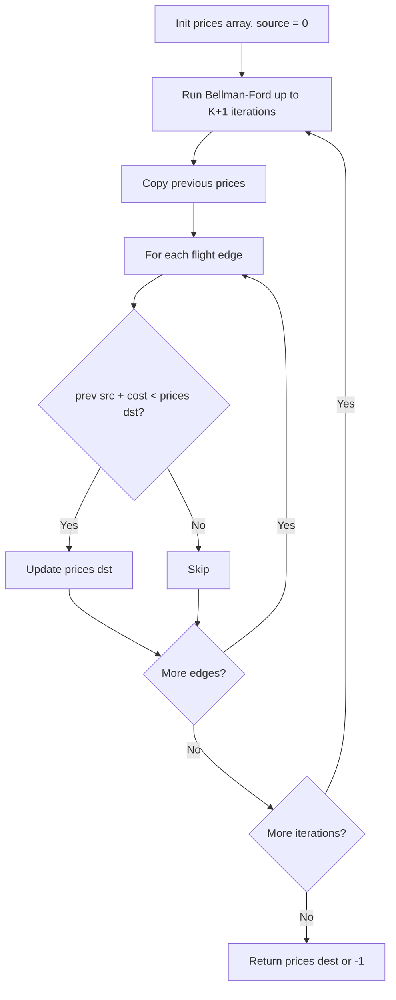

You have a graph of `n` nodes. You are given an integer `n` and an array `edges` where `edges[i] = [a, b]` indicates that there is an edge between `a` and `b` in the graph. Return the number of connected components in the graph.

## Examples

**Input:** n = 5, edges = [[0,1],[1,2],[3,4]]
**Output:** 2
**Explanation:** Components: {0,1,2} and {3,4}.

**Input:** n = 5, edges = [[0,1],[1,2],[2,3],[3,4]]
**Output:** 1
**Explanation:** All 5 nodes are connected through the chain of edges, forming a single component.


## Brute Force

```js
function countComponentsBFS(n, edges) {
  const graph = Array.from({ length: n }, () => []);
  for (const [u, v] of edges) {
    graph[u].push(v);
    graph[v].push(u);
  }

  const visited = new Set();
  let components = 0;

  for (let i = 0; i < n; i++) {
    if (visited.has(i)) continue;
    components++;
    const queue = [i];
    visited.add(i);
    while (queue.length > 0) {
      const node = queue.shift();
      for (const neighbor of graph[node]) {
        if (!visited.has(neighbor)) {
          visited.add(neighbor);
          queue.push(neighbor);
        }
      }
    }
  }

  return components;
}
```

## Solution

```js
function countComponents(n, edges) {
  const parent = Array.from({ length: n }, (_, i) => i);
  const rank = new Array(n).fill(0);

  function find(x) {
    if (parent[x] !== x) parent[x] = find(parent[x]);
    return parent[x];
  }

  function union(a, b) {
    const rootA = find(a);
    const rootB = find(b);
    if (rootA === rootB) return;
    if (rank[rootA] < rank[rootB]) parent[rootA] = rootB;
    else if (rank[rootA] > rank[rootB]) parent[rootB] = rootA;
    else { parent[rootB] = rootA; rank[rootA]++; }
    n--;
  }

  for (const [u, v] of edges) {
    union(u, v);
  }

  return n;
}
```

## Diagram



## TestConfig
```json
{
  "functionName": "countComponents",
  "testCases": [
    {
      "args": [
        5,
        [
          [
            0,
            1
          ],
          [
            1,
            2
          ],
          [
            3,
            4
          ]
        ]
      ],
      "expected": 2
    },
    {
      "args": [
        5,
        [
          [
            0,
            1
          ],
          [
            1,
            2
          ],
          [
            2,
            3
          ],
          [
            3,
            4
          ]
        ]
      ],
      "expected": 1
    },
    {
      "args": [
        1,
        []
      ],
      "expected": 1
    },
    {
      "args": [
        4,
        []
      ],
      "expected": 4,
      "isHidden": true
    },
    {
      "args": [
        3,
        [
          [
            0,
            1
          ]
        ]
      ],
      "expected": 2,
      "isHidden": true
    },
    {
      "args": [
        5,
        [
          [
            0,
            1
          ],
          [
            2,
            3
          ]
        ]
      ],
      "expected": 3,
      "isHidden": true
    },
    {
      "args": [
        6,
        [
          [
            0,
            1
          ],
          [
            1,
            2
          ],
          [
            3,
            4
          ],
          [
            4,
            5
          ]
        ]
      ],
      "expected": 2,
      "isHidden": true
    },
    {
      "args": [
        4,
        [
          [
            0,
            1
          ],
          [
            1,
            2
          ],
          [
            2,
            3
          ]
        ]
      ],
      "expected": 1,
      "isHidden": true
    },
    {
      "args": [
        7,
        [
          [
            0,
            1
          ],
          [
            2,
            3
          ],
          [
            4,
            5
          ]
        ]
      ],
      "expected": 4,
      "isHidden": true
    },
    {
      "args": [
        2,
        [
          [
            0,
            1
          ]
        ]
      ],
      "expected": 1,
      "isHidden": true
    }
  ]
}
```
