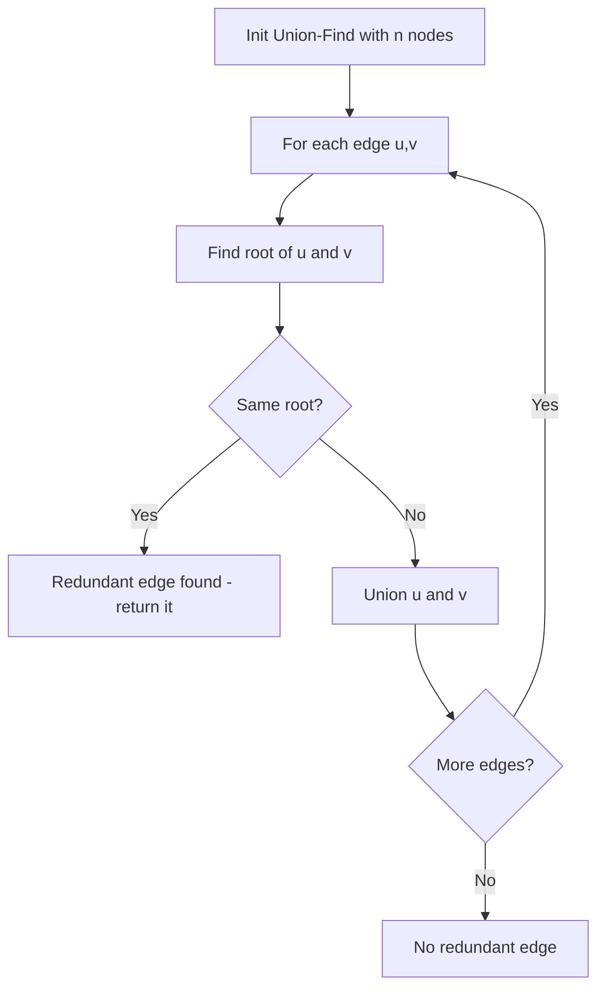

In this problem, a tree is an undirected graph that is connected and has no cycles. You are given a graph that started as a tree with `n` nodes, with one additional edge added. Return an edge that can be removed so that the resulting graph is a tree. If there are multiple answers, return the edge that occurs last in the input.

## Examples

**Input:** edges = [[1,2],[1,3],[2,3]]
**Output:** [2,3]
**Explanation:** Edge [2,3] completes the cycle 1-2-3-1, so removing it restores the tree.

**Input:** edges = [[1,2],[2,3],[3,4],[1,4],[1,5]]
**Output:** [1,4]
**Explanation:** Edge [1,4] is the last edge that forms a cycle (1-2-3-4-1).


## Solution

```js
function findRedundantConnection(edges) {
  const n = edges.length;
  const parent = Array.from({ length: n + 1 }, (_, i) => i);
  const rank = new Array(n + 1).fill(0);

  function find(x) {
    if (parent[x] !== x) parent[x] = find(parent[x]);
    return parent[x];
  }

  function union(a, b) {
    const rootA = find(a);
    const rootB = find(b);
    if (rootA === rootB) return false;
    if (rank[rootA] < rank[rootB]) parent[rootA] = rootB;
    else if (rank[rootA] > rank[rootB]) parent[rootB] = rootA;
    else { parent[rootB] = rootA; rank[rootA]++; }
    return true;
  }

  for (const [u, v] of edges) {
    if (!union(u, v)) return [u, v];
  }

  return [];
}
```

## Explanation

APPROACH: Union-Find — first edge creating a cycle is redundant

Process edges in order. Union-Find tracks connected components. When both endpoints already share the same root, that edge creates a cycle → return it.

```
edges = [[1,2],[1,3],[2,3]]

Union(1,2): roots 1≠2 → merge    parent: 1←2
Union(1,3): roots 1≠3 → merge    parent: 1←2, 1←3
Union(2,3): find(2)=1, find(3)=1
            SAME ROOT! → [2,3] is redundant ✓

    1
   / \
  2 - 3   ← edge [2,3] creates the cycle
```

## Diagram



## TestConfig
```json
{
  "functionName": "findRedundantConnection",
  "testCases": [
    {
      "args": [
        [
          [
            1,
            2
          ],
          [
            1,
            3
          ],
          [
            2,
            3
          ]
        ]
      ],
      "expected": [
        2,
        3
      ]
    },
    {
      "args": [
        [
          [
            1,
            2
          ],
          [
            2,
            3
          ],
          [
            3,
            4
          ],
          [
            1,
            4
          ],
          [
            1,
            5
          ]
        ]
      ],
      "expected": [
        1,
        4
      ]
    },
    {
      "args": [
        [
          [
            1,
            2
          ],
          [
            1,
            3
          ],
          [
            3,
            4
          ],
          [
            2,
            4
          ]
        ]
      ],
      "expected": [
        2,
        4
      ]
    },
    {
      "args": [
        [
          [
            1,
            2
          ],
          [
            2,
            3
          ],
          [
            1,
            3
          ]
        ]
      ],
      "expected": [
        1,
        3
      ],
      "isHidden": true
    },
    {
      "args": [
        [
          [
            1,
            2
          ],
          [
            2,
            3
          ],
          [
            3,
            4
          ],
          [
            4,
            5
          ],
          [
            3,
            5
          ]
        ]
      ],
      "expected": [
        3,
        5
      ],
      "isHidden": true
    },
    {
      "args": [
        [
          [
            1,
            3
          ],
          [
            3,
            4
          ],
          [
            1,
            5
          ],
          [
            3,
            5
          ],
          [
            2,
            3
          ]
        ]
      ],
      "expected": [
        3,
        5
      ],
      "isHidden": true
    },
    {
      "args": [
        [
          [
            1,
            2
          ],
          [
            1,
            3
          ],
          [
            1,
            4
          ],
          [
            3,
            4
          ]
        ]
      ],
      "expected": [
        3,
        4
      ],
      "isHidden": true
    },
    {
      "args": [
        [
          [
            3,
            4
          ],
          [
            1,
            2
          ],
          [
            2,
            4
          ],
          [
            3,
            5
          ],
          [
            2,
            3
          ]
        ]
      ],
      "expected": [
        2,
        3
      ],
      "isHidden": true
    },
    {
      "args": [
        [
          [
            1,
            2
          ],
          [
            2,
            3
          ],
          [
            3,
            1
          ]
        ]
      ],
      "expected": [
        3,
        1
      ],
      "isHidden": true
    },
    {
      "args": [
        [
          [
            1,
            4
          ],
          [
            1,
            2
          ],
          [
            2,
            3
          ],
          [
            3,
            4
          ],
          [
            4,
            5
          ]
        ]
      ],
      "expected": [
        3,
        4
      ],
      "isHidden": true
    }
  ]
}
```
