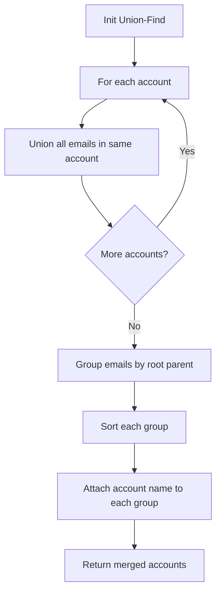

A transformation sequence from word `beginWord` to word `endWord` using a dictionary `wordList` is a sequence where each adjacent pair of words differs by a single letter and every word in the sequence is in `wordList`. Return the number of words in the shortest transformation sequence, or `0` if no such sequence exists.

## Examples

**Input:** beginWord = "hit", endWord = "cog", wordList = ["hot","dot","dog","lot","log","cog"]
**Output:** 5
**Explanation:** hit → hot → dot → dog → cog

**Input:** beginWord = "hit", endWord = "cog", wordList = ["hot","dot","dog","lot","log"]
**Output:** 0
**Explanation:** endWord "cog" is not in wordList.


## Brute Force

```js
function ladderLengthBidirectional(beginWord, endWord, wordList) {
  const wordSet = new Set(wordList);
  if (!wordSet.has(endWord)) return 0;

  let beginSet = new Set([beginWord]);
  let endSet = new Set([endWord]);
  const visited = new Set();
  let steps = 1;

  while (beginSet.size > 0 && endSet.size > 0) {
    if (beginSet.size > endSet.size) {
      [beginSet, endSet] = [endSet, beginSet];
    }

    const nextSet = new Set();
    for (const word of beginSet) {
      const chars = word.split('');
      for (let i = 0; i < chars.length; i++) {
        const original = chars[i];
        for (let c = 97; c <= 122; c++) {
          chars[i] = String.fromCharCode(c);
          const newWord = chars.join('');
          if (endSet.has(newWord)) return steps + 1;
          if (wordSet.has(newWord) && !visited.has(newWord)) {
            visited.add(newWord);
            nextSet.add(newWord);
          }
        }
        chars[i] = original;
      }
    }

    beginSet = nextSet;
    steps++;
  }

  return 0;
}
```

### Brute Force Explanation

Bidirectional BFS: search from both ends simultaneously.

```
Forward set:  {hit}          Backward set: {cog}
Step 1: F→{hot}             B→{cog}  (no overlap)
Step 2: F→{dot,lot}         B→{dog,log}  (no overlap)
Step 3: F→{dog,log}         B→{dot,lot}
        dog ∈ backward? No... but let's swap:
        Smaller set searches forward.

When sets overlap → steps_forward + steps_backward + 1

Bidirectional BFS reduces search space from O(b^d)
to O(b^(d/2)) where b=branching factor, d=depth.
```

## Solution

```js
function ladderLength(beginWord, endWord, wordList) {
  const wordSet = new Set(wordList);
  if (!wordSet.has(endWord)) return 0;

  const queue = [[beginWord, 1]];
  const visited = new Set([beginWord]);

  while (queue.length > 0) {
    const [word, steps] = queue.shift();

    for (let i = 0; i < word.length; i++) {
      const chars = word.split('');
      for (let c = 97; c <= 122; c++) {
        chars[i] = String.fromCharCode(c);
        const newWord = chars.join('');

        if (newWord === endWord) return steps + 1;

        if (wordSet.has(newWord) && !visited.has(newWord)) {
          visited.add(newWord);
          queue.push([newWord, steps + 1]);
        }
      }
    }
  }

  return 0;
}
```

## Explanation

APPROACH: BFS on Implicit Word Graph

Each word is a node. Two words are connected if they differ by exactly one letter. BFS finds the shortest transformation sequence.

```
beginWord = "hit", endWord = "cog"
wordList = ["hot","dot","dog","lot","log","cog"]

BFS levels:
Level 0: hit
Level 1: hot          (hit→hot: h→h, i→o, t→t — 1 diff)
Level 2: dot, lot     (hot→dot: h→d; hot→lot: h→l)
Level 3: dog, log     (dot→dog: t→g; lot→log: t→g)
Level 4: cog          (dog→cog: d→c; log→cog: l→c)

hit → hot → dot → dog → cog = 5 words ✓

Optimization: for each word, try replacing each char
with a-z (26 × wordLength) instead of comparing
all pairs (wordList²).
```

## Diagram



## TestConfig
```json
{
  "functionName": "ladderLength",
  "testCases": [
    {
      "args": [
        "hit",
        "cog",
        [
          "hot",
          "dot",
          "dog",
          "lot",
          "log",
          "cog"
        ]
      ],
      "expected": 5
    },
    {
      "args": [
        "hit",
        "cog",
        [
          "hot",
          "dot",
          "dog",
          "lot",
          "log"
        ]
      ],
      "expected": 0
    },
    {
      "args": [
        "a",
        "c",
        [
          "a",
          "b",
          "c"
        ]
      ],
      "expected": 2
    },
    {
      "args": [
        "hot",
        "dog",
        [
          "hot",
          "dog"
        ]
      ],
      "expected": 0,
      "isHidden": true
    },
    {
      "args": [
        "hot",
        "dot",
        [
          "hot",
          "dot",
          "dog"
        ]
      ],
      "expected": 2,
      "isHidden": true
    },
    {
      "args": [
        "a",
        "c",
        [
          "b",
          "c"
        ]
      ],
      "expected": 2,
      "isHidden": true
    },
    {
      "args": [
        "a",
        "b",
        [
          "b"
        ]
      ],
      "expected": 2,
      "isHidden": true
    },
    {
      "args": [
        "abc",
        "def",
        [
          "abc",
          "dbc",
          "dec",
          "def"
        ]
      ],
      "expected": 4,
      "isHidden": true
    },
    {
      "args": [
        "aaa",
        "bbb",
        [
          "aab",
          "abb",
          "bbb"
        ]
      ],
      "expected": 4,
      "isHidden": true
    },
    {
      "args": [
        "start",
        "endup",
        []
      ],
      "expected": 0,
      "isHidden": true
    }
  ]
}
```
