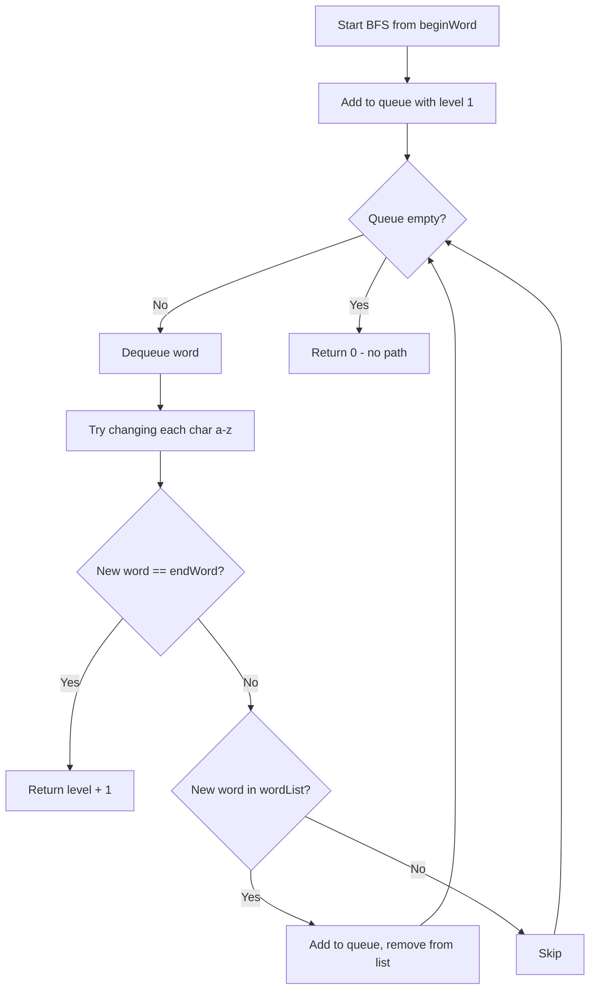

You are given an `m x n` grid `rooms` initialized with three possible values: `-1` (a wall), `0` (a gate), `2147483647` (INF, an empty room). Fill each empty room with the distance to its nearest gate. If it is impossible to reach a gate, leave it as `INF`.

## Examples

**Input:** rooms = [[2147483647,-1,0,2147483647],[2147483647,2147483647,2147483647,-1],[2147483647,-1,2147483647,-1],[0,-1,2147483647,2147483647]]
**Output:** [[3,-1,0,1],[2,2,1,-1],[1,-1,2,-1],[0,-1,3,4]]
**Explanation:** Each empty room is filled with its shortest distance to the nearest gate.


## Solution

```js
function wallsAndGates(rooms) {
  const rows = rooms.length;
  const cols = rooms[0].length;
  const INF = 2147483647;
  const queue = [];
  const dirs = [[1,0],[-1,0],[0,1],[0,-1]];

  for (let r = 0; r < rows; r++) {
    for (let c = 0; c < cols; c++) {
      if (rooms[r][c] === 0) queue.push([r, c]);
    }
  }

  while (queue.length > 0) {
    const [r, c] = queue.shift();
    for (const [dr, dc] of dirs) {
      const nr = r + dr;
      const nc = c + dc;
      if (nr >= 0 && nr < rows && nc >= 0 && nc < cols && rooms[nr][nc] === INF) {
        rooms[nr][nc] = rooms[r][c] + 1;
        queue.push([nr, nc]);
      }
    }
  }
}
```

## Explanation

APPROACH: Multi-source BFS from all gates

Start BFS from all gates (value 0) simultaneously. Each step increments distance by 1. Cells are filled with shortest distance to any gate.

```
INF = ∞

Initial:              After BFS:
 ∞  -1   0   ∞        3  -1   0   1
 ∞   ∞   ∞  -1   →    2   2   1  -1
 ∞  -1   ∞  -1        1  -1   2  -1
 0  -1   ∞   ∞        0  -1   3   4

Queue starts: [(0,2), (3,0)]  ← all gates

Level 1: fill neighbors of gates with 1
Level 2: fill their neighbors with 2
Level 3: fill with 3
Level 4: fill with 4

Each cell gets its distance on first visit (BFS guarantees shortest).
```

## Diagram


