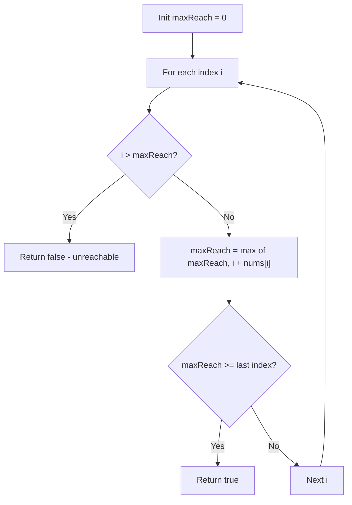

You are given an integer array `nums`. You are initially positioned at the array's first index, and each element in the array represents your maximum jump length at that position. Return `true` if you can reach the last index, or `false` otherwise.

## Examples

**Input:** nums = [2,3,1,1,4]
**Output:** true
**Explanation:** Jump 1 step from index 0 to 1, then 3 steps to the last index.

**Input:** nums = [3,2,1,0,4]
**Output:** false
**Explanation:** You will always arrive at index 3 and its max jump length is 0.


## Brute Force

```js
function canJumpDP(nums) {
  const n = nums.length;
  const dp = new Array(n).fill(false);
  dp[0] = true;
  for (let i = 1; i < n; i++) {
    for (let j = 0; j < i; j++) {
      if (dp[j] && j + nums[j] >= i) {
        dp[i] = true;
        break;
      }
    }
  }
  return dp[n - 1];
}
```

### Brute Force Explanation

DP approach: dp[i] = true if position i is reachable.

```
nums = [3, 2, 1, 0, 4]
dp =   [T, ?, ?, ?, ?]

i=1: check j=0: dp[0]=T, 0+3>=1 ✓ → dp[1]=T
i=2: check j=0: dp[0]=T, 0+3>=2 ✓ → dp[2]=T
i=3: check j=0: dp[0]=T, 0+3>=3 ✓ → dp[3]=T
i=4: check j=0..3: all reach at most 3 → dp[4]=false
```

## Solution

```js
function canJump(nums) {
  let maxReach = 0;
  for (let i = 0; i < nums.length; i++) {
    if (i > maxReach) return false;
    maxReach = Math.max(maxReach, i + nums[i]);
  }
  return true;
}
```

## Explanation

APPROACH: Greedy — Track Maximum Reachable Index

Scan left to right. At each position, update the farthest reachable index. If you ever reach a position beyond maxReach, you're stuck.

```
nums = [2, 3, 1, 1, 4]

i=0: maxReach = max(0, 0+2) = 2
i=1: maxReach = max(2, 1+3) = 4  ← can reach end!
i=2: maxReach = max(4, 2+1) = 4
i=3: maxReach = max(4, 3+1) = 4
i=4: reached end ✓ → true

nums = [3, 2, 1, 0, 4]

i=0: maxReach = max(0, 0+3) = 3
i=1: maxReach = max(3, 1+2) = 3
i=2: maxReach = max(3, 2+1) = 3
i=3: maxReach = max(3, 3+0) = 3
i=4: i(4) > maxReach(3) → STUCK! → false

      [3, 2, 1, 0, 4]
       ↑        ↑  ↑
       |        |  can't reach!
       |        maxReach=3, stuck at 0
       start
```

KEY: You don't need to simulate all possible jumps. Just tracking the maximum reach is sufficient because if any path can reach position i, the greedy maxReach includes it.

## Diagram



## TestConfig
```json
{
  "functionName": "canJump",
  "testCases": [
    {
      "args": [
        [
          2,
          3,
          1,
          1,
          4
        ]
      ],
      "expected": true
    },
    {
      "args": [
        [
          3,
          2,
          1,
          0,
          4
        ]
      ],
      "expected": false
    },
    {
      "args": [
        [
          0
        ]
      ],
      "expected": true
    },
    {
      "args": [
        [
          2,
          0
        ]
      ],
      "expected": true
    },
    {
      "args": [
        [
          1,
          1,
          1,
          1,
          1
        ]
      ],
      "expected": true
    },
    {
      "args": [
        [
          0,
          1
        ]
      ],
      "expected": false
    },
    {
      "args": [
        [
          1,
          0,
          1
        ]
      ],
      "expected": false
    },
    {
      "args": [
        [
          5,
          0,
          0,
          0,
          0,
          0
        ]
      ],
      "expected": true
    },
    {
      "args": [
        [
          1,
          2,
          3
        ]
      ],
      "expected": true
    },
    {
      "args": [
        [
          1,
          0,
          0,
          0
        ]
      ],
      "expected": false
    }
  ]
}
```
