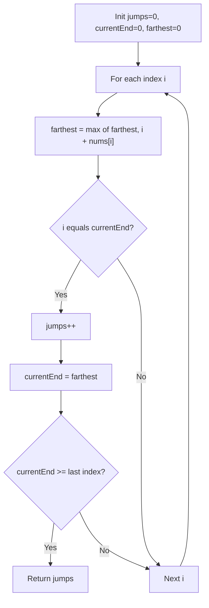

You are given a 0-indexed array of integers `nums` of length `n`. You are initially positioned at `nums[0]`. Each element represents the maximum length of a forward jump. Return the minimum number of jumps to reach `nums[n - 1]`. The test cases are generated such that you can always reach the last index.

## Examples

**Input:** nums = [2,3,1,1,4]
**Output:** 2
**Explanation:** Jump 1 step to index 1, then 3 steps to the last index.

**Input:** nums = [2,3,0,1,4]
**Output:** 2
**Explanation:** From index 0, jump to index 1 (value 3), then jump 3 steps to the last index.


## Solution

```js
function jump(nums) {
  let jumps = 0;
  let currentEnd = 0;
  let farthest = 0;

  for (let i = 0; i < nums.length - 1; i++) {
    farthest = Math.max(farthest, i + nums[i]);
    if (i === currentEnd) {
      jumps++;
      currentEnd = farthest;
    }
  }

  return jumps;
}
```

## Explanation

APPROACH: BFS-like Greedy — Level-by-Level Jumps

Each "level" is the range of positions reachable with the current number of jumps. Track the farthest you can reach within each level.

```
nums = [2, 3, 1, 1, 4]

Jump 0: positions [0]     farthest from here: 0+2=2
        currentEnd=0, hit it at i=0 → jump! jumps=1, currentEnd=2

Jump 1: positions [1,2]   farthest: max(1+3,2+1)=4
        currentEnd=2, hit it at i=2 → jump! jumps=2, currentEnd=4

4 >= last index → done! Answer: 2

Visual:
  [2, 3, 1, 1, 4]
   ↑              Level 0: can see indices 0-2
      ↑  ↑        Level 1: can see indices 1-4
               ↑   Reached end in 2 jumps
```

KEY: This is essentially BFS where each level represents one jump. The greedy insight: within a level, track the maximum reach — we don't need to consider which specific position to jump to.

## Diagram



## TestConfig
```json
{
  "functionName": "jump",
  "testCases": [
    {
      "args": [
        [
          2,
          3,
          1,
          1,
          4
        ]
      ],
      "expected": 2
    },
    {
      "args": [
        [
          2,
          3,
          0,
          1,
          4
        ]
      ],
      "expected": 2
    },
    {
      "args": [
        [
          1
        ]
      ],
      "expected": 0
    },
    {
      "args": [
        [
          1,
          2
        ]
      ],
      "expected": 1
    },
    {
      "args": [
        [
          1,
          1,
          1,
          1
        ]
      ],
      "expected": 3
    },
    {
      "args": [
        [
          10,
          9,
          8,
          7,
          6,
          5,
          4,
          3,
          2,
          1,
          1,
          0
        ]
      ],
      "expected": 2
    },
    {
      "args": [
        [
          2,
          1
        ]
      ],
      "expected": 1
    },
    {
      "args": [
        [
          3,
          2,
          1
        ]
      ],
      "expected": 1
    },
    {
      "args": [
        [
          1,
          2,
          1,
          1,
          1
        ]
      ],
      "expected": 3
    },
    {
      "args": [
        [
          5,
          6,
          4,
          4,
          6,
          9,
          4,
          4,
          7,
          4,
          4,
          8,
          2,
          6,
          8,
          1,
          5,
          9,
          6,
          5,
          2,
          7,
          9,
          7,
          9,
          6,
          9,
          4,
          1,
          6,
          8,
          8,
          4,
          4,
          2,
          0,
          3,
          8,
          5
        ]
      ],
      "expected": 5
    }
  ]
}
```
