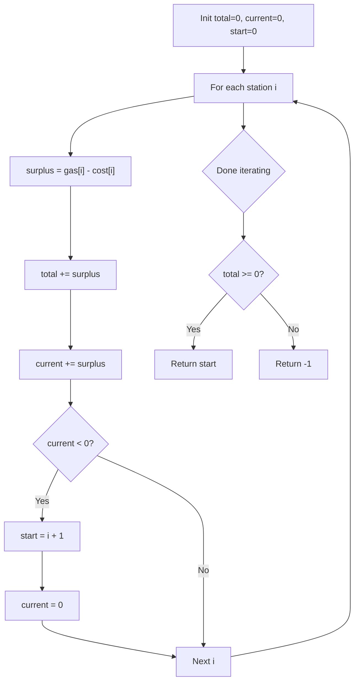

There are `n` gas stations along a circular route, where the amount of gas at the `i`th station is `gas[i]`. You have a car with an unlimited gas tank and it costs `cost[i]` of gas to travel from the `i`th station to its next `(i + 1)`th station. Return the starting gas station index if you can travel around the circuit once in the clockwise direction, otherwise return `-1`. If a solution exists, it is unique.

## Examples

**Input:** gas = [1,2,3,4,5], cost = [3,4,5,1,2]
**Output:** 3
**Explanation:** Starting at station 3 (gas=4, cost=1), you accumulate enough surplus to complete the full circuit.

**Input:** gas = [2,3,4], cost = [3,4,3]
**Output:** -1
**Explanation:** Total gas (9) is less than total cost (10), so no starting point can complete the circuit.


## Solution

```js
function canCompleteCircuit(gas, cost) {
  let totalSurplus = 0;
  let currentSurplus = 0;
  let start = 0;

  for (let i = 0; i < gas.length; i++) {
    totalSurplus += gas[i] - cost[i];
    currentSurplus += gas[i] - cost[i];
    if (currentSurplus < 0) {
      start = i + 1;
      currentSurplus = 0;
    }
  }

  return totalSurplus >= 0 ? start : -1;
}
```

## Explanation

APPROACH: Greedy — Reset Start When Tank Goes Negative

If totalSurplus >= 0, a solution must exist. When currentSurplus goes negative, none of the stations from start to i work → reset start to i+1.

```
gas  = [1, 2, 3, 4, 5]
cost = [3, 4, 5, 1, 2]
diff = [-2,-2,-2, 3, 3]

Scan:
i=0: currentSurplus = -2 < 0 → reset start=1, current=0
i=1: currentSurplus = -2 < 0 → reset start=2, current=0
i=2: currentSurplus = -2 < 0 → reset start=3, current=0
i=3: currentSurplus = 3 ≥ 0 → keep going
i=4: currentSurplus = 6 ≥ 0 → keep going

totalSurplus = -2-2-2+3+3 = 0 ≥ 0 → answer: start=3 ✓

WHY reset works:
If you can't get from A to B, then no station
between A and B can get to B either (they'd have
even less gas accumulated).
```

## Diagram



## TestConfig
```json
{
  "functionName": "canCompleteCircuit",
  "testCases": [
    {
      "args": [
        [
          1,
          2,
          3,
          4,
          5
        ],
        [
          3,
          4,
          5,
          1,
          2
        ]
      ],
      "expected": 3
    },
    {
      "args": [
        [
          2,
          3,
          4
        ],
        [
          3,
          4,
          3
        ]
      ],
      "expected": -1
    },
    {
      "args": [
        [
          5,
          1,
          2,
          3,
          4
        ],
        [
          4,
          4,
          1,
          5,
          1
        ]
      ],
      "expected": 4
    },
    {
      "args": [
        [
          3,
          1,
          1
        ],
        [
          1,
          2,
          2
        ]
      ],
      "expected": 0
    },
    {
      "args": [
        [
          1
        ],
        [
          1
        ]
      ],
      "expected": 0
    },
    {
      "args": [
        [
          5,
          8,
          2,
          8
        ],
        [
          6,
          5,
          6,
          6
        ]
      ],
      "expected": 3
    },
    {
      "args": [
        [
          1,
          2,
          3,
          4,
          5
        ],
        [
          3,
          4,
          5,
          1,
          2
        ]
      ],
      "expected": 3
    },
    {
      "args": [
        [
          2
        ],
        [
          2
        ]
      ],
      "expected": 0
    },
    {
      "args": [
        [
          3,
          3,
          4
        ],
        [
          3,
          4,
          4
        ]
      ],
      "expected": -1
    },
    {
      "args": [
        [
          6,
          1,
          4,
          3,
          5
        ],
        [
          3,
          8,
          2,
          4,
          2
        ]
      ],
      "expected": 2
    }
  ]
}
```
