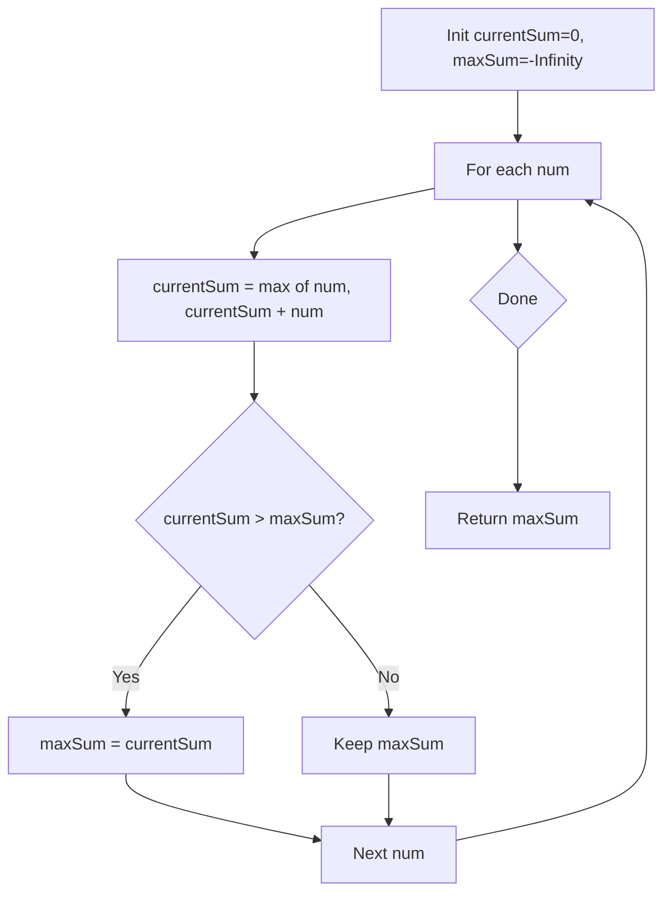

Given an integer array `nums`, find the subarray with the largest sum, and return its sum.

## Examples

**Input:** nums = [-2,1,-3,4,-1,2,1,-5,4]
**Output:** 6
**Explanation:** The subarray [4,-1,2,1] has the largest sum 6.

**Input:** nums = [1]
**Output:** 1
**Explanation:** A single-element array has only one possible subarray, which is the element itself.

**Input:** nums = [5,4,-1,7,8]
**Output:** 23
**Explanation:** The entire array sums to 5+4-1+7+8 = 23, which is the maximum since all partial sums stay positive.


## Brute Force

```js
function maxSubArrayBrute(nums) {
  let maxSum = -Infinity;
  for (let i = 0; i < nums.length; i++) {
    let sum = 0;
    for (let j = i; j < nums.length; j++) {
      sum += nums[j];
      maxSum = Math.max(maxSum, sum);
    }
  }
  return maxSum;
}
```

### Brute Force Explanation

Check all subarrays O(n²):

```
For each start i:
  For each end j >= i:
    sum(i..j) = sum(i..j-1) + nums[j]
    maxSum = max(maxSum, sum)
```

## Solution

```js
function maxSubArray(nums) {
  let maxSum = nums[0];
  let currentSum = nums[0];

  for (let i = 1; i < nums.length; i++) {
    currentSum = Math.max(nums[i], currentSum + nums[i]);
    maxSum = Math.max(maxSum, currentSum);
  }

  return maxSum;
}
```

## Explanation

APPROACH: Kadane's Algorithm — Extend or Restart

At each position: either extend the current subarray or start fresh. If currentSum is negative, starting over is always better.

```
nums = [-2, 1, -3, 4, -1, 2, 1, -5, 4]

i=0: currentSum = max(-2, -2) = -2      maxSum = -2
i=1: currentSum = max(1, -2+1) = 1      maxSum = 1
i=2: currentSum = max(-3, 1-3) = -2     maxSum = 1
i=3: currentSum = max(4, -2+4) = 4      maxSum = 4  ← restart!
i=4: currentSum = max(-1, 4-1) = 3      maxSum = 4
i=5: currentSum = max(2, 3+2) = 5       maxSum = 5
i=6: currentSum = max(1, 5+1) = 6       maxSum = 6  ← peak!
i=7: currentSum = max(-5, 6-5) = 1      maxSum = 6
i=8: currentSum = max(4, 1+4) = 5       maxSum = 6

Answer: 6 (subarray [4, -1, 2, 1])

      -2  1 -3 [4 -1  2  1] -5  4
                └──────────┘
                  sum = 6
```

KEY: The greedy choice is simple: if adding the current element to the running sum makes it worse than just the element alone, drop the prefix and start fresh.

## Diagram



## TestConfig
```json
{
  "functionName": "maxSubArray",
  "testCases": [
    {
      "args": [
        [
          -2,
          1,
          -3,
          4,
          -1,
          2,
          1,
          -5,
          4
        ]
      ],
      "expected": 6
    },
    {
      "args": [
        [
          1
        ]
      ],
      "expected": 1
    },
    {
      "args": [
        [
          5,
          4,
          -1,
          7,
          8
        ]
      ],
      "expected": 23
    },
    {
      "args": [
        [
          -1
        ]
      ],
      "expected": -1
    },
    {
      "args": [
        [
          -2,
          -1
        ]
      ],
      "expected": -1
    },
    {
      "args": [
        [
          1,
          2,
          3,
          4
        ]
      ],
      "expected": 10
    },
    {
      "args": [
        [
          -1,
          -2,
          -3,
          -4
        ]
      ],
      "expected": -1
    },
    {
      "args": [
        [
          2,
          -1,
          2,
          3,
          4,
          -5
        ]
      ],
      "expected": 10
    },
    {
      "args": [
        [
          -2,
          1
        ]
      ],
      "expected": 1
    },
    {
      "args": [
        [
          8,
          -19,
          5,
          -4,
          20
        ]
      ],
      "expected": 21
    }
  ]
}
```
